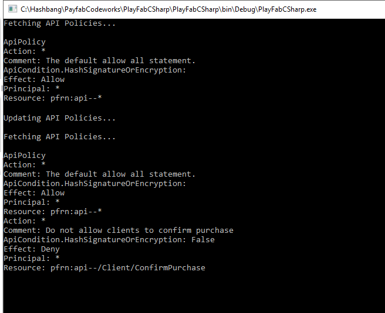

# API access policy

The API Access Policy controls access to API resources. At times it is necessary for a title to allow or deny certain APIs from the game client, for anti-cheat or other security purposes. You can control the access using Policy Statements to specify a set of access rules that are applied in specific situations.

This topic discusses the use API permission policies to create the appropriate rules.

> [!IMPORTANT]
> This guide discusses advanced techniques. If applied incorrectly, it is possible to completely disable client access to your title using this feature.

## Policy control and structure

Titles use the PlayFab Admin API calls to retrieve and update the access policies. The two specific calls that you use to set the API access policy are [GetPolicy](xref:titleid.playfabapi.com.admin.authentication.getpolicy) and [UpdatePolicy](xref:titleid.playfabapi.com.admin.authentication.updatepolicy). For more information about the Admin API calls, see [PlayFab API Reference](/rest/api/playfab/admin/).

To use the Admin API you must provide the developer secret key associated with your title. The Developer key is used to authorize your Title to make Admin API calls. For information about retrieving your secret key, see [Secret key management](../gamemanager/secret-key-management.md).

Each policy contains a list of statements, which act as rules for one or more PlayFab resources. PlayFab defines a default set of policy statements that allows all policies. If you delete this set of policy statement with out replacing it, your Title will not be able to call the Client APIs.

The default PlayFab policy statements:

```json
    "Statements": [
        {
            "Resource": "pfrn:api--*",
            "Action": "*",
            "Effect": "Allow",
            "Principal": "*",
            "Comment": "The default allow all policy"
        }
    ]
```    

Each set of Permission Statements consists of the following items as defined in [Authentication - Update Policy](xref:titleid.playfabapi.com.admin.authentication.updatepolicy#permissionstatement):

* Resource - A string that uniquely identifies one or more PlayFab resources.
 
    To describe the API resource, use the convention shown below.
    
    `pfrn:api--/API-GROUP/API-CALL`
    
    Specify the Client API as the `API-GROUP`: `Client`, `Server`, or `Admin`.
    
    Replace `API-CALL` with an API name such as `ConfirmPurchase`, `LoginWithTwitch`, or `ReportPlayer`.
    
    A resource string supports wildcards. The following resource string matches any resource.

    `pfrn:api--*`

* Action - A string that describes an operation to perform on the resource. Use `*` to match any operation.
* Effect - A string that specifies a rule definition. Use `Allow` or `Deny` to allow or deny operations over the resource.
* Principal - A string that uniquely identifies the class of the user. Use `*` to match any user.
* Comment - A user-defined string that provides more information about the policy statement.
* ApiConditions - An *optional object* that defines advanced rule conditions, for example - Encryption and Signed Headers.

You can set strong security rules for your application by modifying your policy to use more detailed permission statements that only allows access by the APIs you use in your application.

The following example shows how to restrict the `DeleteCharacterFromUser` call:

```json
    {
        "Resource": "pfrn:api--/Server/DeleteCharacterFromUser",
        "Action": "",
        "Effect": "Deny",
        "Principal": "",
        "Comment": "Disable server character delete"
    }
```

## API access policy example

The following code sample shows basic operations with policies. The code performs the following actions:

* Retrieves and logs the existing **Policy**.
* Updates the policy.
* Retrieves and logs the existing **Policy** again.

```csharp
public void Start() {
    PlayFabSettings.staticSettings.DeveloperSecretKey = "<insert key here>";
    PlayFabSettings.TitleId = "< insert title id here >";
    FetchApiPolicy(UpdateApiPolicy);
}

private void FetchApiPolicy(Action nextAction = null) {
    PlayFabAdminAPI.GetPolicy(new GetPolicyRequest() {
        PolicyName = "ApiPolicy"
    }, result => {
        Debug.Log(result.PolicyName);
        foreach (var statement in result.Statements)
        {
            Debug.Log("Action: "+ statement.Action);
            Debug.Log("Comment: "+ statement.Comment);
            if(statement.ApiConditions != null)
                Debug.Log("ApiCondition.HashSignatureOrEncryption: "+ statement.ApiConditions.HasSignatureOrEncryption);
            Debug.Log("Effect: "+ statement.Effect);
            Debug.Log("Principal: "+statement.Principal);
            Debug.Log("Resource: "+ statement.Resource);
        }

        if (nextAction != null) nextAction();

    },error=>Debug.LogError(error.GenerateErrorReport()));
}

private void UpdateApiPolicy() {
    PlayFabAdminAPI.UpdatePolicy(new UpdatePolicyRequest() {
        PolicyName = "ApiPolicy",
        OverwritePolicy = false, // Append to existing policy. Set to True, to overwrite.
        Statements = new List<PermissionStatement>() {
            new PermissionStatement() {
                Action = "*", // Statement effects Execute action
                ApiConditions = new ApiCondition() {
                    HasSignatureOrEncryption = Conditionals.False // Require no RSA encrypted payload or signed headers
                },
                Comment = "Do not allow clients to confirm purchase",
                Resource = "pfrn:api--/Client/ConfirmPurchase", // Resource name
                Effect = EffectType.Deny, // Do not allow,
                Principal = "*"
            }
        }
    }, result => {
        FetchApiPolicy();
    }, error => Debug.LogError(error.GenerateErrorReport()));
}
```

The image below shows an example of the output after the code is run the first time. As shown, the policy consists of several [Permission Statements](xref:titleid.playfabapi.com.admin.authentication.updatepolicy#permissionstatement).


