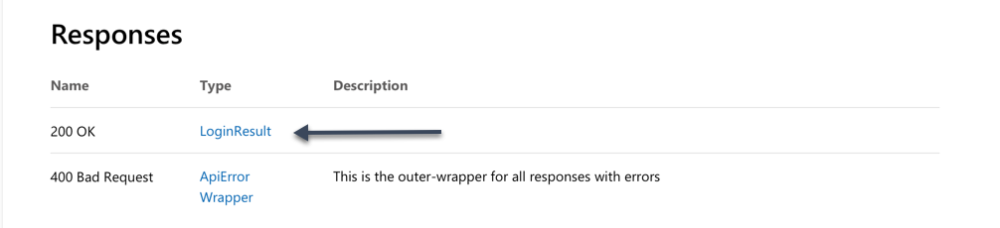

# REST API overview

Welcome to the PlayFab REST API reference. Here you will find reference material and gain insight into how our APIs work. Each API reference is broken down into several different sections.

## Endpoint

The endpoint is the HTTP URL that you can make API requests against. It is preceded with a REST method type (eg. GET, POST). In addition, the titleId must be replaced with your game titleId.

Example:

```html
POST https://[titleId].playfabapi.com/Client/LoginWithCustomID
```

## Request Body

The request body is the object model that is sent as (JSON) to our API service. These models will contain properties that need to be sent along with your API as the payload. Some properties will be flagged as **required**, while others are **optional**.

## Responses

The API service will either return a 200 OK with a JSON payload that can be deserialized as a model. In the below example, Login API calls deserialize into a type of LoginResult.



If the response fails for any reason, a 400 Bad Request is received. This could mean the API service is returning information about a bad request. Often, this could be missing parameters in your API call or a number of other reasons. The ApiErrorWrapper object contains valuable information about the error including error codes, error details and error messages from the server.

## Security

Each API has some form of security that needs to be passed in the header of each request. See this section to know what needs to be defined. Sometimes this is a session ticket from a login request or it could be your title secret key if you are making server api requests.

## Concurrency

The API service is designed to handle a very large number of concurrent calls from each title, but there are limits and restrictions on the number of concurrent calls that can access a single player or other single entity such as a character or group. If this concurrency limit is exceeded, the API returns an `APIConcurrentRequestLimitExceeded` or `ConcurrentEditError` error code. In general, it is safe to make more than one read request for a given player concurrently, but it is best to make a single update request at a time.

## Model Definitions

Each response from the API service can contain one or more Models in the response. These are located below the ApiErrorWrapper and each model is represented in the same document as the API. Each model is also linked in the response parent model. You can also visit the Definitions section in each API page to see a list of Models supported by the API.

### Event Model Definitions

The [PlayStream Event Model reference](events/index.md) contains the models of the automatically generated PlayStream event types. Each event type has a set of properties that are included as part of event's data wherever it is sent.
