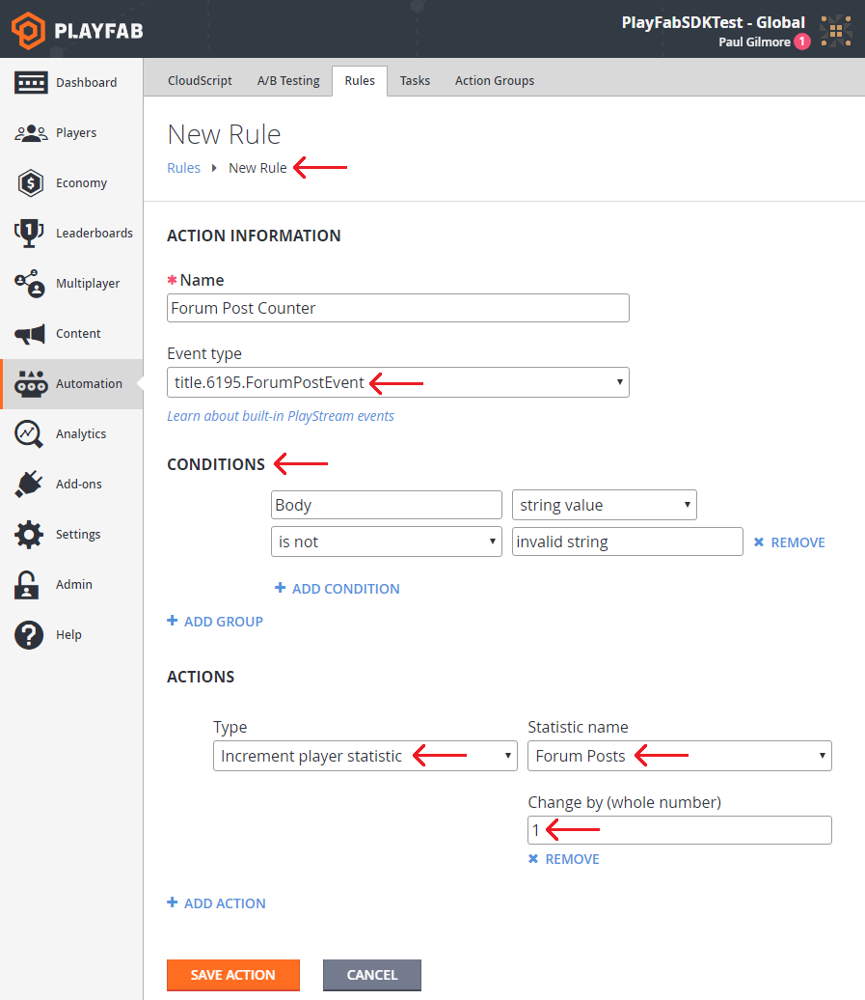
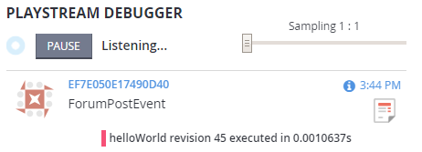

# Actions and rules quickstart

A PlayStream rule allows you to react to a subset of one type of PlayStream events in real time.

## Requirements

- [Game Manager quickstart](../../gamemanager/quickstart.md)
- [Using player statistics](../../features/data/playerdata/using-player-statistics.md) (contains information that can help you with the example in this tutorial).

A quick glossary of relevant terms:

- **PlayStream**: The group of features that make up the PlayFab Event pipeline.
  - A **PlayStream Event** is a JSON-formatted string describing an event about a Player or Title.
  - **PlayStream Events** have a maximum size based on your Automation feature tier.

- **Rule**: Performs extra logic in response to one type of PlayStream Event in real time.
  - The sum of: One **Event Trigger**, an optional list of **Conditions**, and an optional list of **Actions**.

- **Trigger**: The name of the Event which activates this Rule.

- **Condition**: A content filter for Rules and other PlayStream features.
  - Performs a very lightweight evaluation of the PlayStream event JSON object, and skips events that don't match requirements.

- **Action**: The contextual work to be done on the appropriate entity.

A rule consists of exactly one Trigger, an optional list of Conditions, and typically at least one Action (not required, but quite useless without it).

Triggers, Conditions, and Actions are also part of other systems: [bulk actions](action-rules-bulk-actions-for-an-entire-player-segment.md) and [tournament leaderboards](../../features/social/tournaments-leaderboards/using-resettable-statistics-and-leaderboards.md).

## Example Case: Count custom events from the client

In the example presented below, we post the following custom event from the client.

```csharp
public void WriteEvent() {
    PlayFabClientAPI.WritePlayerEvent(new WriteClientPlayerEventRequest {
        EventName = "ForumPostEvent",
        Body = new Dictionary<string, object> {
            { "Subject", "My First Post" },
            { "Body", "My awesome Post." }
        }
    }, LogSuccess, LogFailure);
}
```

In this case, the client is manually reporting a custom `ForumPostEvent` (this does not currently correspond to any Automatic Event in PlayFab or supported partners)

 We will use a PlayStream Rule to count the number of times that a Player reports a forum post in this way.

**Requirement**: Your game must *already* be posting Events of this type before the Game Manager GUI will allow you to create a Rule triggering on it.

Go to your **Game Manager**:

- Navigate to your **Title**.
- Select **Automation**.
- Go to **Rules**.
- Select **New Rule**.

  

Let's evaluate the **New Rule** in this example piece by piece:

- **`title.6195.ForumPostEvent`**
  - `6195` is the title used in this tutorial. Your titleId will match your own Title.
  - `ForumPostEvent` is the event name used in the code for this example case.
  - This line will only be available if you have recently posted at least one `ForumPostEvent` in your Title.
- The **Conditions** used specifically in this example, has minimal use.
  - However, it *does* demonstrate filtering our Custom Event if the **Body** key is mapped to **Invalid string** in our **Body** dictionary.
  - Filters are optional, and should remove irrelevant players from your Rule.
- The chosen **Actions** in this case increments a statistic counter by one.
  - **Requirement**: The **Forum Posts** statistic must be defined under Leaderboards in the Game Manager.

In the Game Manager **PlayStream Debugger** (shown below), you can watch as the trigger takes effect.

  

As you can see, the custom `ForumPostEvent` automatically triggers the statistic that we set under **Actions** for our new Rule.

## Advanced: CloudScript Actions

Many of the built-in actions in **PlayFab** are fairly simple, and might not give you the full power you need. That's why we allow you to fully customize the action logic with CloudScript.

Let's edit the **Rule**.

- Remove the **Condition**.
- Set the **Action** to **Execute CloudScript**.
- Select the **Save Action** button.

  

Now, if we post a new **ForumPostEvent**, we will see a CloudScript execution.

  

Writing your CloudScript to react to PlayStream Rules is an advanced topic covered in our tutorial: [using CloudScript actions with PlayStream](action-rules-using-cloudscript-actions-with-playstream.md).
