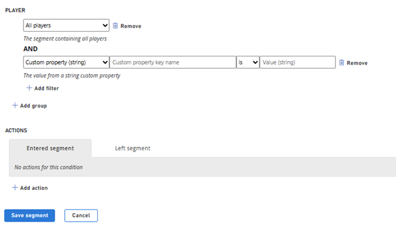

# Advanced Segmentation with Custom Properties

> [!NOTE]
> The Advanced Segmentation with Custom Properties feature is in private preview. We anticipate ongoing changes to it as we continue gathering feedback and optimizing for customer use.

Advanced Segmentation changes the approach to designing segments by leveraging [Custom Properties](player-custom-properties.md), which enables you to store and manage player’s custom information and then use it to create segments based on those specific properties. These properties can be set on players via APIs, Game Manager, or PlayStream rules, and can be used to define segments that group players based on shared characteristics. Once these segments have been created, they can be used to generate actions on players. Additionally, these segments can be used to define scheduled or manual tasks. 

## Creating segments with Player Custom Properties

You can create segments with Player Custom properties either via API or Game manager. 

### Via API

- 	Use the [Create Segment API](/rest/api/playfab/admin/segments/create-segment) to create a segment. 
- 	Add custom property predicates using the [Update Segment](/rest/api/playfab/admin/segments/update-segment) API.

### Via Game Manager 

- Sign in to [Game Manager](https://developer.playfab.com/en-US/login).
- Go to the **Players** page.
- Go to the **Segments** tab.
- [Create or update a segment](segmentation-quickstart.md).
- Add custom property predicates by selecting **Add filter** under **Player**.
- Save segment. 

## Exporting players from a segment with custom properties 
 
1.	[Create a segment](segmentation-quickstart.md) that references custom property predicates.
2.	Use the [ExportPlayersInSegment API](../acting-data/segmentation-export-players-in-a-segment.md) to export player profiles 

## Scheduled Tasks 
 
1.	[Run scheduled task](../acting-data/scheduled-tasks/index.md) on a segment using custom property predicates. 

