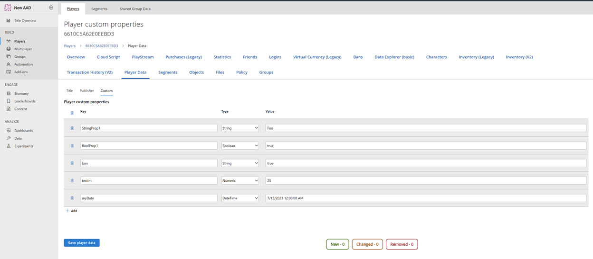
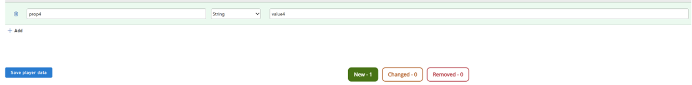
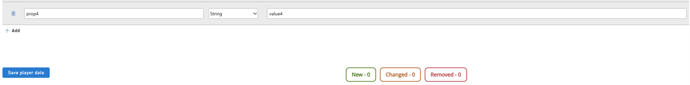
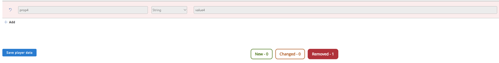
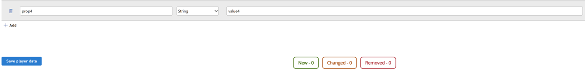
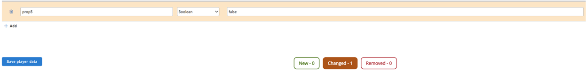
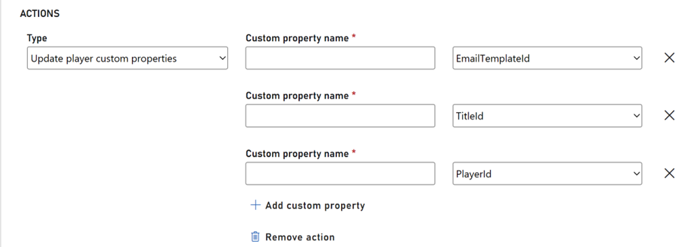

# Player Custom Properties Quickstart

> [!NOTE]
> The Player Custom Properties feature is in private preview. We anticipate ongoing changes to it as we continue gathering feedback and optimizing for customer use.

To get started using Player Custom Properties, follow the guides below. 

## Creating, modifying, deleting Player Custom Properties in Game Manager 

 Sign in to [Game Manager](https://developer.playfab.com/en-US/login).
- Go to the **Players** page and select a player.
- Select the **Player Data** tab. 
- Select the **Custom** subtab.

### Create a new custom property: 

- Select **Add**.
- Fill the **Key** and **Value** fields.
- Select the custom property **Type** from the dropdown.
- You'll notice the **New** label at the bottom increase by the number of custom properties you add.
- Select **Save player data** 

### Remove a custom property: 

- Select the **Trash can** on the left side of the custom property.
- You'll notice the **Removed** label at the bottom increase by the number of custom properties you remove.
- Select **Save player data**.

To modify a custom property: 
- Select **Key** and **Value** fields and change the values in them.
- You'll notice the **Changed** label at the bottom increase by the number of custom properties you modify.
- Select **Save player data**.

## Creating and modifying custom properties on a player via PlayStream Rules 

> [!NOTE] 
> V1 and V2 PlayStream events can be used to set or update custom properties.

- Sign in to [Game Manager](https://developer.playfab.com/en-US/login).
- Go to the **Automation** page and select the **Rules** tab.
- Select the **New rule** button on the top right of the page.
- Populate the **Name** and **Event** type text boxes. V1 events are prefixed with **com.playfab**. or **title.** whereas v2 events are prefixed with **playfab.** or **custom.**
- If desired, set any **Conditions** for triggering this rule based on the event's contents.
- To create a custom property, under **Actions** select **Adding custom property** and populate the fields.
- To modify a custom property, under **Actions** select **Update player custom properties**. The action accepts an expandable list of properties as shown below.
- Select **Save action**.

> [!NOTE]
> If the event chosen for the rule is a standard event, you will have a list of available properties to choose from. If the event is a custom event, then this will be an open text field.
