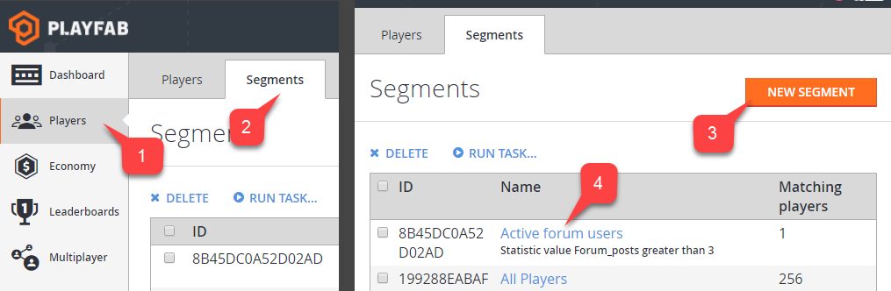
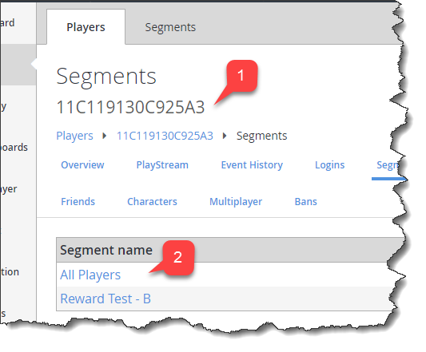

# Segment configuration

The **Segment configuration** page, accessed from the **Players** tab in **Game Manager**, allows you to configure a new or existing segment by adjusting the name, defining filters, and assigning tasks.

Each segment allows you to define useful or interesting groups of players, and perform exclusive actions on that group.

## How to create and access a segment

To access segment configuration:

1. Select **Players** from the menu on the left.
2. Select the **Segments** tab.

You may then choose to:

  3. Use the **New Segment** button to create and configure a new **Segment**.
  4. Locate an *existing* **Segment**, and select the name label to configure the **Segment**.

  

## How to configure a segment

**Prerequisites**:

To configure a segment like the example in this tutorial, you will need:

- Players with and without a distinctive characteristic defined in PlayFab.
- A defined [CloudScript PlayStream Hook](../acting-data/action-rules-using-cloudscript-actions-with-playstream.md).

In this example we are going to:

- Configure a segment using this *defining characteristic*:  all players that come from Canada.
- Run a CloudScript function **helloWorld** for each player that enters the segment.

The *defining characteristic* of a player can be:

- Login time
- Linked device type
- Tags
- Real-world location
- Statistic values
- Virtual currency values
- Real money purchases, and more.

Player's location is one of many possible options, and only specifically required for this example. Feel free to replace the country/region requirement with another filter of your choice.

When a segment is defined, you have a variety of action options to run when a player enters or leaves the segment.

CloudScript is by far the most flexible action, granting you full control of the player and segmentation information at the time of segment transition.

Utilize the second parameter, *Context* in your CloudScript handler to identify the player, and segment transition. Afterwards, perform any action you wish on the player, such as granting inventory items, virtual currency, player data, or statistics.

In this particular case, segment configuration requires 4 simple steps:

1. Assign an appropriate name for the segment. It's a good idea to use a name that incorporates your *Defining Characteristic* - **Canada Players**.
2. Assign conditions that a player has to meet to enter the segment. In this case we want a *Location (country/region)* filter with the strict value: *Canada*.
3. Add a CloudScript action for the entered segment trigger. Configure the action to run the function you want. In this example, we want **helloWorld**.
4. Commit by selecting the **Save Segment** button.

When a segment is defined, you have a variety of action options to run when a player enters or leaves the segment. CloudScript is by far the most flexible action, granting you full control of the player and segmentation information at the time of segment transition.

Utilize the second parameter, *Context* in your CloudScript handler to identify the player, and segment transition. Afterwards, perform any action you wish on the player, such as granting inventory items, virtual currency, player data, or statistics.

In this particular case, segment configuration requires 4 simple steps:

1. Assign an appropriate name for the segment (it's a good idea to use a name that incorporates your *defining characteristic* - **Canada Players**).
2. Assign conditions that a player has to meet to enter the segment. In this case we want a *Location (country/region)* filter with the strict value: *Canada*.
3. Add a **CloudScript** action for the entered segment trigger. Configure the action to run the function you want. In this example, we want: **helloWorld**.
4. Commit by selecting the **Save Segment** button.

  

**Group (2)** is a set of players that meet all defined conditions called **Filters (3)**.

In other words, to be part of a segment, a player must be part of at least 1 group. To be part of a group, a player must meet all conditions (filters).

This is denoted by the OR/AND operators: filters are combined using the AND operator, while groups are combined using the OR operator.

The screenshot shown below offers an example of how a segment can be defined. This segment consists of 2 groups. The first group is defined by 2 filters:

- A player must be from Canada.
- A player must have Apple **Push notifications enabled**.

The second group is also for players from Canada, but they must have Google **Push notifications enabled**.

  
In the end, we have a segment of players from Canada with either Google or Apple push notifications.

Each filter has a unique configuration and purpose. As of 4/30/2017, the following filters are available:

- The **All players filter** - This filter has no configuration and is unique, because it allows you to create a segment of all players. This comes in handy when you want to run automatic operations for every new player (segment actions are described in the [How to manage actions](#how-to-manage-actions) section, later in this tutorial).
- The **First login (date) filter** - Allows you to filter based on first login datetime. For example, players that have first logged in after 1/1/2017.
- The **First login (timespan) filter** - Allows you to filter based on first login timespan relative to the current datetime. For example, player that have first signed in 20 minutes ago (from now).
- The **Last login (date) filter** - Allows you to filter based on last login datetime. For example, players that have not signed since 1/1/2017.
- The **Last login (timespan) filter** - Allows you to filter based on last login timespan relative to the current datetime. For example, players that have not signed in for a week (from now).
- The **Linked user account to filter** - Allows you to filter based on users linked accounts. For example, players that have a Steam account linked with an email account.
- The **Location (country/region) filter** - Allows you to filter based on player's country/region. For example, players from Canada.
- The **Push notifications enabled with filter** - Allows you to filter based on player push settings and capabilities. For example, players that have Google push notifications enabled.
- The **Statistics value filter** - Allows you to filter based on your own custom statistic attribute. For example, players that inflicted 20000 damage in total.
- The **Tag filter** - Allows you to filter based on whether a player has or doesn't have a certain tag. For example, players that have a *cheater* tag.
- The **Total value to date in US filter** - Allows you to filter based on how much USD currency a player has spent in your game. For example, players that have spent over $30.
- The **Value to date filter** - Allows you to filter based on how much of a certain currency a player has spent in your game. For example, players that have spent 50 RUB.
- The **User origination filter** - Allows you to filter based on the first authentication method that a player used to start playing the game.

> [!NOTE]
> The trick here is that a player may *start* with authentication based on, say, an iOS device ID, but later, the *same* player may have a GameCenter account linked. In this case, *user origination* will be the iOS device ID. For example, players that first signed in using an iOS device ID.

- The **Virtual currency balance filter** - Allows you to filter based on the custom virtual currency deposit of a player. For example, players that have less than 50 Crystal.

## How to manage actions

Each *action* needs a *trigger* in order to run. Some actions are run manually, triggered right from the page. Sometimes, though, you have to select a trigger - an event that causes an action to run.

A trigger defines the *context* of the action. For example, a *player entered segment* trigger passes you the context containing a reference to the player. The general workflow for the **Actions** panel is:

1. Select an **Event condition**, also known as a *Trigger*.
2. Select an action **Type**. PlayFab offers a variety of actions. If, at any point, you need more a flexible action, consider a CloudScript action. This action type allows you to run your own CloudScript function.
3. Configure the action (specific for each action **Type**).
4. Select **REMOVE** to remove the action from the trigger.
5. Select **Add Action** to add action to the trigger.

## How to inspect player segments

It is possible to look up what segments a player belongs to by means of the **Player Segments** page. To access the **Player Segments** page:

1. Select **Players** in the sidebar menu.
2. Then select the **Players** tab.
3. Locate the player you want to inspect, and select the **ID** label.
4. Finally, select **Segments** in the **Players Toolbar**.

  

On the **Player Segments** page, note the following:

1. The **Player ID** label identifies the player you currently inspecting.
2. The **Segments** table contains a list of all segments a player belongs to. Select the **Segment name** label to configure a segment.

  
