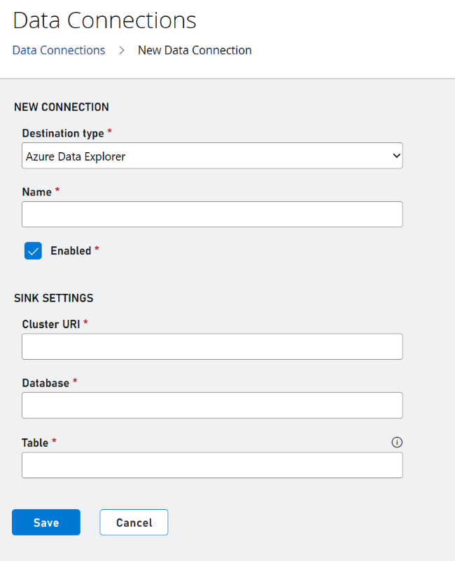
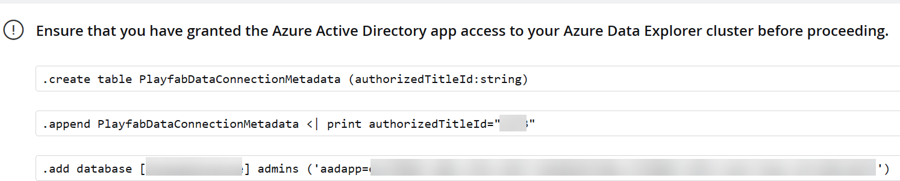

# Configuring your data connection to Azure Data Explorer (ADX)

Data Connections now allows you to export to Azure Data Explorer for near-real time ingestion and distribution of your data. After you configure a data connection with your ADX cluster information, PlayFab exports your data into the ADX cluster specified. 

> [!NOTE]
> Don't have a ADX cluster yet? See [Create a free Azure Data Explorer cluster](/azure/data-explorer/start-for-free-web-ui).

## Create an Azure Data Explorer Data Connection in PlayFab

### Step 1: Navigate to the data connections tab

 

- Sign in to PlayFab and navigate to your title.
- Select the “Data” section in the left-hand menu
- Select the “Data Connections” tab

### Step 2: Configure a new Data Connection

- Select the “New Connection” button.
- Choose the “Destination Type” to be “Azure Data Explorer”
- Populate the fields using the following values  

| Value | Details |
|:-----------|:-----------|
|Name | The friendly name of your data connection. This name allows you to find the data connection later to edit it. Put a descriptive name here. 
| Cluster URI  | The Azure Data Explorer cluster URI. This field information is available in your Azure Data Explorer cluster details.|
| Database | The database name. The PlayFab ingestion service creates a table in this database and ingests the data to that table. |
| Table | The name of the table in the database that PlayFab ingests the data into. If the table doesn't exist, then the ingestion service creates the table. |

> [!Note]
> We recommend using a table name that does not exist. If you use an existing table and the schema is not what PlayFab is expecting, then the schema will be modified.

### Step 3: Run commands

- Run the following commands in order as they appear in the onboarding flow individually in your ADX clusters

