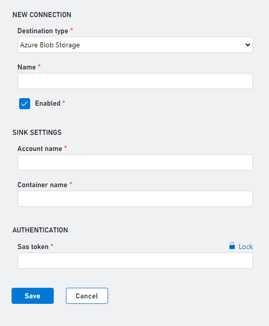

# Configuring your Azure Storage Data Connection

First, you need an Azure subscription and a storage account. 

For existing PlayFab and Azure customers, you can create a storage container on the [Azure portal](https://ms.portal.azure.com/#allservices) and get started with Data Connections on [Azure PlayFab](https://developer.playfab.com/en-US/sign-up).

For existing PlayFab who are new to Azure, you can sign up for an [Azure subscription](https://ms.portal.azure.com/).

> [!Note]
> Make sure to create your Storage Account in the West US 2, otherwise, egress cost will be applied to your storage account. You can configure up to three Azure Blob Storage accounts in the WestUS2 region.

## Setting up your Storage in Azure

For PlayFab to ingest data in your storage account, container details along with authorization using a SAS token are required. To create a SAS token using the Microsoft Azure portal, follow the steps below.

### Option 1: Create the SAS token on the container level. 
> [!Important]
> Generate and retrieve the shared access signature for your container, not for the storage account itself.

- In the [Azure portal](https://ms.portal.azure.com/#allservices), select **Your storage account > Containers**.
- Select a container from the list.
- Go to the right of the main window and select the three ellipses associated with your chosen container.
- Select **Generate SAS** from the dropdown menu to open the **Generate SAS** window.

 

- Define **Permissions** by selecting or clearing the appropriate checkbox. Make sure the **Create** and **Write** permissions are selected.

 

- Specify the signed key **Start** and **Expiry** times. 
- Select **Generate SAS token and URL**.
- The **Blob SAS token** query string appears in the lower area of the window.
- Copy and paste the **Blob SAS token** values into a **secure location for use in the Azure PlayFab Data Connections**. It's displayed only once and can't be retrieved after the window is closed.

### Option 2: Create the SAS token on the account level.
> [!Important]
> Generate and retrieve the shared access signature for your storage account itself.

- In the [Azure portal](https://ms.portal.azure.com/#allservices), select **Your storage account** 
- Select a **Shared access signature** from the list under **Security + Networking**.
- Define **Services** by selecting **blob** and clearing other checkboxes. 
- Define **Resource Type** by selecting **Object** and clearing other checkboxes. 
- Make sure the **Create** and **Write** permissions are selected.
- Specify the signed key **Start** and **Expiry** times. 
- Select **Generate SAS token and URL**.
- The Blob SAS token query string appears in the lower area of the window.
- Copy and paste the **Blob SAS token** values into a **secure location for use in the Azure PlayFab Data Connections**. It's displayed only once and can't be retrieved after the window is closed.

 

## Create an Azure Blob Data Connection in PlayFab

### Step 1: Navigate to the data connections tab

 

- Login to PlayFab and navigate to your title.
- Click on the “Data” section in the left-hand menu
- Click on the “Data Connections” tab

### Step 2: Configure a new Data Connection

- Click “New Connection” button.
- Choose the “Destination Type” to be “Azure Blob Storage”
- Populate the fields using the following values  

| Value | Details |
|:-----------|:-----------|
|Name | The friendly name of your data connection. This name will allow you to find the data connection later to edit it. Put a descriptive name here. 
| Account name  | The Azure Storage Account. |
| Container name | The Azure Storage Account Container. |
| Sas token |  Either the SAS token generated by the container, or the Blob SAS token query string.  |

 

> [!Note]
> We recommend using a table name that does not exist. If you use an existing table and the schema is not what PlayFab is expecting, then the schema will be modified. 
