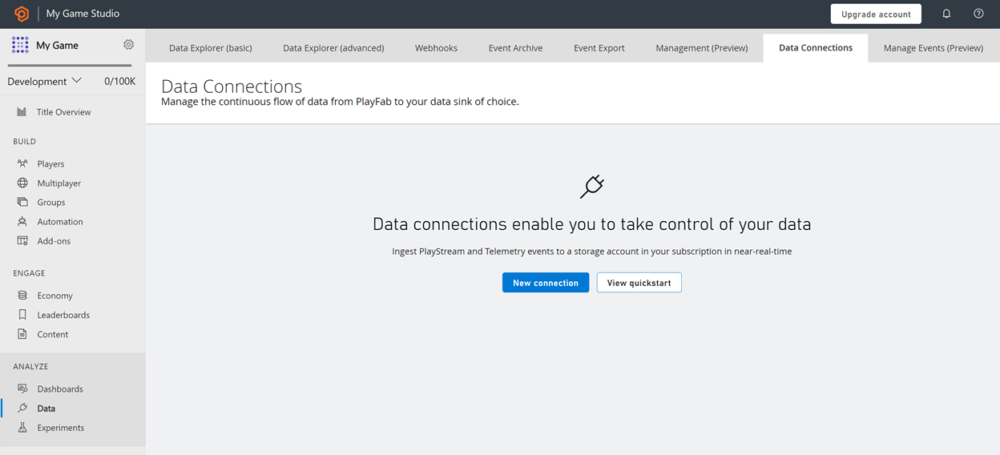

# Data connections

**Data connections** enables the continuous near real-time distribution and ingestion of PlayStream and Telemetry data into your chosen and authorized storage resource in your Azure subscription. Today it works with Azure Blob Storage, Azure Data Explorer (ADX) and Microsoft Fabric KQL databases.

It provides control of your data in your storage account with less than 5-minute data ingestion latency. The architecture is designed for better batch processing that facilitates Parquet files in blob storage with the highest throughput, low storage cost, and most flexibility. In case of failure in data distribution, a built-in automatic retry mechanism is in place to ensure data quality.

You can get started with data connections for event ingestion using PlayFab’s Game Manager portal or scalable APIs.

> [!Note]
> Although you can use either ADX, Blob or Fabric KQL, these have different potential use cases. Blob may be preferred if you are leveraging synapse for ML modelling and batch processing, while ADX supports ad-hoc querying and real-time debugging of your live services with analytics.

## Why do you need it?

Data connections is the replacement for the Event Export and Export to S3 features that currently PlayFab supports. Data connections allow for faster export in preferred formats for offline processing. You get to bring your storage account for data to be ingested and distributed. That means you get to manage and control the encryption-at-rest policy, the lifetime management policy, and network access. The billing becomes simplified as the costs associated with that storage account are accounted for centrally in your all-up Azure account billing.  

### Azure Blob Data Connection
The data is readily available in Parquet blob format. Parquet is a column-oriented data file format designed for efficient data storage and retrieval. It provides efficient data compression and encoding schemes with enhanced performance to handle complex data in bulk, resulting in low latency, higher throughput, and low cost of data storage. It's designed to be a common interchange format for both batch and interactive workloads. Thus, data connections enables your endeavors for custom advanced analytics and reporting, to run ad-hoc queries in a cost-optimized manner.

### Azure Data Explorer Data Connection
Data Connections allows you to export to Azure Data Explorer for near-real time ingestion and distribution of your data. Azure Data Explorer can query millions of records in a few seconds enabling you to gain invaluable insights and make informed decisions swiftly and efficiently. 

For more optimized cost and data control, you can make use of data connections with [Event Sampling](event-sampling-overview.md) - Sampling enables you to configure the percentage of events data that you want to receive.

### Microsoft Fabric KQL database Data Connection

You can utilize PlayFab's Data Connections service to distribute game events to Real-Time Analytics (RTA) databases, allowing you to generate near-real-time analytics and insights in Power BI or through KQL queries on your Microsoft Fabric workspace.
