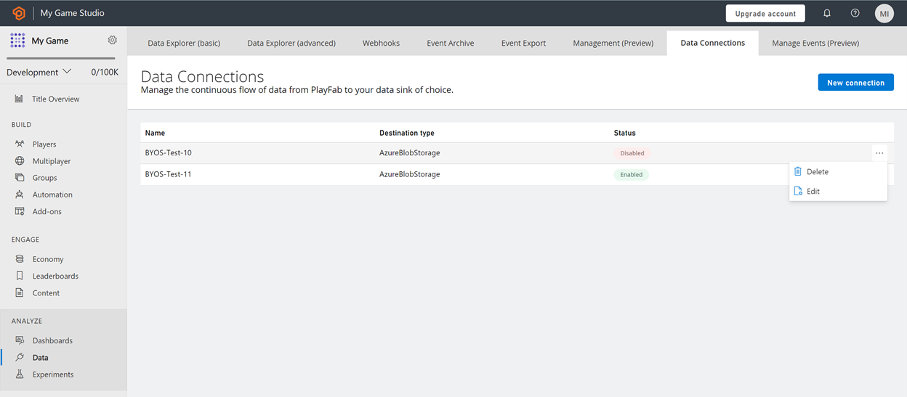

# Data Connections quickstart

## Prerequisites
- For Data Connections, you need an Azure subscription and a storage account. 
- For PlayFab to ingest data in your storage account, container details along with authorization using a SAS token are required. To create a SAS token using Microsoft Azure portal, follow the steps below.

## Create a Data Connection

A Connection is created to integrate your storage resource with PlayFab and retrieve the PlayStream and Telemetry data. You can configure up to three data connections in the “enabled (active)” state. 

### Azure Blog Storage

From the Game Manager:
- Navigate to your **Title**
- Select **Data** from the menu on the left
- Select **Data Connections** from the **Data** tabs
- Select **New Connection**, new data connections configuration page is opened
- Define **Sink Setting** of Azure Blob Storage type
    *	Enter **Name**
    *	Enter **Account Name**
    *	Enter **Container Name**
    *	Enter **SAS Token** as generated in the Azure portal
- Select **Save**
    *	With the default check on **Enabled**, the connection between PlayFab and the customer’s resource is established once saved.
    *	With uncheck on **Enabled**, the connection between PlayFab and the customer’s resource is validated but not established until saved.

### Microsoft Fabric KQL database

From PlayFab Game Manager:

- Navigate to your **Title**
- Select **Data** from the menu on the left
- Select **Data Connections** from the **Data** tabs
- Select **New Connection**, new data connections configuration page is opened
- On the **Destination type** dropdown, select the **Fabric KQL Database** option 
- Give your **Data Connection** a name on the **Name** field 
- Make sure the **Enabled** box is checked 
- Go to [Microsoft Fabric](https://msit.powerbi.com/home)
- Select **Workspaces** on the left panel and select **Your Workspace** 
- Select the **Database** you want to store the data on 
- Copy the **Query URI** by selecting the **Copy** icon next to **Query URI** label 
- Go back to Data Connections on PlayFab's Game Manager
- Paste the **Query URI** you got from Fabric into the **Ingestion URI** field
- In the **Database** field, enter the name of the **KQL Database** you created in Fabric
- Fill the **Table** field with a significant name. Example: **Events** 

> [!Note]
> To optimize your use of a Fabric KQL Data Connection and gain valuable insights into your game data, follow the tutorial on PlayFab and Microsoft Fabric Real-Time Analytics (RTA) for game creators: [PlayFab and Microsoft Fabric Real-Time Analytics (RTA) for game creators](../learn-data/reports/real-time-analytics-tutorial.md)

## Manage connections

The Data Connections overview (landing) page displays the available connections categorized as **enabled** or **disabled** as a **status**. You can have up to 3 enabled connections to the blob storage account at any time. 
The Data Connections overview page can also be used to manage connections by selecting any Connections’ ellipsis (…). Two actions comprising Edit and Delete can be taken on the connections. 

