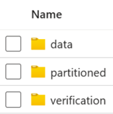
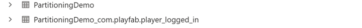

# Event Partitioning overview

> [!NOTE]
> The Event Partitioning feature is in private preview. This means it's only available to be used by specific titles we enable it for. We anticipate ongoing changes to it, without notice, as we continue gathering feedback and optimizing for customer use.

Event Partitioning is an addition to PlayFab’s game data processing capabilities. This feature allows you to partition certain selected events into their own folder in the blob data connections and automatically creates their own individual table in Azure Data Explorer (ADX) data connections. 

## What to expect after setting an event for partitioning? 

Changes happen in both Azure Blob Storage and Azure Data Explorer when an event is set to be partitioned.

### Azure Blob Storage

Once you set an event to be partitioned, those events are written to your Azure Blob Storage storage account in separate folder named “Partitioned”. 

Within the event's subdirectory, the data will be divided into further subdirectories by date and hour. The format of the data will be the same parquet format that is used for events that aren't partitioned.

Example parquet file directory: 

### Azure Data Explorer

Once you set an event to be partitioned, those events are written to your Azure Data Explorer in a separate table. The table is named using the event's full name.

You'll be able to see its respective table in Azure Data Explorer.

## Benefits

Event Partitioning improves performance in processing jobs that deal with specific events, as you no longer need to load the data for all events to find the data for the specific events required for the job.

## Limitations

You can select a maximum of 20 events for partitioning.

## Next steps

* [Event Partitioning quickstart](event-partitioning-quickstart.md)
  
