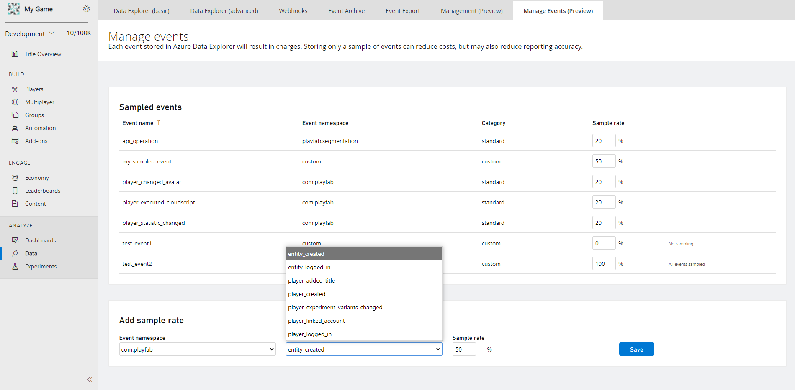
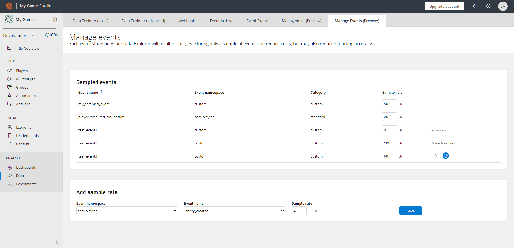

# Event Sampling quickstart

To take advantage of sampling using our Manage Events page, configure a sampling percentage on individual event levels. When you specify a sampling percentage on a certain event, sampling comes into effect by overriding the default or existing value and remains in effect until you change it. The percentage specified in the sample ratio field is the percentage of events that will be filtered out.  

The sampling rate can be as high as 100% and as low as 0%. By default, the sampling rate for all events is 100%, thus, leading to 100% event retention in the sample set. 

> [!Note]
> Sampling comes into play after all the events are processed by the PlayStream rules engine. So, all events will support actions/ rules, if specified and independent of sampling.

### Configure Sampling for Event(s)

You can configure the sampling ratio on both PlayStream and Custom events from the Game Manager portal. To do so,
- Add Sample Rate to an Event
- Navigate to your **Title**
- Select **Data** from the menu on the left
- Select **Manage Events** from the menu on the left
- To add sample rate for an intended event, determine if it’s a PlayStream or Telemetry event. Based on it,
    *	Select the **Event Namespace** from the drop-down of the **Add Sample Rate** windowpane
    *	Then, select the **Event Name** from the drop-down
         * The Event Name dropdown contains the comprehensive list of events that are applicable for event sampling and are yet to have any sampling configuration
- Enter a whole number as the desired **Sample Rate** which ranges between 0% to 100% 
- Select **Save**, the event sampling is configured
    *	The configured event shows up in a new pane known as **Sampled Events**, just above the **Add Sample Rate** pane
         * The Sampled Events overview pane shows all the configured **Event Name** with a categorization of **Event Namespace**, **Category** stating if it’s a standard PlayStream event or custom event, along with the configured **Sample Rate**

         
> [!Note]
> Sampling takes up to 4 hours to come into effect and processes the configuration on each event level.

### Manage Sample Rate to an Event

The overview (landing) page displays the sampled events pane. You can **manage events** by **selecting the Sample Rate box and modifying it as desired**. The options to modify appear on hover over any event. To persist the change, select __save__ button, and to revert the change, select the __cancel__ button. 

To **remove the sampling** for any sampled event(s), modify the Sample Rate box with a 100% entry and select the persist button.

