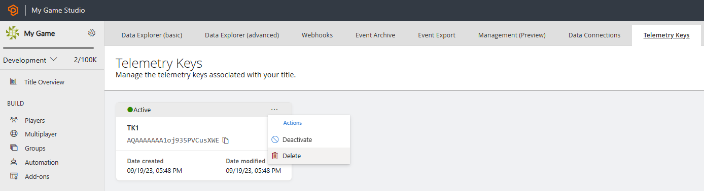

# How to delete Telemetry Keys in Game Manager

> [!WARNING]
> Deleting a Telemetry Key is not reversible. Please be aware that even if you create another key with the same name, the new key will be different from the original one that was deleted.

- Sign in to [Game Manager](https://developer.playfab.com/en-US/login).
- Go to **My Studios and Titles** page and select your game title to display the dashboard.
- Select **Data** from the menu on the left.
- Select the **Telemetry Keys** tab.
- Expand the **three-dot menu** at the top right corner of the Telemetry Key.
- Select the **Delete** action. 

- Select the **Delete** button to confirm.