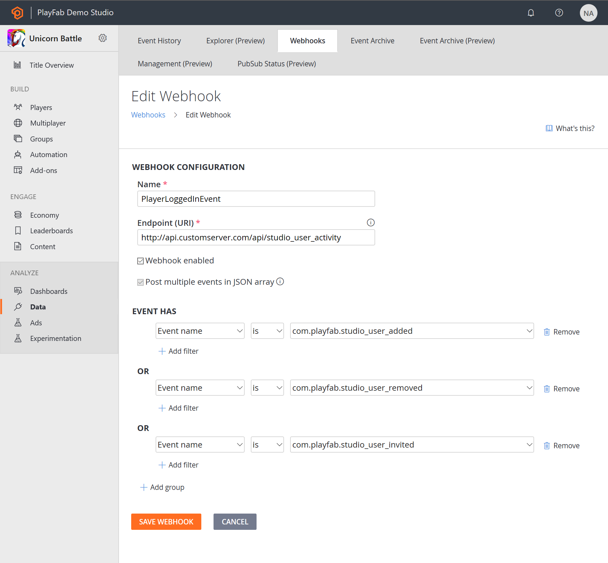

# PlayStream event capabilities

PlayStream provides game developers with a range of features that enable them to analyze data collected from in-game events, gain valuable insights, and enhance player engagement and can also be used for LiveOps. This document provides a detailed review of each of these features.

## PlayStream features

- **An event pipeline** - Unifies the entire data flow from your game into a single data stream. The PlayFab Game Services will automatically insert events into PlayStream, and you can add custom events using our WriteEvent API client and server methods. Our Marketplace Add-ons will also generate events automatically. Events are managed as JSON data.
- **A real time rules engine** - Evaluates complex rules in response to incoming events through PlayStream, and trigger various actions, including CloudScript.
- **A real time segmentation system** - Groups players into segments based on various player properties. Segments are calculated in real time and are always up-to-date. Actions might be triggered automatically as players enter or exit segments.
- **A real time visualization of event data** - Includes a real-time event debugger.
- The ability to send some or all of the events to **external web services via webhooks** - These can be configured automatically by installing Marketplace Add-ons, or configured manually to send events to your own servers.
- **An event archive** - Where you can filter, search, and view historical events - including event delivery history.

> [!NOTE]
> PlayStream now offers support for **entity events** as well as classic PlayStream events. To learn more, please reference the [PlayStream with entity events](playstream-with-entity-events.md) article after you finish this one.

Let’s look at PlayStream features in more detail.

### PlayStream event pipeline and monitor

The easiest way to see the event pipeline in action is through the PlayStream Debugger. You’ll notice the monitor as soon as you select on the **Title Overview** section and into **PlayStream Monitor** tab for your game.

The PlayStream monitor is a real-time stream of all the events for your game, including any custom events you choose to send, using our WriteEvent API methods.

This is immensely valuable during development, as it gives you a way to immediately see what’s happening on the back end as you test out your client- and server-side code. It also links you straight to the player accounts, so that you can check them against the game logic you’re working on.

There are several selectable fields in each event. If you select the “(i)” information circle, you'll see the raw event JSON data.

You can also select the player’s ID to jump straight to the player’s profile. Certain other events also have selectable fields.

When you are in a specific player view, you can select the **PlayStream** tab, which should show you the real-time monitor view filtered by that specific player.

### Player segmentation and actions

Using those events, you can set up segments, which define players within your users, based upon most player properties. This all happens in real time - so there should be no perceptual lag, even at large scale.

If you can tie an event to the thing you want to use as a differentiating factor, you can make a segment for it. And segments will apply retroactively to *all* players, based on the data in their profiles. So, if you define a segment of players where XP > 3,000, then every player with XP > 3,000 will now be in that segment.

This particular segment will be evaluated anytime the statistic called "Total_XPGained" changes. If the condition (> 3000) evaluates to **TRUE**, then the player will enter the “High XP Players" segment, and the corresponding action(s) will be triggered. In this case, it will send a push notification and grant gold to the player.
You can also trigger different custom actions when the player leaves a segment, allowing you to make any other needed changes as a result.
There are various basic actions available, including granting an item to the player, granting virtual currency, changing statistics, banning a player, sending a player an email, or sending a Push notification. You can also trigger custom CloudScript to be run instead.

### Rules and actions

The same action system shown above can also be utilized to respond on specific events coming from your game. For example, the rule shown below demonstrates how when a custom event (**Client_StoreVisit**) is seen, the player receives some virtual currency, and receives a push notification thanking them for their visit.

Using rules and actions, you can affect LiveOps behaviors in your game without making any changes to the game client.

### Webhooks

You can also set up Webhooks, such that some or all of the events going through PlayStream will get pushed out to an external service.

For example, you could use the feature shown below to call your own back end server on any player login.

PlayStream Webhooks are POST calls to your provided endpoint, which passes along all the data for the event in the body of the call. Using this mechanism, you could then enable additional custom actions on your real-time data, using your own custom services.

### Data Explorer
By default, events are kept for a certain period of time that depends on your service tier. You can view all event history in two places - you can view all events for your title in the **Data Explorer Basic** tab, or in the **Data Explorer Advanced** tab. Both are under the **Data** section of **Game Manager**.

### Custom Tags 

The [Custom Tags](playstream-custom-tags.md) feature allows game developers to further enrich their standard PlayStream events with business specific metadata.

This is a quality of life feature designed to make building on top of PlayFab easier and more extensible. 

### Custom properties

This feature allows you to store and access additional key data points about your players. 
As an example, you can use custom properties to save and retrieve data related to player preferences, such as their favorite game modes or character types. By doing so, you can create more targeted segmentation that enables tailored experiences for your players, within Segments, associated actions like CloudScript or with Experiments.

## V1 vs V2 Events

PlayStream offers V1 and V2 events, and the table below provides a feature comparison for each event type: 

| Feature  | V1 (Player/Title/Character) | V2 (Entity Based)     |
| ----------- | ----------- | ----------- |
| Event Explorer |  Yes  |  Yes  |
| Data Connections |  Yes  |  Yes  |
| PlayStream Debugger |  Yes  |  Yes  |
| Actions |  Execute Function   Send Email   Push Notification   CloudScript   Player Ban Action   GrantVC   Delete Player   Increment Statistic  |  Execute Function   Send Email   Inventory/AddVC   Inventory/GrantItem |
| Segments |  Yes  |  No  |
| Event-Trigger Rules |  Yes  |  Yes  |
| Webhooks |  Yes  |  No  |
| Custom Properties |  Yes  |  Yes   |
| S3 Archiver (Legacy) |  Yes  |  No  |

## How PlayStream can help power your game

These are some examples of how can use PlayStream to power your game and unlock its full potential:
- Trigger actions such as granting items and virtual currency when players log in, complete tutorial levels, or reach specific milestones, and use this data to tailor the player's experience.
- Automatically flag or ban players who exhibit cheating behavior.
- Collect data on player progression, gameplay mechanics, and level difficulty. Use this data to make informed decisions about game balancing and tuning to ensure a challenging yet enjoyable experience for players.
- Encourage and reward positive social interactions within the game.
- Send automatic push notifications or emails when players reach milestones or make purchases or complete levels. 