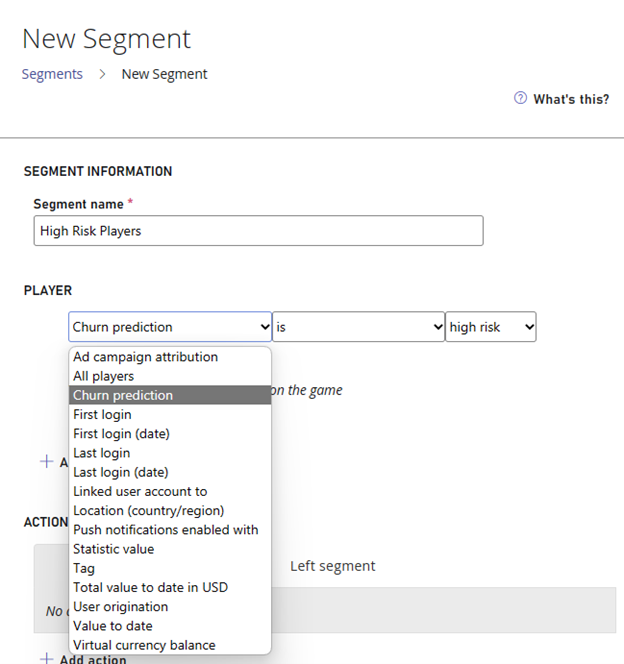
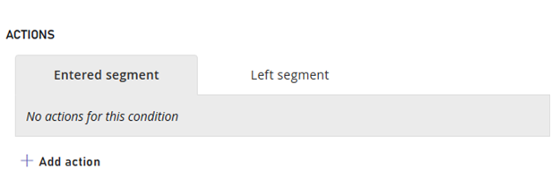

# Player Churn Prediction quickstart 

## Prerequisites

1. Sign in to [PlayFab portal](https://playfab.com).
2. Navigate to your title.

## Create a Churn Prediction segment and apply mitigation strategy

**Note** - Churn Prediction segments can only be created 48 hours after the feature has been enabled for the title.

1. On the **Players** page, select the **Segments** tab at the top.
2. Select **New Segment.**
3. Enter a descriptive name as the **Segment name.** For example, "MyChurnPredictionSegment".
4. Under **Players**, select **Churn Prediction** and then select **High Risk** as the churn category.

5. **Actions**, select **Add Action.**

6. For **Type,** select **Grant Virtual Currency.**  
   For **Virtual currency code,** select **GC (Game Coins).**  
   For **Amount,** enter **50** as the amount you would like to grant to the player.  

7. Navigate back to **Segments** page to see your newly created churn segment and the count of players within that segment.

You've successfully created a player segment for high-risk churn players and applied a mitigation strategy to reduce churn rate and retain your players.
