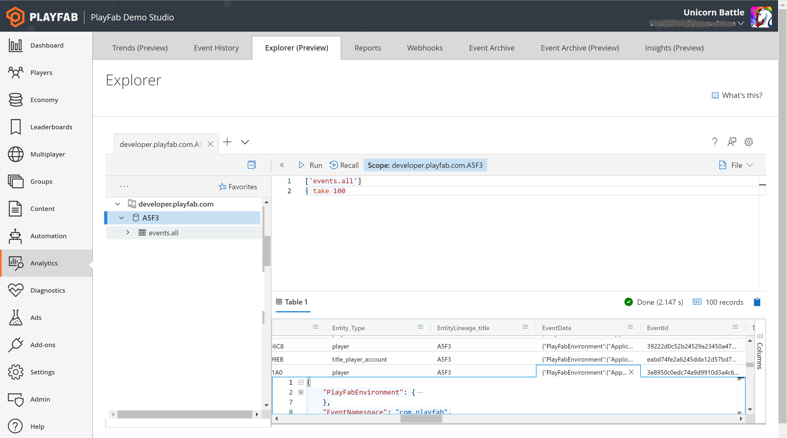

# Getting started with Data Explorer advanced mode

>[!IMPORTANT] 
>The Data Explorer feature is in public preview. We anticipate ongoing changes to it as we continue gathering feedback 
and optimizing for customer use.

Data Explorer advanced mode is designed for more complex queries and deeper insights using the [Azure Data Explorer query language](/azure/data-explorer/write-queries) – a SQL-like language optimized for ad hoc data exploration. To learn how to write non-technical queries, see the [Getting Started with Data Explorer basic mode](getting-started-with-data-explorer-basic.md) tutorial.

## Authoring custom queries

To begin authoring your own queries in advanced mode, it's important to first understand the shape of the data you're accessing.

### The events.all table

The `events.all` table is the default destination for all incoming events. It's a single semi-structured table with columns for common values such as time & event name. You'll quickly become familiar with the EventData column, which contains the full original JSON payload and is useful in almost all queries. You can read the following documentation on the [events.all table](../../acting-data/schemas-events-all.md).

### The anatomy of a query

A query expression most commonly begins with the name of the table. This is followed by the pipe delimiter (|). 
Next comes one or more operators. Each operator is separated by the pipe delimiter. 


As a matter of preference, a query can be expressed on a single line or using a line return before each pipe delimiter. It makes no difference to the query itself.


The Query pane can contain more than one query. This makes it easy to start with a simple expression, validate it runs, and build on it.

A blank line separates one query from another. Your cursor position determines which query runs when you press the “Run” button. You can also highlight a portion of the query to run only that expression. 


### Building Your first query

Now let’s author your first query from scratch. You can type the table name into the Query pane. But we’re going to use a little shortcut. Find the `events.all` table in the Resources pane. You may have to expand your title ID database by clicking the arrow.


Once you’ve located the `events.all` table, double click the table name. You’ll notice this expression has been added to the Query pane. 

> [!NOTE]
> In Preview, you'll need to manually add the brackets and single quotes around the table name. A fix for this inconvenience is in progress.

```json
['events.all']
| 
```

Note the brackets and single quotes around the name. Whenever the table or column name includes a “.” these are required. Your cursor is now in the correct position to author your first operator. Let’s start using the take operator.

```json
['events.all']
| take 100
```

Run this query. Note that the Results pane now shows 100 rows of raw data. 

In the Results pane, select the top row. Using the right arrow, navigate over to the FullName_Name column. This is the name of the event. Arrow down until you find a `player_logged_in` event. Once you’ve found one, right arrow over to the EventData column and double click. You should now see this:



Your query can reference any properties in the EventData JSON using the dot notation (.). You can try this now by modifying your query to return only player_logged_in events from a single player. Double-click the EntityID GUID and copy it to the clipboard. 

Now update your query as follows and insert the GUID you copied:

```json
['events.all']
| where FullName_Name == 'player_logged_in'
| where Entity_Id == 'paste from clipboard here'
```

> [!TIP]
> Double equal signs are used to evaluate string equivalency. Single quotes at the beginning and end set apart a string.

Run the query and you’ll see the Results pane show player_logged_in events only for the selected player. You can use dot notation to reference multiple nested layers of JSON hierarchy by simply adding a dot between each layer. 

Now let’s create a second query to group player logins by region. Without deleting what you’ve written, press return twice. Let’s add a comment to our next query by using “//”. Comments won't be executed and are helpful to keep track of the intent behind each query.

```json
//Player logins by platform
```

Once again, double-click the events.all table from the resources pane. This time, let’s add a time delimiter to our expression to scope our query to just the past three days. 

```json
//Player logins by platform
['events.all']
| where Timestamp > ago(30d)
| where FullName_Name == 'player_logged_in'
```

Run this query to get a full list of all sign-in events over the past three days. However, we want to know how many distinct players have logged in, not the count of events. To do this, we’ll use the distinct operator by Entity ID. 

```json
['events.all']
| where Timestamp > ago(3d)
| where FullName_Name == 'player_logged_in'
| distinct Entity_Id
```

This query returns a list of Entity IDs who have logged in during the past three days. The Results pane shows the number of records, so we can see the total count. 


Now let’s get the count of players who have logged in from each platform. To do this, we’ll need the distinct count of Entity IDs grouped by the platform property in the EventData JSON. This requires the `summarize` operator. Because `summarize` does not support dynamic types, we’ll also need to cast platform to a string.  

```json
['events.all']
| where Timestamp > ago(3d)
| where FullName_Name == 'player_logged_in'
| summarize dcount(Entity_Id) by tostring(EventData.Platform)
```

Let’s finish this off with a flourish. By adding a single additional expression, we can render our results as a column chart. 

```json
['events.all']
| where Timestamp > ago(3d)
| where FullName_Name == 'player_logged_in'
| summarize dcount(Entity_Id) by tostring(EventData.Platform)
| render columnchart
```


## Sample Queries

We’ve only just scratched the surface of the types of queries that can be authored in Explorer. More example queries can be loaded from the Explorer page by pressing “What’s This”. Each of these sample queries is chosen to demonstrate some of the various operators available and how they can be applied to real world questions.

> [!NOTE]
> Because the shape of your data might vary from our demo data set, you may need to modify the sample query to run for your scenario.

## Limits
There are two limits that govern Explorer query usage:
 
1. Max query runtime: An individual query isn't permitted to run longer than 30 seconds. If this limit is exceeded, the query will be terminated and you'll receive an error message.

2. Interval Usage: Each title is permitted a cumulative total runtime of three minutes per any given 10 minute interval. If this limit is exceeded, you'll receive an error message and will need to wait before running additional queries. 

## Data Retention

By default, Data Explorer queries run on hot storage, which can be configured in the Management tool. Queries that search beyond the data stored in hot storage have significantly longer run times and may time out.
