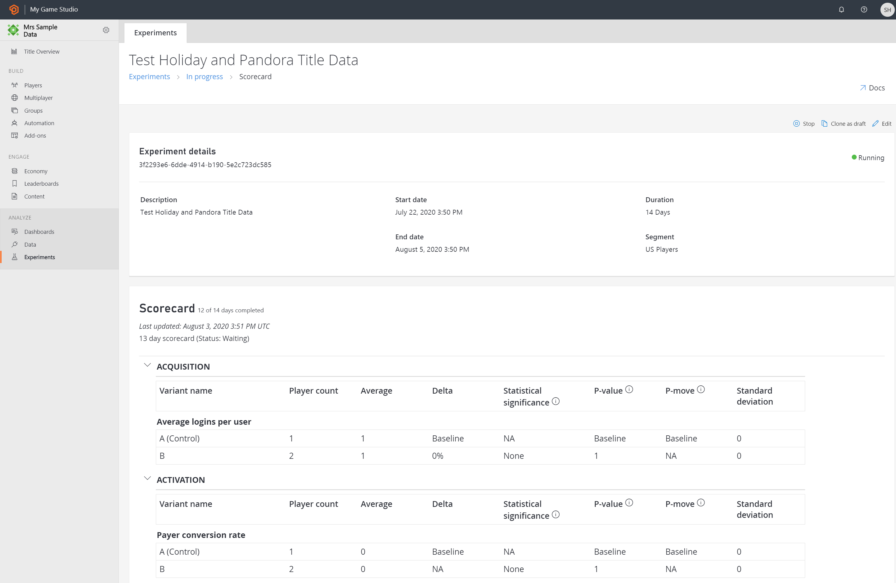
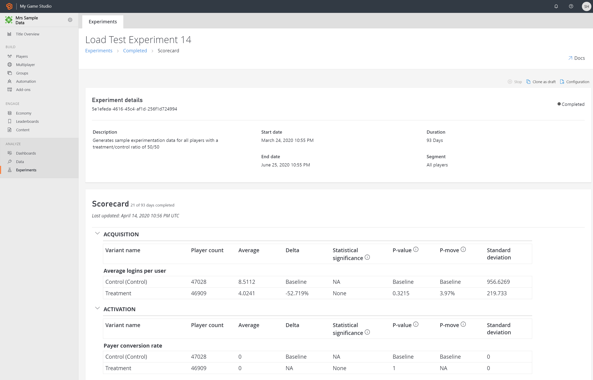

# Analyze Experiments  

Experiments' results are shown in **Experiment details and scorecard page**. The scorecard is generated in a regular cadence. The first scorecard is generated in 12 hours, followed by scorecard(s) every 24 hours for the entire duration of an experiment.

The experiment details and scorecard page, lists the experiment name, description, start and end date, intended duration, audience, and variant count. The actions like Stop, Run, Clone as draft is available on the page based on the state of the experiment.

Once the experiment is completed, select the **Completed** tab view, and select on the name of the experiment to view the **Scorecard**, along with the experiment details. Additionally, the at-run experiments’ scorecard and details can be viewed by selecting the name of the experiment. 

> [!Note]
> To learn more about SRM and how to resolve it, see the **Sample Ratio Mismatch** section in [Experimentation Best Practices and Recommendations](experimentation-keys.md) 

 

At the experiment run:
- Player count, Average, Delta, Statistical significance, P-value, P-move, and Stanard deviation metrics are produced
-	If an issue of Sample Ratio Mismatch (SRM) is identified, then it's flagged to the user for investigation.
    *	SRM indicates sampling bias in the randomization, which leads to the options of resolving bugs (if any), immediately stop the experiment based on the estimated impact or take the risk and let the experiment continue.

At the completion of the experiment:
- The overall statistical computation of each metric is available for analysis.

For details on the variant, its associated variables, and overrides, select **Configuration** and **Experiment configuration page** will be displayed with details.

## Next steps
* [Codeless experiments quickstart](quickstart.md)
* [Manage Experiments](manage-experiments.md)
* [Scorecard metrics](scorecard-metrics.md)
* [Experimentation APIs](experimentation-apis.md)
* [Integrating Experiments with other PlayFab services](experiments-other-services.md)
* [Prevent Interaction Effects with Exclusion Group](exclusion-groups.md)