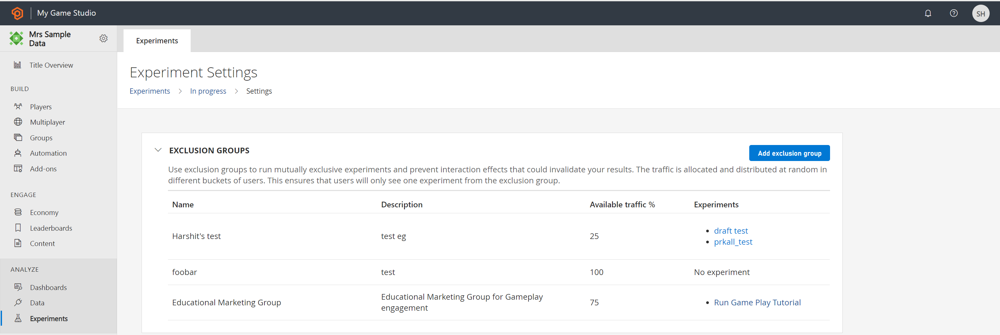
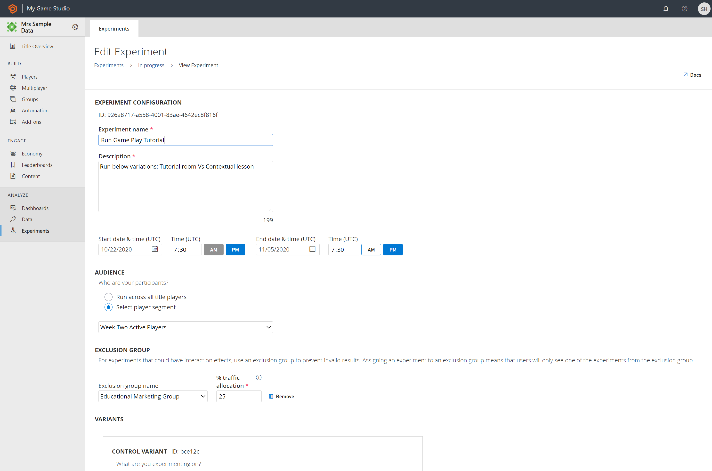

# Prevent Interaction Effects with Exclusion Group

For related concurrent experiments, it's important for players to only see one of the experiments in order to prevent skewed results. This is where exclusion groups come into play. PlayFab exclusion groups allow you to create mutually exclusive experiments. 

With an exclusion group, you limit the participating target audience (players) to participate in one experiment at a time. This ensures that the same users don't see overlapping experiments within an exclusion group. This means that the data collected for one experiment isn't affected by any other experiment, even if both the experiments are set up on the same game flow and targets the same set of players.

In an exclusion group, the traffic allocation happens without overlapping players’ data between the experiments and is distributed at random in different buckets of players for each experiment. This ensures clean results where the change in conversion rate is attributed to the correct experiment without bias and overlap of the target audience, eliminating any interaction effects.

For unrelated experiments, it doesn't matter if your players become a part of more than one experiment. However, if the experiments are related like below, with concurrent or overlapping run schedule, you may want to keep the players exclusive to each experiment:

-	Variation of configurations on the same game flow
-	Variation of configuration involving the same funnel where there's a possibility of player overlap

>[!Note]
>Use of exclusion group reduces the statistical power of your experiments as each one competes with others for traffic. So, use exclusion group when experiments are related and interaction effects are anticipated. 

You can create experiment(s) with exclusion group(s) through Game Manager and [APIs](/rest/api/playfab/experimentation/experimentation). 

## Create Exclusion Group

From the Game Manager:
1. Navigate to your **Title**
1. Select **Experiments** from the menu on the left
1. Select **Experiment Settings** on the right side of the page, the settings page opens
1. Under Exclusion Group, select **Add exclusion group**
1. Enter the **Name** and **Description** for the group, and select **Save**

This navigates to the exclusion group overview page, which shows the details of exclusion groups along with the **Available traffic %** and **Experiments** in each of them. You can edit and delete any exclusion group. 
>[!Note]
>If certain experiment(s) is running within an exclusion group then that exclusion group is undeletable until the run completion of the experiment(s) under it. 

## Create Experiment with Exclusion Group

From the Game Manager’s Experiments page:
1. Select **New Experiment**, experiment configuration page opens
1. Enter Experiment configuration details like **Experiment Name**, **Description**, **Start Date & Time**, **Duration** (up to 90 days)
1. Select your target Audience for the experiment. By default, the experiment's audience is “**Run across all title players**”. Configure to run the experiment on a Segment by selecting the radio button “**Select player segment**” and select on the drop-down
1. To run a mutually exclusive experiment, configure under **Exclusion Group** by selecting the button “**Add exclusion group**”
    *	Select exclusion group from the drop-down list of the existing **Exclusion group name**
    *	Enter **% traffic allocation** which is the percentage of total traffic that is eligible for the experiment
        * If the % traffic allocation is greater than the **Available traffic %** then scheduling or immediate run of the experiment won't persist 
1. Under **Variants**, define the **Control Variant** and **Treatment Variant(s)**
1. Select **Schedule**, **Save as Draft**, or **Run Now**

## Manage Experiments using Exclusion Group

The Experiments’ overview (landing) page displays the available experiments. The **Running** and **Scheduled** experiments are shown in a timeline view. The **Drafted** experiments are shown in the same ‘In-progress’ tab. just below the timeline card view.

The exclusion group and associated traffic are editable for **Schedules** and **Drafted** experiments. The caveat is that only if the available traffic % exists the change in experiments’ exclusion group configuration persists.

## Next steps
* [Codeless experiments quickstart](quickstart.md)
* [Manage Experiments](manage-experiments.md)
* [Analyze Experiments](analyze-experiments.md)
* [Scorecard metrics](scorecard-metrics.md)
* [Experimentation APIs](experimentation-apis.md)
* [Integrating Experiments with other PlayFab services](experiments-other-services.md)