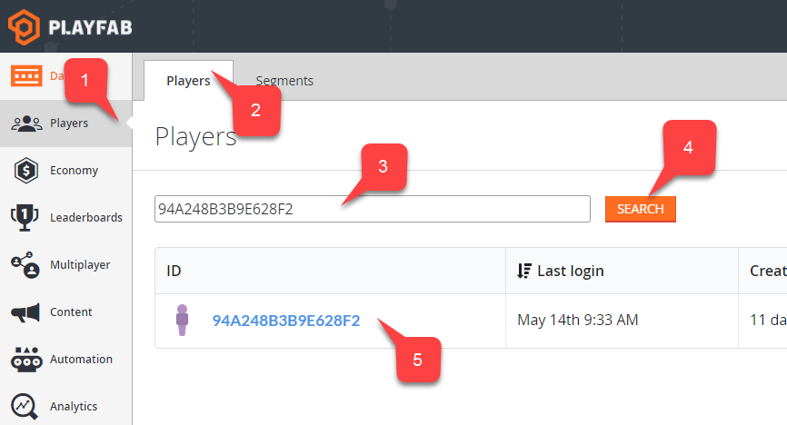

# Daily Abuse Reports History Report

The Daily Abuse Reports history report contains a CSV document with all of the player reports that happened during the specified day.

In the example shown below, a player with ID of  **6079A16A9E4FB67** is reporting a player with ID of **94A248B3B9E628F2** for the reason **Test Report** on 5/14/2017.

  

> [!NOTE]
> For GDPR compliance reasons, the Daily Abuse History Reports are only available for the past 30 days. To learn more, visit our [GDPR documentation](../../privacy-compliance/playfab-gdpr-deleting-and-exporting-player-data.md).

Using this information, you can then use the reportee ID, to quickly look up the reported player and investigate.



## Populating the report

The following API call will produce new entries for this report.

```csharp
public void ReportPlayer() {
    PlayFabClientAPI.ReportPlayer( new ReportPlayerClientRequest() {
        ReporteeId = "94A248B3B9E628F2",
        Comment = "I think this person is cheating! Please, check!"
    }, result => {
        // Success
    }, error => Debug.LogError(error.GenerateErrorReport()));
}
```
