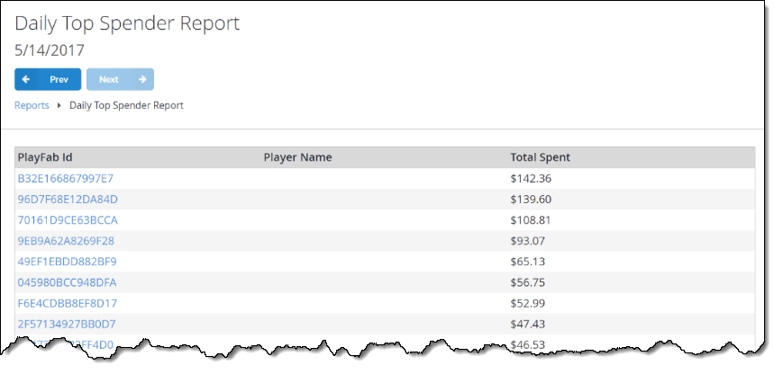

# Daily and Monthly Top Spender report

The Daily and Monthly Top Spender report shows the list of players who spent money in your game on a given day or month, sorted by the transaction amount.

> [!NOTE]
> For GDPR compliance reasons, the Daily Abuse History Reports are only available for the past 30 days. To learn more, visit our [GDPR documentation](../../privacy-compliance/playfab-gdpr-deleting-and-exporting-player-data.md).

You can select the PlayFab ID label to quickly navigate to the **Player's Details** page.

  

  

The Daily and Monthly Top Spender report shows the list of players who spent money in your game on a given day or month, sorted by the transaction amount.

You can select the PlayFab ID label to quickly navigate to the **Player's Details** page.

## Populating the Reports

Please refer to [Non-receipt Payment Processing](../../../features/economy/tutorials/non-receipt-payment-processing.md) tutorial to learn how to conduct payments.
