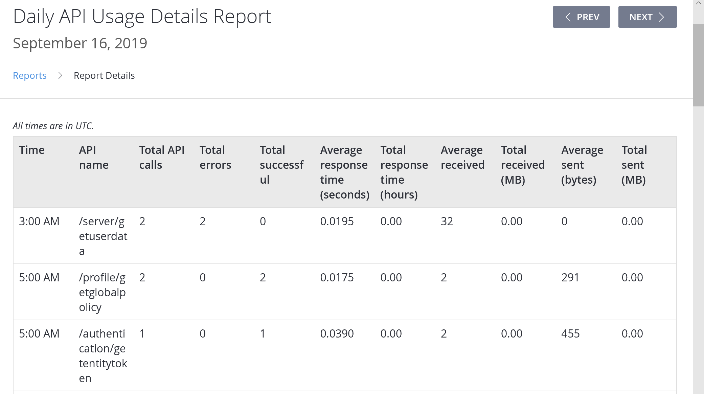

# Daily API Usage Details report

The daily API Usage Details report contains statistics for each API call, aggregated by the API name on an hourly basis. The table contains the following metrics:

- **Total API Calls**, **Total Errors** and **Total Successful** - These columns allow you to check the overall usage and stability of your API calls.
- **Average Response Time**, **Total Response Time**, **Average Received bytes**, **Total Received bytes**, **Average Sent bytes**, and **Total Sent** (**MB**) - These columns are useful for monitoring system performance, as well as optimizing some user-defined, heavy-duty function calls (for example, CloudScript).

If you experience lag spikes in your application while executing API calls, you can refer to this report to track down the underlying cause.

For example - using the report, you will be able to check whether the data was too large, or that a handler worked inefficiently. You can further utilize the report to tune the performance of CloudScript execution by adjusting its behavior and associated data.

## Populating the report

Any API call will be captured and included into this report. Check the [PlayFab API Reference documentation](../../../api-references/index.md) for the list of all API options.
