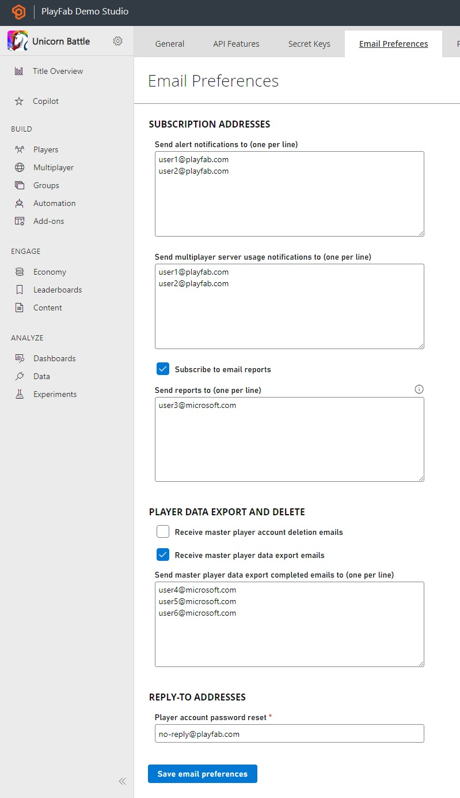

# Daily Title report email

The Daily Title report contains statistics for daily engagement and revenue for your title. The table contains the following metrics:

- **Engagement**: **DAU** (Daily Active Users), **New Players**, **MAU** (Monthly Active Users), **Total number of logins**, **Day 1 retention**, and **Day 7 retention**. 
- **Revenue**, **Transaction revenue**, **Playing players**, **ARPU** (Average revenue per user), **ARPPU** (Average revenue per paying user), **Day 1 conversion**, and **Day 7 conversion**.

The report can assist you in identifying trends and identifying changes happening daily in your title.

## How to opt in and out of this email report

Titles are subscribed to the email by default but you'll only receive the email if you have active players within the past month. The email is based on UTC time and is sent out daily between 5-6am UTC (9-10pm pst).

To unsubscribe from this list follow these steps:

- Sign in to [Game Manager](https://developer.playfab.com/en-US/login).
- Go to **My Studios and Titles** page and select your game title to display the dashboard.
- Select the **Settings** icon next to the Title name on the upper left side.
- Select **Title Settings** tab.
- Select **Email Preferences**.
- Unselect the **Suscribe to email reports**. 
- Select **Save email preferences**.

  

## See also

- [Reports Overview](../reports/overview.md).
- [Reports Quickstart](../reports/quickstart.md).