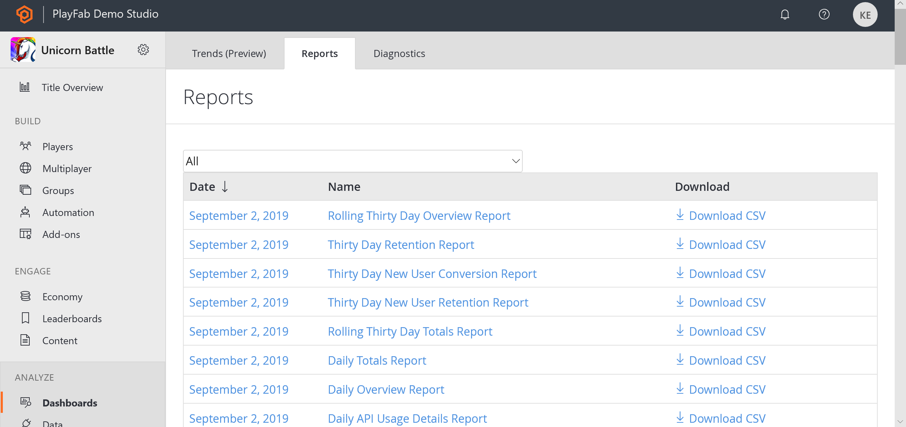

# Reports quickstart

The **Reports** page gives you access to various reports composed from events, and broken down by dates.

> [!IMPORTANT]
> Before using **Reports**, make sure you have executed some API calls which have been captured by the **Reports** system already.

## Access reports

To access the **Reports** page:

1. Use the side bar menu and navigate to **Analytics**.

2. Select the **Reports** tab.

  

## Reports overview

The example shown below shows an overview of the **Reports** page.

1. The first section allows you to filter **Reports** by **Type** (**Name**).

2. The **Date** column lists the time intervals for all **Reports** that have been generated. You can select the **Date** label to access report details for a specific date.

3. The **Name** column identifies the **Report Type** uniquely. You can select the **Name** label to access report details for the corresponding **Date**.

4. When **Report** data is available, you can download a **CSV** representation of the data by selecting **Download CSV**.

5. When **Report** data is *not* available for a given day (no events that day), the **Date** and **Name** labels will render black, will not be selectable, and the option of downloading the report as a **CSV** will not be available.

  

## Report Types

- [Daily, Monthly, and Rolling Thirty-Day Overview and Totals Reports](daily-monthly-and-rolling-30-day-overview-and-totals-reports.md)
  - Tracks hourly, daily, and monthly logins, revenue, and API usage.
- [Thirty-day Retention Report](thirty-day-retention-report.md)
  - Tracks the percentages of all active players who return to your game over 30 days.
- [Thirty-day New User Retention Report](thirty-day-new-user-retention-report.md)
  - Tracks the percentages of new players who return to your game over the *first* 30 days.
- [Thirty-day New User Conversion Report](thirty-day-new-user-conversion-report.md)
  - Tracks the percentages of new players who spend money within the first 30 days.
- [Daily and Monthly Top Spender Report](daily-and-monthly-top-spender-report.md)
  - Tracks the top 100 spenders in your game.
- [Daily and Monthly Top Items Report](daily-and-monthly-top-items-report.md)
  - Tracks the top 100 items in your game.
- [Daily AB Test KPI Report](daily-ab-test-kpi-report.md)
  - Evaluates the effectiveness of your A/B test experiments.
- [Daily API Usage Details Report](daily-api-usage-details-report.md)
  - Tracks the PlayFab **API** calls used by your title.
- [Daily and Monthly CDN Usage Report](daily-and-monthly-cdn-usage-report.md)
  - Tracks **Content Delivery Network** (**CDN**) usage by your players.
- [Daily Abuse Reports History Report](daily-abuse-reports-history-report.md)
  - View and read player bug reporting, and/or let players report each other for cheating.

> [!NOTE]
> The **Name** column is never selectable on this report, but the **Download CSV** column will *still* work if there is data present.
