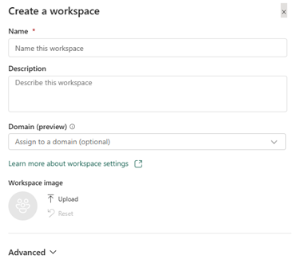
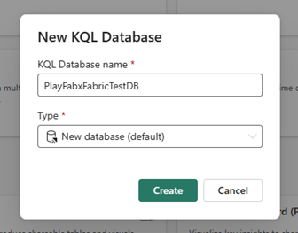
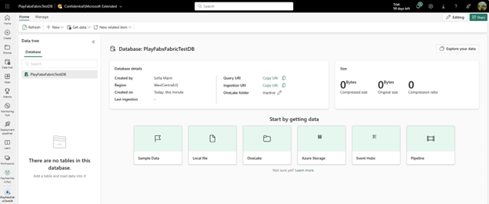
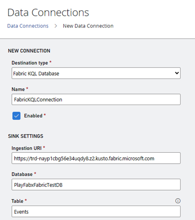
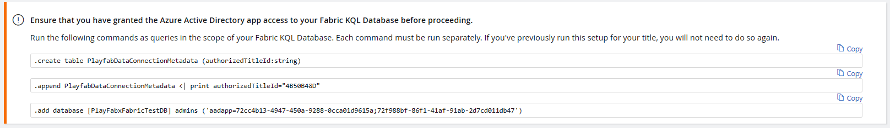
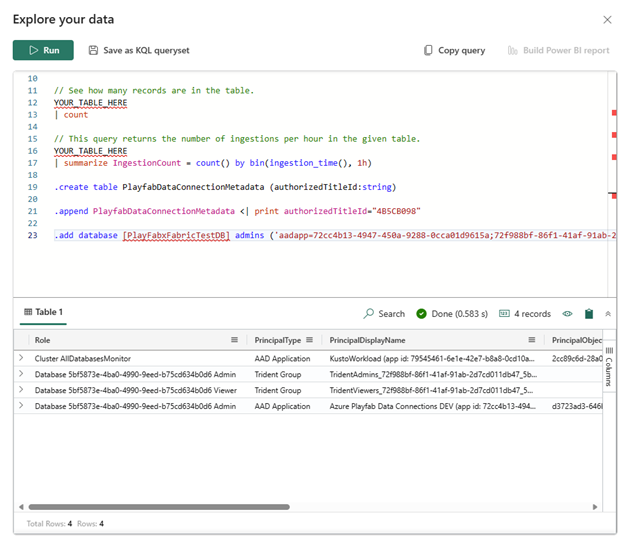

# PlayFab and Microsoft Fabric Real-Time Analytics (RTA) for game creators

This tutorial explains end-to-end steps on how to integrate **PlayFab** and **Fabric Real-Time Analytics** to enable real-time analytics and insights for your game. By following the step-by-step instructions, you will learn how to use PlayFab's Data Connections service to distribute game events to Fabric Real-Time Analytics Database and how to access the Fabric Power BI dashboard to explore key game KPIs. The tutorial includes a sample Power BI dashboard and all the necessary resources to complete the integration.

### Prerequisites

* To successfully complete this tutorial, you need a Microsoft Fabric-enabled [capacity](/fabric/enterprise/licenses#capacity). For a limited time, you can [sign up for the Microsoft Fabric (Preview) trial](/fabric/get-started/fabric-trial).
* A PlayFab developer account. Sign up at [playfab.com](https://developer.playfab.com/en-US/sign-up)
* Microsoft PowerBI Desktop installed. See [Get started with Power BI Desktop](/power-bi/fundamentals/desktop-getting-started#install-and-run-power-bi-desktop)

## Create a Fabric workspace

1. Go to [Microsoft Fabric](https://msit.powerbi.com/home).
2. On the left side navigation bar, select **Workspaces** > **New workspace**.
3. A pane opens on the right side of the screen.
4. Enter a name for the workspace. The only mandatory field is the **Name**. Example: **PlayFabReports**.

5. Select **Apply** to save your workspace.

For details, see [Create a workspace - Microsoft Fabric | Microsoft Learn](/fabric/get-started/create-workspaces)

## Create a KQL Database 

Once you set up your workspace, the next step is to create a KQL Database, where all your PlayFab events flow into.

1.	Go to [Microsoft Fabric](https://msit.powerbi.com/home).
2.	On the left side navigation bar, select **Workspaces** > **Your Workspace**.
3.	Select **New** > **More Options** > **KQL Database**.
4.	Enter a name for the **KQL Database name** field and select **New database** as the **Type**.

5. Select **Create** to complete the Database creation.

To learn more, see [Real-time analytics - Create resources](/fabric/real-time-analytics/tutorial-1-resources).

## Create a Microsoft Fabric Data Connection 

After creating the KQL Database, it shows up in your workspace, as shown in the screenshot below.

Now, proceed to create a Data Connection so that all your events can flow into your KQL Database.

1. Go to [Microsoft Fabric](https://msit.powerbi.com/home).
2. Select **Workspaces** on the left panel and select **Your Workspace**. 
3. Copy the **Query URI** by selecting the **Copy** icon next to **Query URI** label. 
4. Go to **PlayFab** and sign in on [Game Manager](https://developer.playfab.com/).
5. Select **Data** from the menu on the left. 
6. Select the **Data Connections** tab. 
7. Select the **New connection** button.
8. On the **Destination type** dropdown, select the **Fabric KQL Database** option. 
9. Give your **Data Connection** a name on the **Name** field. 
10. Make sure the **Enabled** box is checked. 
11. Paste the **Query URI** you got from Fabric into the **Ingestion URI** field.
12. In the **Database** field, enter the name of the **KQL Database** you created in Fabric.
13. Fill the **Table** field with a significant name. Example: **Events**. 

There's a set of queries at the bottom of the page. In the next section, let's copy these queries into Fabric. 

## Bringing it all together

1. Go back to your **KQL Database** page on **Fabric**. 
2. Select **Explore your data**.
3. Copy and run each of the queries one by one, selecting the **Run** button at the top of the pane.
4. The result should look like this:

5. Go back to the **Data Connections** tab on **Game Manager**.
6. Select **Save**.

## See everything in action

For the best results, follow these steps after completing all the instructions above.

Now, for demo purposes, let’s create some new Players in PlayFab’s Game Manager, then you should be able to see their data in the Power BI Report. 

### Create Players in Game Manager

1. Go to **PlayFab** and sign in on [Game Manager](https://developer.playfab.com/).
2. Select **Players** from the menu on the left. 
3. Select the **Players** tab. 
4. Select **New player**.
5. Select **Create and login player**.
6. Repeat these steps to create as many players as you want!

### Upload PlayFab’s Power BI template to Microsoft Fabric

There are two steps in this process. First, download PlayFab's Power BI template and then upload it to Microsoft Fabric.

#### Download the Power BI template from GitHub

1. Go to [GitHub](https://github.com/) and sign in.
2. Go to the [PlayFabPowerBITemplates](https://github.com/PlayFab/PlayFabPowerBITemplates) repository. 
3. Select the **three-dot button** on the top right of the page to download the template.

#### Open the Template on Power BI Desktop and publish to Microsoft Fabric

1. Open **PowerBI Desktop**.
2. Select the **File** tab at the top of the screen.
3. Select **Browse this device** at the bottom left of the screen.
4. Look for the template file (.pbit) you downloaded **select** and **open** it.

> [!TIP]
> Update the file type to Power BI Template Files (*.pbit) in the drop down when looking for the downloaded template since it defaults to show *.pbix files.

5. Fill the connection parameters on the **PlayfabReportTemplate** window.
    * Go to [Microsoft Fabric](https://msit.powerbi.com/home).
    * Select **Workspaces** on the left panel and select your workspace. 
    * URI: Copy the Query URI by selecting the **Copy icon** next to the URI field.
    * Database: In the **Database** field, enter the name of the KQL Database you created in Fabric.
    * Enter the table name that you created in [Create a Microsoft Fabric Data Connection](#create-a-microsoft-fabric-data-connection) under **Table**. If you used the example name above, it's **Events**.
6. Select **Load**. 
7. Select **Publish** at the top of the page. 
8. Select **Save**.
9. Fill out the **Save** this file form. (Only if you haven’t saved the file before).
    * Give the Report a significant **Name** for you. Example: **OverviewReport**
    * Select a **Location** to save it to. 
    * Select **Save**. 
10. Fill out the **Publish** form by selecting your **Microsoft Fabric Workspace**.
11. Select the **Open OverviewReport.pbit in Power BI** link, this opens the template report in Fabric.

Once you complete these steps, select your workspace on Fabric to find the list of database and reports. 

> [!IMPORTANT]
> The amount of data you see is dependent on when the Data Connection was created. PlayFab doesn’t backfill data.

## See also

* [Microsoft Fabric terminology](/fabric/get-started/fabric-terminology)
* [Create a workspace](/fabric/get-started/create-workspaces)
* [Navigate to your items from Microsoft Fabric Home page](/fabric/get-started/fabric-home)
* [End-to-end tutorials in Microsoft Fabric](/fabric/get-started/end-to-end-tutorials)
