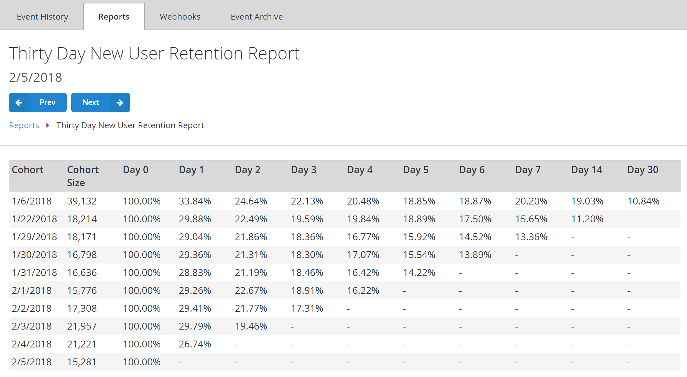

# Thirty Day New User Retention report

The Thirty Day New User Retention report tracks the percentage of new user cohorts who return to the game on subsequent days.

A Cohort of players is defined by grouping newly registered players on a given day (**Day 0**) and their retention is tracked over a 30-day period.

Cohort size is determined by the number of players within it.

The example report shown below, was generated on **2/5/2018**. On **1/6/2018**, **39,132** new players created accounts in the example title.

Since **Day 0** is an initiation date for a new Cohort, this column always has **100%** retention rate.

Then **33.84%** of those players logged in again the *next day*, **24.64%** in *two days* later, and so on. **10.84%** of the Cohort returned on the *30th day*, which corresponds to **2/5/2018**.

For additional details, see [Metrics and Terminology](../../../features/analytics/metrics/metrics-and-terminology.md).

## Populating the report

To populate this report, you must register a player and then have them log in for several days in a row at least once.

This, however, will produce trivial results, (with **100%** retention for each day).

Throwing more players into the process and skipping some days will produce more interesting results.

The following API calls may be used to log in:

- [LoginWithAndroidDeviceID](xref:titleid.playfabapi.com.client.authentication.loginwithandroiddeviceid)
- [LoginWithCustomID](xref:titleid.playfabapi.com.client.authentication.loginwithcustomid)
- [LoginWithEmailAddress](xref:titleid.playfabapi.com.client.authentication.loginwithemailaddress)
- [LoginWithFacebook](xref:titleid.playfabapi.com.client.authentication.loginwithfacebook)
- [LoginWithGameCenter](xref:titleid.playfabapi.com.client.authentication.loginwithgamecenter)
- [LoginWithGoogleAccount](xref:titleid.playfabapi.com.client.authentication.loginwithgoogleaccount)
- [LoginWithIOSDeviceID](xref:titleid.playfabapi.com.client.authentication.loginwithiosdeviceid)
- [LoginWithKongregate](xref:titleid.playfabapi.com.client.authentication.loginwithkongregate)
- [LoginWithPlayFab](xref:titleid.playfabapi.com.client.authentication.loginwithplayfab)
- [LoginWithSteam](xref:titleid.playfabapi.com.client.authentication.loginwithsteam)
- [LoginWithTwitch](xref:titleid.playfabapi.com.client.authentication.loginwithtwitch)
- `LoginWithWindowsHello`<!-- [LoginWithWindowsHello](xref:titleid.playfabapi.com.client.authentication.loginwithwindowshello) -->

To register a player you may use the following API calls:

- [RegisterPlayFabUser](xref:titleid.playfabapi.com.client.authentication.registerplayfabuser)
- `RegisterWithWindowsHello`<!-- [RegisterWithWindowsHello](xref:titleid.playfabapi.com.client.authentication.registerwithwindowshello) -->

You may also you use the following API calls to register and log in simultaneously if the `CreateAccount` flag is set:

- [LoginWithAndroidDeviceID](xref:titleid.playfabapi.com.client.authentication.loginwithandroiddeviceid)
- [LoginWithCustomID](xref:titleid.playfabapi.com.client.authentication.loginwithcustomid)
- [LoginWithFacebook](xref:titleid.playfabapi.com.client.authentication.loginwithfacebook)
- [LoginWithGameCenter](xref:titleid.playfabapi.com.client.authentication.loginwithgamecenter)
- [LoginWithGoogleAccount](xref:titleid.playfabapi.com.client.authentication.loginwithgoogleaccount)
- [LoginWithIOSDeviceID](xref:titleid.playfabapi.com.client.authentication.loginwithiosdeviceid)
- [LoginWithKongregate](xref:titleid.playfabapi.com.client.authentication.loginwithkongregate)
- [LoginWithSteam](xref:titleid.playfabapi.com.client.authentication.loginwithsteam)
- [LoginWithTwitch](xref:titleid.playfabapi.com.client.authentication.loginwithtwitch)
