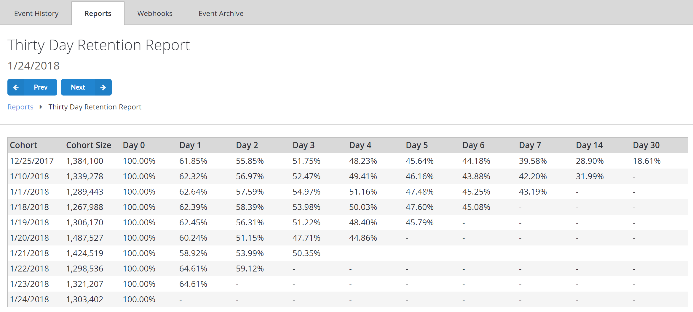

# Thirty Day Retention report

The Thirty day Retention report table illustrates how many of your players came back to the game within a 30-day period.

A new Cohort of players is formed every day, based on all the players (new and returning), who have logged in to your game on a given day (**Day 0**).

Cohort size is determined by the number of players within it. Then each cell shows the percentage of players **(%)** from a given Cohort who returned on each subsequent day.

The Thirty Day Retention report table illustrates how many of your players came back to the game within a 30-day period.

The example report shown below was generated on **1/24/2018**. It shows, for instance, that on **12/25/2017**, 1.38M users logged in.

Then **61.85%** of them logged in the *next* day, and **55.85%** of them logged in *two days* later.

Finally, **18.6%** came back *30 days* later, which corresponds to the report generate date, **1/24/2018**.

This report, in addition to the [New User Retention Report](thirty-day-new-user-retention-report.md), is especially useful when you are running a LiveOps event, and want to check its effect on boosting engagement of existing players. For additional details, see [Metrics and Terminology](../../../features/analytics/metrics/metrics-and-terminology.md).

## Populating the report

To populate this report, you need to register a player, and then have them log in several days in a row at least once.

This, however, will produce trivial results, (with **100%** retention for each day). Throwing more players into the process and skipping some days will produce more interesting results.

The following API calls may be used to log in:

- [LoginWithAndroidDeviceID](xref:titleid.playfabapi.com.client.authentication.loginwithandroiddeviceid)
- [LoginWithCustomID](xref:titleid.playfabapi.com.client.authentication.loginwithcustomid)
- [LoginWithEmailAddress](xref:titleid.playfabapi.com.client.authentication.loginwithemailaddress)
- [LoginWithFacebook](xref:titleid.playfabapi.com.client.authentication.loginwithfacebook)
- [LoginWithGameCenter](xref:titleid.playfabapi.com.client.authentication.loginwithgamecenter)
- [LoginWithGoogleAccount](xref:titleid.playfabapi.com.client.authentication.loginwithgoogleaccount)
- [LoginWithIOSDeviceID](xref:titleid.playfabapi.com.client.authentication.loginwithiosdeviceid)
- [LoginWithKongregate](xref:titleid.playfabapi.com.client.authentication.loginwithkongregate)
- [LoginWithPlayFab](xref:titleid.playfabapi.com.client.authentication.loginwithplayfab)
- [LoginWithSteam](xref:titleid.playfabapi.com.client.authentication.loginwithsteam)
- [LoginWithTwitch](xref:titleid.playfabapi.com.client.authentication.loginwithtwitch)
- `LoginWithWindowsHello`<!-- [LoginWithWindowsHello](xref:titleid.playfabapi.com.client.authentication.loginwithwindowshello) -->
