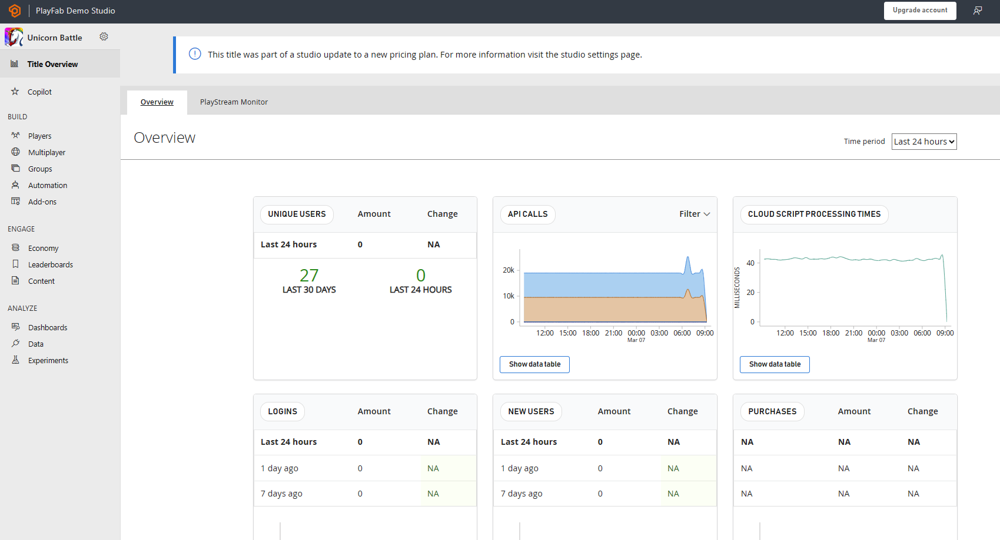

# Title Overview

The Title Overview page is the landing page within PlayFab that provides a high-level summary of your game's key performance indicators (KPIs) and other important metrics. Once you sign in and select your title, you'll see the Title Overview page. This page is composed of different graphs that can tell you the state of your game. You can look at information regarding Unique Users, API Calls, Cloud Script Processing Times, Logins, New Users, Purchases, Multiplayer Servers, and Reports, all within a span from 24 hours to 4 weeks. 

This page is great to get a gist of what's going on in your game and can help you find insights about metrics you want to analyze. The graphs on the Title Overview page can be used to identify trends and patterns over time. 

