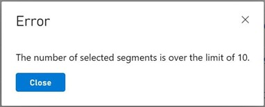

# Segments as a dimension

The Segments as a Dimension on the Trends Dashboard feature leverages on the already existing way of visualizing changes over time, but it now allows you to choose which segments to include as part of the dimension. 

> [!NOTE]
> Data does not start getting generated for a segment before it being selected. 

## Limitations

One limitation regarding Segments as a Dimension is the rate limit, if you try to select more than ten segments, you will get an error dialog like this:  

## See also

[Segmentation overview](../../acting-data/segmentation-overview.md)
  
