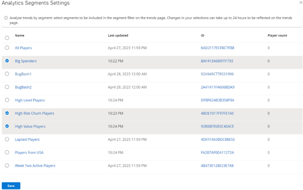

# Segments as a dimension quickstart

There are two ways to manage segments as a dimension.

## Segment Dimensions via API 
You can now use these three new APIs: 
- **GetAllAnalyticsSegments**: Returns a list of segment IDs that have been selected for the Segment dimension. 
- **AddAnalyticsSegment**: Adds a segment to the list of segments used by the Segment dimension. 
- **RemoveAnalyticsSegment**: Removes a segment from the list of segments used by the Segment dimension. 
 
## Segment Dimensions via Game Manager 

The Trends page now includes a segment dropdown filter and the option to manage segments. 
 
From the Game Manager screen: 
- Navigate to your **Title**. 
- Select **Dashboards** from the menu on the left. 
- Go to the **Trends** tab. 
- Select **Manage segments**, this opens the **Analytics Segments Settings** window. 
- Select the **Segments** to be included in the segment filter on the trends page. 
- Save your selection. 
 
The screenshot below is an example of the **Analytics Segments Settings** window described above. 
 
 

Once you have configured the segments as dimensions, after closing the **Analytics Segments Settings window**, you will now be able to select those segments on the **Segment** filter in the **Trends** page. 
 
> [!NOTE]
> Changes in your selections of segments can take up to 24 hours to be reflected on the trends page.
 
On the **Trends** page:  
- Select the **Segment** dropdown. 
- Select which segment you would like to filter. 
 
## See also

[Segmentation overview](../../acting-data/segmentation-overview.md)
