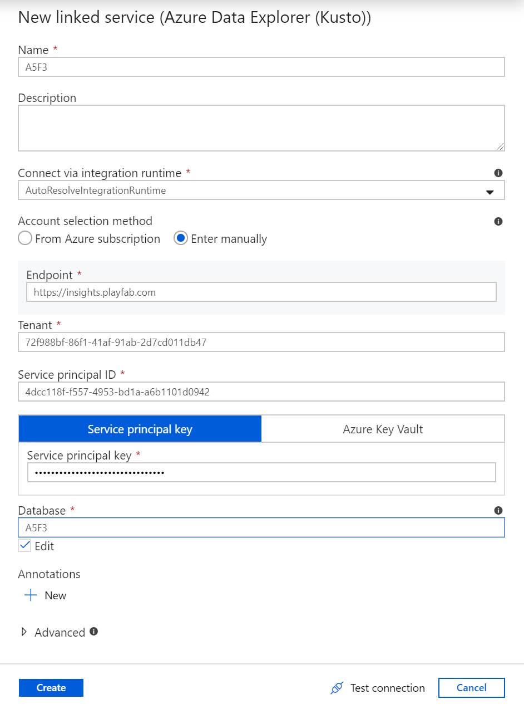

# Tutorial: Connecting Azure Data Factory (ADF) to Insights

This guide helps you get started using Azure Data Factory (ADF) along with Insights. After connecting, you can use Azure Data Factory to create workflows for orchestrating data movement and transforming game data at scale. To learn more about other tools you can connect Insights with, see [Connecting external tools to Insights](index.md).

In this tutorial you learn how to:

> [!div class="checklist"]
> * Create a data factory in Azure
> * Create a pipeline

> [!NOTE]
> PlayFab Insights Management was deprecated on December 11th, 2023. We recommend using [Azure Data Explorer (ADX) Connections](../../export-data/data-connection-adx.md) to manage your performance and cost going forward. If your title is still using **Insights**, continue to see this article for implementation details. For more information, see [Insights Deprecation Blog](https://developer.microsoft.com/en-us/games/articles/2023/09/playfab-insights-management-to-be-deprecated-starting-december-11/).

## Prerequisites

### PlayFab account authenticated with AAD

You need a PlayFab account or user for which the authentication provider is set to Microsoft. The Microsoft authentication provider uses Azure Active Directory (AAD) for authentication which is required to use the Azure services. See [Azure Active Directory Authentication for Game Manager](../../../features/authentication/aad-authentication/index.md) for instructions on creating an AAD-authenticated account or user.

To verify that the account, or user, is set to use the Microsoft authentication provider:

* Navigate to [developer.playfab.com](https://developer.playfab.com).
* Select **Sign in with Microsoft** to access your PlayFab account.

If you can sign in, then the account is set to use the Microsoft authentication provider.

### Game Manager permissions for Insights

You need to assign your account a [user role](../../../gamemanager/playfab-user-roles.md) with the following Game Manager permissions enabled:

* Admin status.
* Access to the Explorer tab and associated data.
* Read and write access to Analytics data.

You can either create a new user role or add these permissions to an existing role.

### Other prerequisites

*  [Create an Azure Active Directory (AAD) application and connect it to your title database](creating-AAD-app-for-insights.md)

## Create a new data factory

To create a new data factory:

1. Sign in to the [Azure portal](https://portal.azure.com). From the homepage under **Azure Services**, select **Create a resource**. Search for **Data Factory**, select it and then select **Create**.

   

2. Fill out the required fields:
   * For **Name**, choose a name for your data factory. The name must be *globally unique*.
   * For **Subscription**, select your Azure subscription in which you want to create the data factory.
   * For **Resource Group**, use one of the following steps:
     * Select **Use existing**, and select an existing resource group from the list.
     * Select **Create new**, and enter the name of a resource group.
   * You do not need to enable GIT right now, so uncheck the box below.

   

3. Select **Create**. After the deployment completes, under **Next steps** select **Go to resource**.

4. To open the Data Factory UI in a separate tab, select **Author & Monitor**.

## Create a pipeline

We are now going to create a new pipeline to get data from Insights. To create a pipeline:

1. On the **Let's get started** page, select **Create pipeline**.

2. In the **Activities** panel under **Azure Data Explorer**, drag and drop an **Azure Data Explorer Command** into the blank workspace. In the bottom panel under **General**, fill out the name and description.

    

3. Select the **Connection** tab and select **New**. 

    

4. In the **New linked service (Azure Data Explorer (Kusto))** window, fill out the fields:
    * For **Name**, use the Title ID.
    * For **Account selection method**, select **Enter manually**.
    * For the **Endpoint**, use the PlayFab API endpoint, which is `https://insights.playfab.com`.
    * For **Service Principal ID**, enter your Client ID from your Azure app.
    * For **Service Principal Key**, enter your Client secret from your Azure app.
    * In the **Database** box, type the Title ID in all upper case.

    

    Select **Create**. Now the pipeline is ready. You can go back to the main pipeline view by clicking the pipeline name.

5. To verify that all of the information is correct, select **Test connection**. If everything is set up correctly, it returns a Connection successful response.

   

6. To validate and debug the pipeline, in the toolbar above the workspace, select **Validate** and then select **Debug**.

## Additional resources

* [Azure Data Factory (ADF) documentation](/azure/data-factory/)
* To learn about other tools to connect to Insights, see  [Connecting external tools to Insights](index.md)
