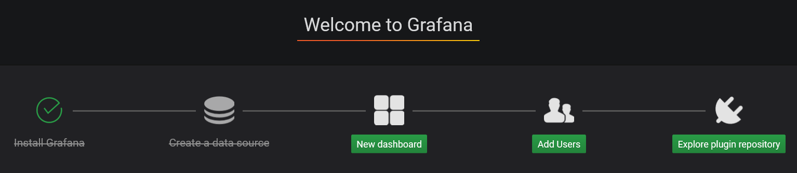
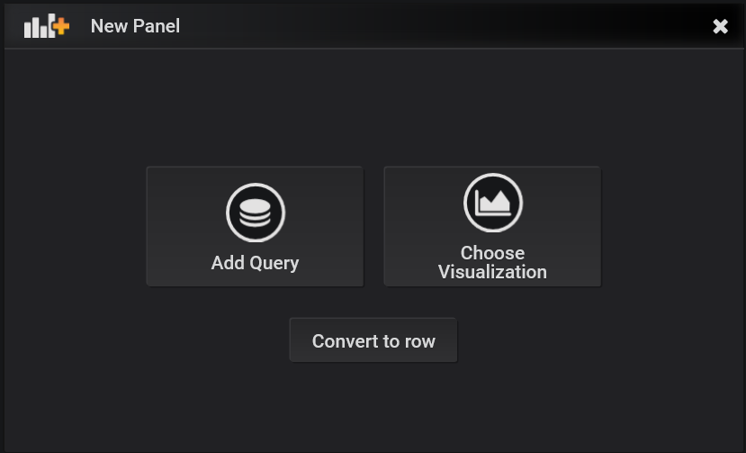
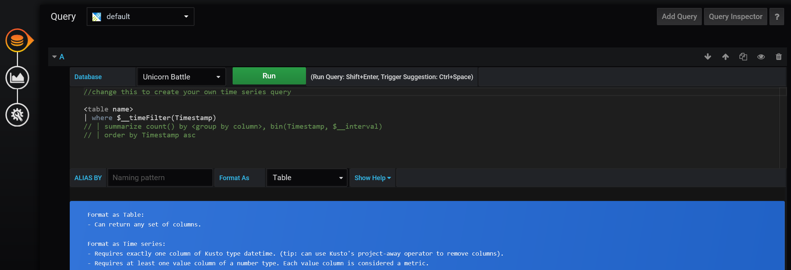
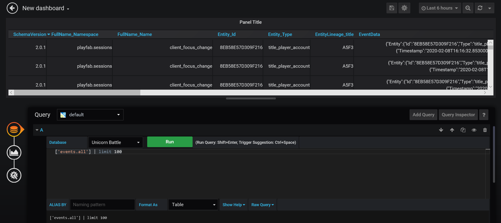

# Tutorial: Connecting Grafana to Insights

This guide helps you get started using Grafana along with Insights. After connecting, you can use Grafana to run analytics and monitoring systems on your game data from Insights. To learn more about other tools you can connect Insights with, see [Connecting external tools to Insights](index.md).

In this tutorial you learn how to:

> [!div class="checklist"]
> * Set up Grafana for Insights
> * Create a data source in Grafana
> * Create a dashboard in Grafana
> * Run Kusto queries and commands using the dashboard

> [!NOTE]
> PlayFab Insights Management was deprecated on December 11th, 2023. We recommend using [Azure Data Explorer (ADX) Connections](../../export-data/data-connection-adx.md) to manage your performance and cost going forward. If your title is still using **Insights**, continue to see this article for implementation details. For more information, see [Insights Deprecation Blog](https://developer.microsoft.com/en-us/games/articles/2023/09/playfab-insights-management-to-be-deprecated-starting-december-11/).

## Prerequisites

### PlayFab account authenticated with Microsoft Entra ID

You need a PlayFab account or user for which the authentication provider is set to Microsoft. The Microsoft authentication provider uses Microsoft Entra ID (previously Azure Active Directory (AAD)) for authentication that is required to use the Azure services. See [Azure Active Directory Authentication for Game Manager](../../../features/authentication/aad-authentication/index.md) for instructions on creating an Microsoft Entra ID authenticated account or user.

To verify that the account, or user, is set to use the Microsoft authentication provider:

* Visit [developer.playfab.com](https://developer.playfab.com).
* Select **Sign in with Microsoft** to access your PlayFab account.

If you can sign in, then the account is set to use the Microsoft authentication provider.

### Game Manager permissions for Insights

You need to assign your account a [user role](../../../gamemanager/playfab-user-roles.md) with the following Game Manager permissions enabled:

* Admin status.
* Access to the Explorer tab and associated data.
* Read and write access to Analytics data.

You can either create a new user role or add these permissions to an existing role.

### Other prerequisites

* [Create a Microsoft Entra ID application and connect it to your title database](creating-AAD-app-for-insights.md)

## Get set up with Grafana

1. There are two ways to get Grafana. You can [create a free account](https://grafana.com/login) and download Grafana to run on your computer. Or, if you have a paid Grafana Cloud subscription, you can use your online hosted instance.

2. Install the [Azure Data Explorer](https://grafana.com/grafana/plugins/grafana-azure-data-explorer-datasource) plugin for Grafana.

## Create a new data source in Grafana

Now that your title database is linked to an Azure app, you can use the app to connect with Grafana. To create a new data source:

1. Log in to Grafana.

2. On the **Welcome to Grafana** page, select **Add data source**.

3. On the **Add Datasource** page, select the **Azure Data Explorer Datasource**. You can search for it with the search bar or find it listed under the section **Others**. If you don't see the **Azure Data Explorer Datasource** option, you need to install the Azure Data Explorer Datasource For Grafana plugin.

   

4. On the **Azure Data Explorer Datasource** configuration page:

   * For **Cluster URL**, enter the PlayFab API endpoint, which is `https://insights.playfab.com`.
   * Enter your **Tenant Id**, **Client Id**, and **Client secret** from your Microsoft Entra ID application into their respective fields.
   * Select **Save & Test**. You should see a **Connection Successful** return message.
   * From **Default Database**, select your Title ID or database name. This field automatically populates after you successfully save and test the datasource. If it doesn't show up after a successful connection, try exiting and reopening the configuration page.

   

## Create a dashboard

From the Grafana homepage we'll create a new dashboard. To create a dashboard:

1. Select **New dashboard**.

   

2. In the **New Panel** dialog box, select **Add Query**.

   

3. In the **Query** panel next to **Database**, select your database from the drop-down menu. In this example the database name is **Unicorn Battle**.

   

## Run Kusto queries and commands

Now you're going to use your newly created Dashboard to run Kusto queries and commands on your database. To run a query:

1. In the **Query** panel next to **Format As**, select **Table** from the drop-down menu.

   

2. Use the icons on the left to switch to the Visualization panel. Select the drop-down menu to the right of **Visualization**, then select the **Table** option.

   

3. Return to the **Query** tab. Enter a query and select **Run**. The results appear in the table above the **Query** tab. In this example, we ran the query `['events.all'] | limit 100`.

   

   Running a Kusto command follows the same process. Enter your command in the **Query** tab and select **Run**. The results are displayed above. In this example, we ran the command `.show tables`.

   

## More resources

* [Grafana documentation](https://grafana.com/docs/grafana/latest/)
* To learn about other tools to connect to Insights, see  [Connecting external tools to Insights](index.md).
