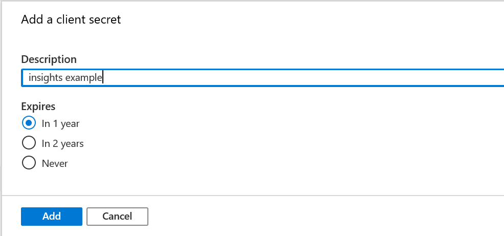

# Tutorial: Create a Microsoft Entra ID Application to use with Insights

This tutorial covers creating a Microsoft Entra ID application to use with Insights, which is one of the prerequisites for connecting the following tools with Insights:
* Azure Data Factory (ADF)
* Grafana
* Python

> [!NOTE]
> PlayFab Insights Management was deprecated on December 11th, 2023. We recommend using [Azure Data Explorer (ADX) Connections](../../export-data/data-connection-adx.md) to manage your performance and cost going forward. If your title is still using **Insights**, continue to see this article for implementation details. For more information, see [Insights Deprecation Blog](https://developer.microsoft.com/en-us/games/articles/2023/09/playfab-insights-management-to-be-deprecated-starting-december-11/).

## Prerequisites
* An Azure account with an active subscription. [Create an account for free](https://azure.microsoft.com/free)  

## Create a Microsoft Entra ID application

To create a Microsoft Entra ID application to link to your title database:

1. Log into the [Azure portal](https://portal.azure.com). If you don't have an Azure subscription, [create a free account](https://azure.microsoft.com).

2. After logging into the portal, use the search bar to find and select **App Registrations**. Then, select **New registration** in the upper left-hand corner.  

   

3. In the Register an application window, enter a name for your registration, then select which account types you would like this registration to support. (If you need help deciding, select the **Help me choose** link, which will open a window with more information.)

     

4. Select **Register**. You'll be directed to a page with an overview of your newly registered application. Save the **Application (client) ID** and **Directory (tenant) ID** somewhere (you'll need these later).

5. In the navigation panel on the left-hand side select **Certificates & secrets** -> **New client secret**. 

   

6. Enter a description for the secret and select how long you would like it to be valid. 

   

7. Select **Add**, and the new secret will appear below **Client secrets**. Now make sure to copy the secret key and save it somewhere secure. *It's essential that you do this now, since you won't be able to access the secret key once you leave this page.*

## Connect the Microsoft Entra ID app to your title database

Now we'll connect the Azure app to your title database. 

1. From the **Explorer** page in GameManager or in Kusto Explorer, run the following command, replacing with your own Title ID and client/tenant ID:
   > `.add database <titleID> Admin ('aadapp=<app/client ID>;<tenant ID>') `

   `titleID` is case sensitive, so make sure it is in all caps.

   

   You can verify that this command was successful by going to the **Users** page in [GameManager](https://developer.playfab.com). There should be an entry that matches the Client/Tenant ID.

   Note that this will make the Azure app an Admin on your game in PlayFab. If you would like the Azure app to have lesser permissions, assign the Azure app a [custom role](../../../gamemanager/playfab-user-roles.md) in PlayFab that only has permissions for the Kusto database. The necessary permissions are:
   * **Explorer data & tab**.
   * **Analytics data read access**, to run queries and simple management commands.
   * **Analytics data write access**, to create/drop tables, alter retention policy, ingest data, purge.

> [!NOTE] 
> Changing the roles for the application is only possible through **Roles -> Edit Role Members** Menu if you don't want to assign an email address to your application 

   

   ## Next steps

   Now that you have created an Azure app and linked it to your title database, follow the steps to connect your tool of choice with Insights:
   *  [Connect with Azure Data Factory (ADF)](connecting-azure-data-factory-to-insights.md)
   * [Connect with Grafana](connecting-grafana-to-insights.md)
   * [Connect with Python](connecting-python-to-insights.md)
