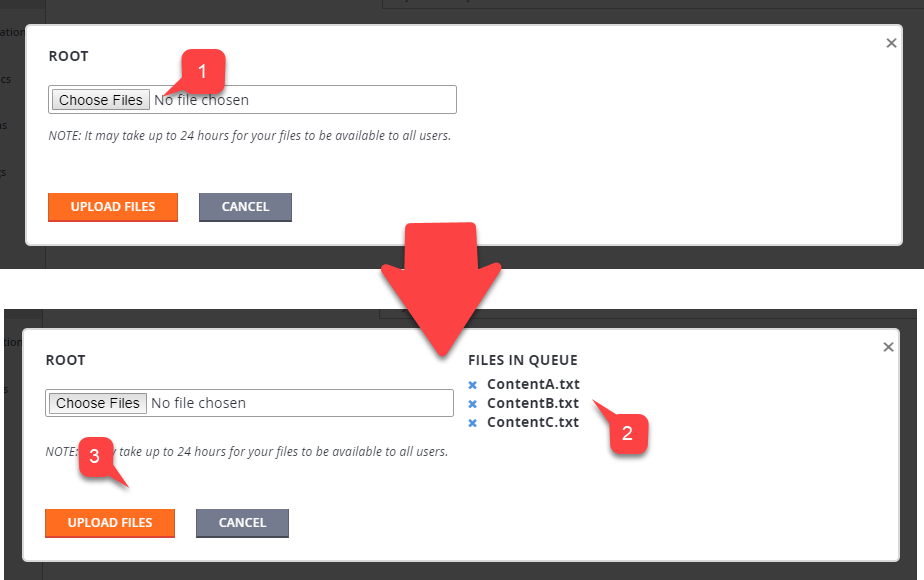

# Content Delivery Network quickstart

> [!IMPORTANT]
> PlayFab CDN is a legacy feature supported for accounts with at least one title that has previously configured CDN. For new PlayFab developers interested in a content management solution, we recommend using Azure CDN. To get started, see the [Azure CDN documentation](/azure/cdn/).

The PlayFab Content Delivery Network (CDN) stores individual assets as files uniquely identified by the file name (also referred to as a *key*). This implies that you add, update, remove, and retrieve assets by key.

PlayFab CDN allows segregating assets by folders. The folder path to the asset becomes part of the *asset key*.

The following example is a valid asset key stored inside the folder named `Android`.

 `Android/Image.png`.

When the user is fetching assets, their requests are automatically routed to the nearest edge location, so content is delivered with the best possible performance.

This, however, can introduce delays into file management actions, like those found in the following examples:

- **File uploading**: Your file is available immediately.

- **File overwriting**: The old file appears to users for up to 24 hours, until it's overwritten with the new file.

- **File deletion**: The file continues to exist for up to 24 hours, while the delete command removes it from all edge locations.

## Uploading assets

Before your users are able to fetch an asset, it must be uploaded to the CDN. This can be done in **Game Manager**:

- Select **Content** from the menu on the left.
- Choose the **File Management** tab.
- Then select the **Upload Files**.

  

You can:

- Select multiple **Files (1)**.
- Every file selected appears in the list **(2)**.
- Submit your files by selecting the **Upload Files** button **(3)**.

  

- Uploaded files appear in the list **(1)**.
- Keep in mind that you might also manage *folders*.
  - To create a folder, select the **New Folder** button **(2)**.


- Fill in the **Folder name (1)**.
- Select the **Create Folder** button **(2)**.

  

This creates a new folder in the tree. You might then select this folder, and upload the files normally.

Alternatively, you can upload assets via code using the admin SDK. This is a two step process:

1. First, call [GetContentUploadUrl](xref:titleid.playfabapi.com.admin.content.getcontentuploadurl) and obtain the presigned URL that authorizes your upload.
2. Then, use the URL to make a `HTTP PUT` request,  provide your data, and (optionally) content type.

Consider using the snippet provided below that shows how to get a presigned URL.

```csharp
public void UploadFileToCDN(string key, byte[] content, string contentType = "binary/octet-stream") {
    GetUploadUrl(key, contentType, presignedUrl => {
        PutFile(presignedUrl, content, contentType);
    });
}

void GetUploadUrl(string key, string contentType, Action<string> onComplete) {
    PlayFabAdminAPI.GetContentUploadUrl(new GetContentUploadUrlRequest() {
        ContentType = contentType,
        Key = key
    }, result => onComplete(result.URL),
    error => Debug.LogError(error.GenerateErrorReport()));
}

void PutFile(string presignedUrl, byte[] content, string contentType = "binary/octet-stream") {
    // Implement your own PUT HTTP request here.
    // - Must use PUT method
    // - Must set content type Header
}
```

You can then check the result through the PlayFab Game Manager. Make sure the file is in the list.

## Fetching assets

Downloading the asset via code is identical to uploading the asset. As was mentioned earlier, it's a two step process.

1. First, make a call to [GetContentDownloadUrl](xref:titleid.playfabapi.com.client.content.getcontentdownloadurl) and obtain a presigned URL that authorizes your download.
2. You then use the  presigned URL to make a `HTTP GET` request, and fetch the data.

Consider using the snippet provided below that shows the bare bones of the process.

```csharp
public void DownloadFileFromCDN(string key) {
    GetDownloadUrl(key, presignedUrl =>
    {
        GetFile(presignedUrl);
    });
}

void GetDownloadUrl(string key, Action<string> onComplete) {
    PlayFabClientAPI.GetContentDownloadUrl(new GetContentDownloadUrlRequest() {
        Key = key,
        ThruCDN = true
    }, result => onComplete(result.URL),
    error => Debug.LogError(error.GenerateErrorReport()));
}

void GetFile(string preauthorizedUrl) {
    // Implement your own GET HTTP request here.
}
```

As mentioned before, CDN might involve latency in regards to file updates. During development, it's sometimes useful to force-fetch the latest, freshest files.

The  [GetContentDownloadUrl](xref:titleid.playfabapi.com.client.content.getcontentdownloadurl) call allows you to set the `ThruCDN` parameter to `False`. The URL returned points to noncached fresh files.

> [!NOTE]
> Your published game client should *never* use this option!
