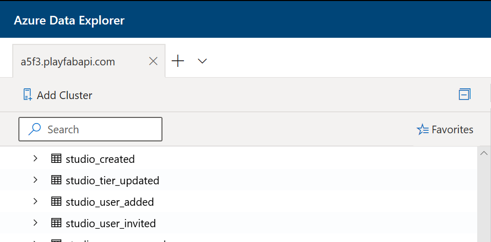

# Tutorial: Connecting Azure Data Explorer to Insights

This guide helps you get started using Azure Data Explorer (ADX) along with Insights. After connecting, you can use Azure Data Explorer to query your game data and discover relevant insights. To learn more about other tools you can connect Insights with, see [Connecting external tools to Insights](index.md).

## Prerequisites
* ### PlayFab account authenticated with AAD
   You need a PlayFab account or user for which the authentication provider is set to Microsoft. The Microsoft authentication provider uses Azure Active Directory (AAD) for authentication which is required to use the Azure services. See [Azure Active Directory Authentication for Game Manager](../../authentication/aad-authentication/index.md) for instructions on creating an AAD-authenticated account or user. 
   
   To verify that the account, or user, is set to use the Microsoft authentication provider:
   * Visit the PlayFab [log in page](https://developer.playfab.com/login).
   * Use the the Sign in with Microsoft link to access your PlayFab account.
   
   If you can sign in, then the account is set to use the Microsoft authentication provider.

* ### Game Manager permissions for Insights
   You need to assign your account a [user role](https://docs.microsoft.com/gaming/playfab/features/config/gamemanager/playfab-user-roles) with the following Game Manager permissions enabled:
   * Admin status.
   * Access to the Explorer tab and associated data.
   * Read and write access to Analytics data.

   You can either create a new user role or add these permissions to an existing role.

## Connect with Azure Data Explorer (ADX)
 
To connect with Azure Data Explorer:

1. Open [Azure Data Explorer](https://dataexplorer.azure.com/). Select **Add Cluster**. 

   

2. Enter the PlayFab API endpoint, which is `https://insights.playfab.com`. 
3. Select **Add**. Now are you able to execute queries or commands on the database. 

## Additional resources

* [Azure Data Explorer documentation](/azure/data-explorer/)
* To learn about other tools to connect to Insights, see [Connecting external tools to Insights](index.md)
