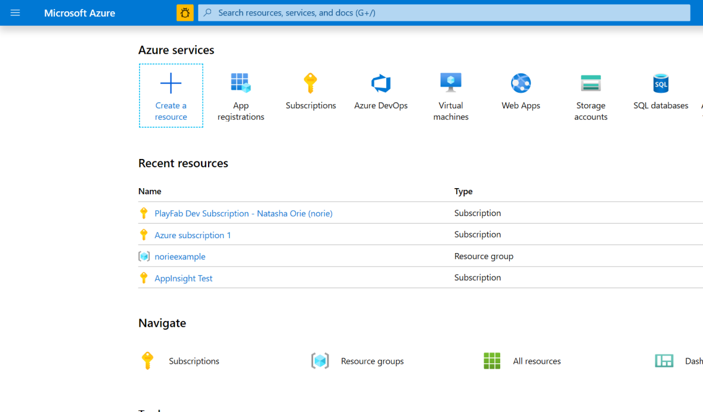
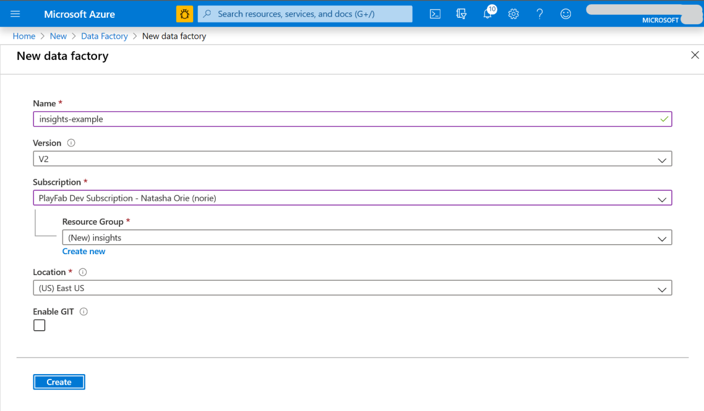
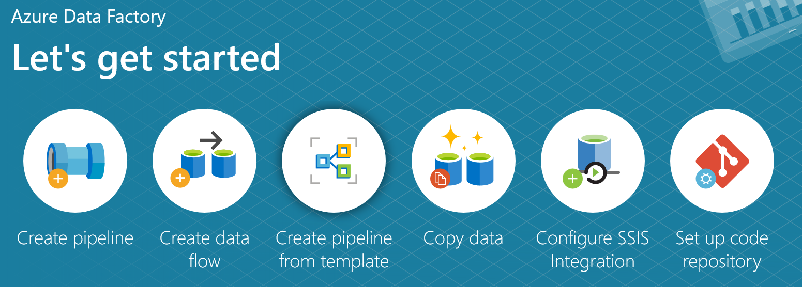
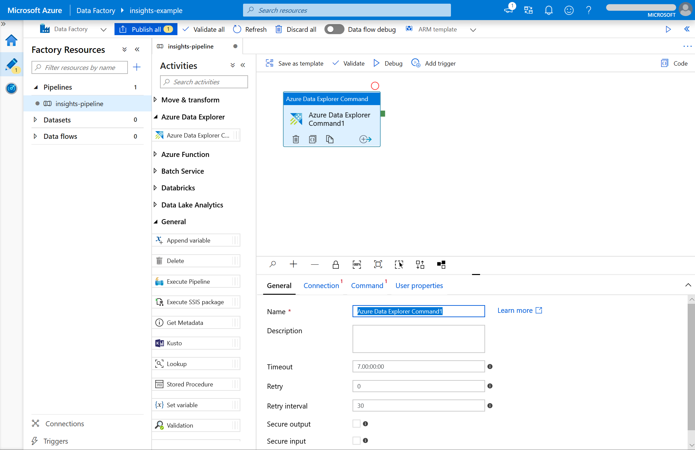
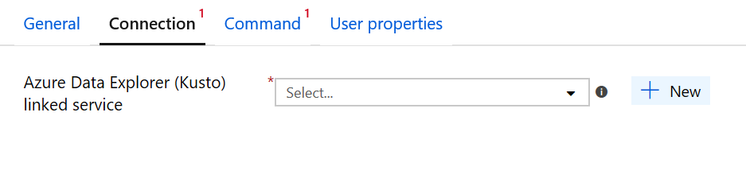
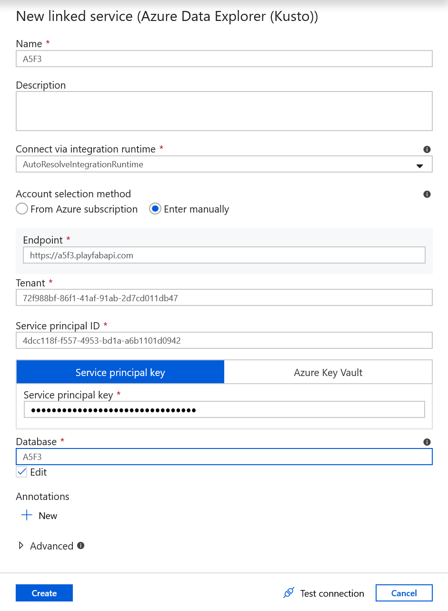
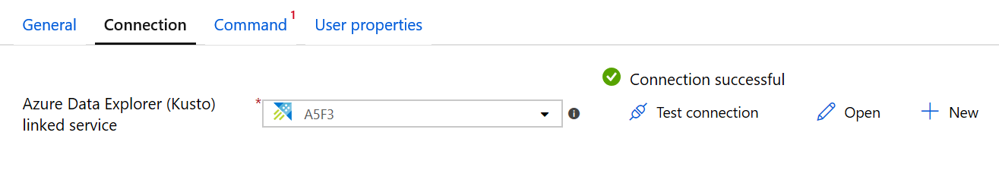

# Tutorial: Connecting Azure Data Factory (ADF) to Insights

This guide helps you get started using Azure Data Factory (ADF) along with Insights. To learn more about other tools you can connect Insights with, go to the [connectivity guide](index.md).

## Prerequisites
* A PlayFab user account authenticated with [AAD (Azure Active Directory)](https://docs.microsoft.com/gaming/playfab/features/authentication/aad-authentication/).
* The following [Game Manager permissions](https://docs.microsoft.com/gaming/playfab/features/config/gamemanager/playfab-user-roles#assigning-roles) enabled for your user:
    *  Admin status.
    *  Access to the Explorer tab and associated data.
    *  Read and write access to Analytics data.

## Create an Azure Active Directory (AAD) application and connect it to your title database

1. Follow the steps in this [guide](creating-AAD-app-for-insights.md) to create an Azure Active Directory (AAD) application and connect it to your title database.

## Create a new Data Factory
1. Login to the [Azure portal](https://portal.azure.com). From the homepage, select **Create a resource**. Search for and select **Data Factory**. Select **Create**.

   

2. Fill out the required fields:
   * Give your data factory a **Name**.
   * Select the **Azure subscription** that you would like to create it in.
   * Create a new **resource group** or select an existing one to use.
   * You do not need to enable GIT right now, so uncheck the box below.

   

3. Once the deployment has completed, under **Next steps** select **Go to resource**. 
   
4. Select **Author & Monitor** to open the Data Factory UI in a separate tab. 

## Create a pipeline

We are now going to create a new pipeline. 

1. On the **Let's get started** page, select **Create pipeline**.

   

 2. In the **Activities** panel under **Azure Data Explorer**, drag and drop an **Azure Data Explorer Command** into the blank workspace. In the bottom panel under **General**, fill out the name and description.
 
    

 3. Switch to the **Connection** tab and select **New**. 
 
    
 
 4. In the **New linked service (Azure Data Explorer (Kusto))** window, fill out the fields:
    * For **Name**, use the Title ID.
    * For **Account selection method**, select **Enter manually**.
    * For the **Endpoint**, use the title's API URL. It will follow the format `https://<titleid>.playfabapi.com`.
    * For **Service Principal ID**, enter your Client ID from your Azure app.
    * For **Service Principal Key**, enter your Client secret from your Azure app.
    * In the **Database** box, type the Title ID in all upper case.
   
    

   Select **Create**.

2.  Select **Test connection** to verify that all of the information is correct. If everything is set up correctly, it will return a **Connection successful** response. 

   

3. Finally, **Validate** and **Debug** the pipeline using the buttons in the toolbar above the workspace. 

## Additional resources

* Azure Data Factory (ADF) [documentation](https://docs.microsoft.com/azure/data-factory/).
* Connect [more tools](insights-connectivity.md) with Insights.