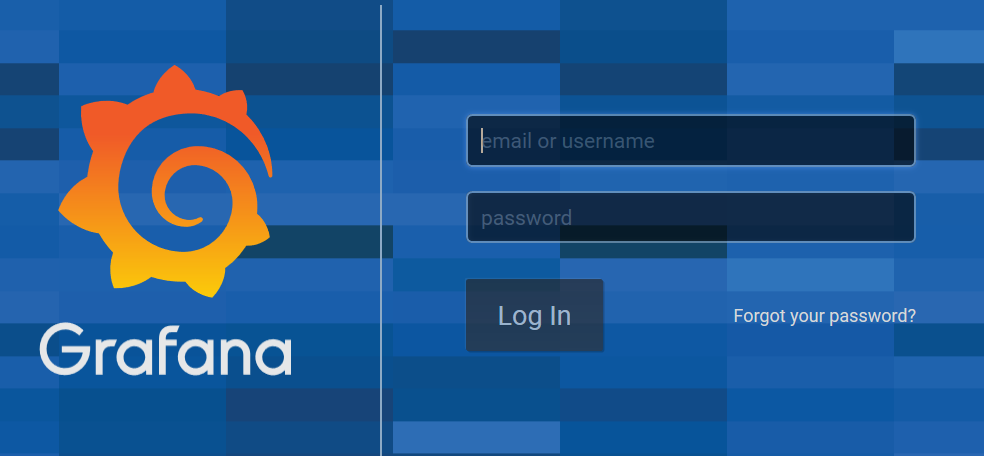
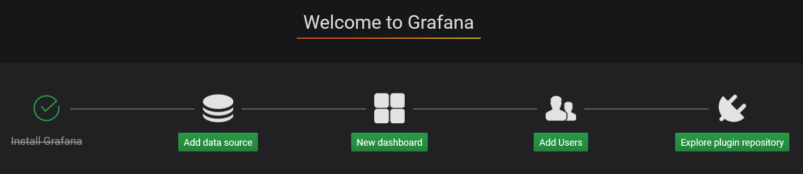
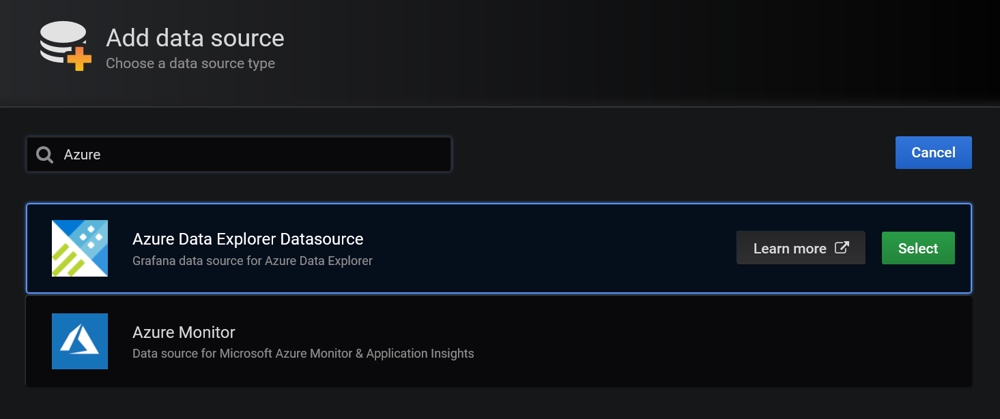
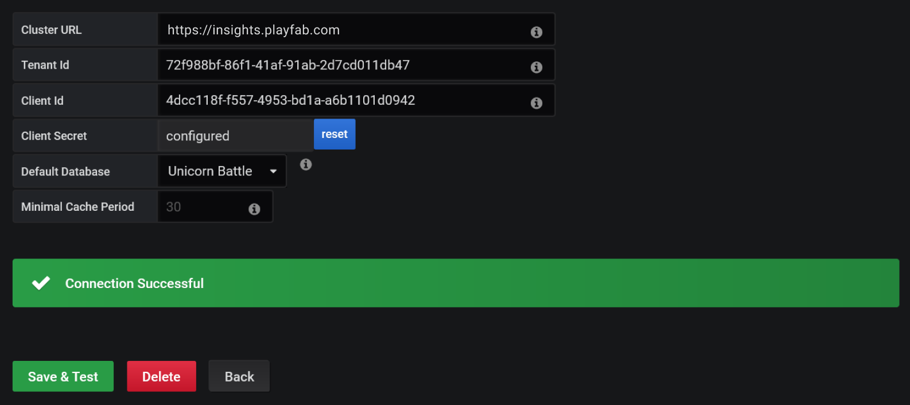
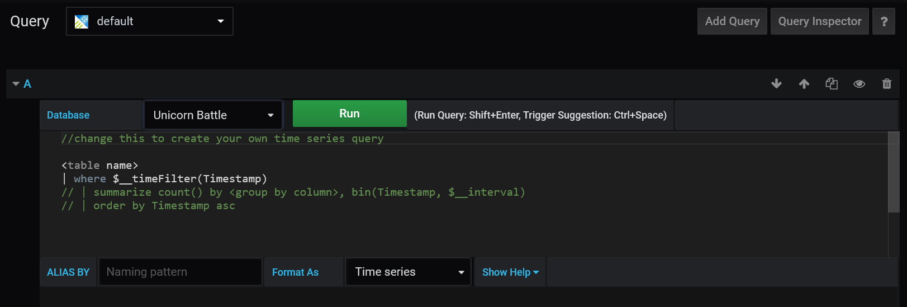
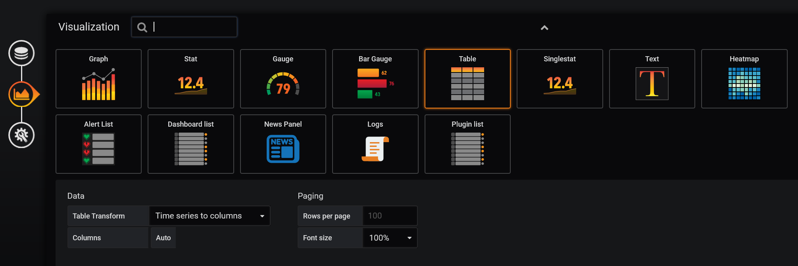
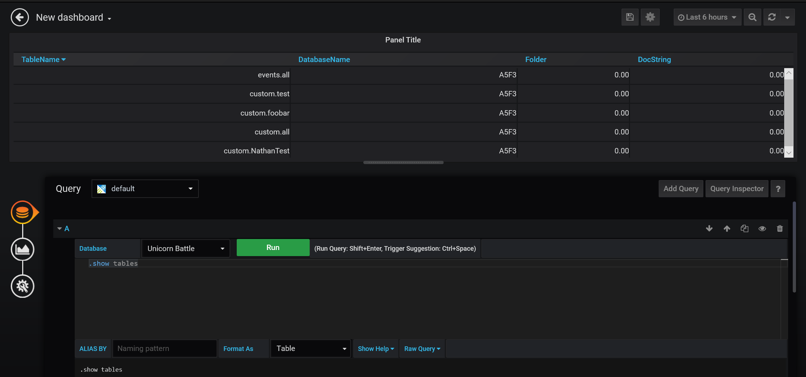

# Connecting Insights to Grafana

[comment]: < Replace links with relative links once placement of article is determined. >

This guide helps you get started using Insights along with Grafana. To learn more about other tools you can connect Insights with, go [here](insights-connectivity.md).

## Prerequisites
* A PlayFab user account authenticated with [AAD (Azure Active Directory)](https://docs.microsoft.com/gaming/playfab/features/authentication/aad-authentication/).
* The following [Game Manager permissions](https://docs.microsoft.com/gaming/playfab/features/config/gamemanager/playfab-user-roles#assigning-roles) enabled for your user:
    *  Admin status.
    *  Access to the Explorer tab and associated data.
    *  Read and write access to Analytics data.

## Get set up with Grafana
1. If you don't have a free Grafana account, create one [here](https://grafana.com/login). You can either download Grafana to run on your computer or use the online hosted instance. 

2. Install the Azure Data Explorer [plugin](https://grafana.com/grafana/plugins/grafana-azure-data-explorer-datasource) for Grafana.

## Create an Azure Active Directory (AAD) application

You are going to create a new AAD application to link to your title database. 

1. Log into the [Azure portal](https://portal.azure.com). If you don't have an Azure subscription, [create a free account](https://azure.microsoft.com).

2. After logging into the portal, use the search bar to find and select **App Registrations**. Then, select **New registration** in the upper left-hand corner.  

   

3. In the **Register an application** window enter a name for your registration, then select which account types you would like this registration to support. (If you need help deciding, select the **Help me choose** link which will open a window with more information.)

     

4. Select **Register**. You will be directed to a page with an overview of your newly-registered applcation. Save the **Application (client) ID** and **Directory (tenant) ID** somewhere (you will need these later).

5. In the navigation panel on the left-hand side select **Certificates & secrets** -> **New client secret**. 

   

6. Enter a description for the secret and select how long you would like it to be valid. 

   

7. Select **Add**, and the new secret will appear below **Client secrets**. Now make sure to copy the secret key and save it somewhere secure. *It's essential that you do this now, since you won't be able to access the secret key once you leave this page.*

## Connect the AAD app to your title database

Now we will connect the Azure app to your title database. 

1. From the Explorer page in GameManager or in Kusto.Explorer, run the following command, replacing with your own Title ID and client/tenant ID:
   > `.add database <titleID> Admin ('aadapp=<app/client ID>;<tenant ID>') `

   `titleID` is case sensitive, so make sure it is in all caps.

   

## Create a new data source in Grafana
Now that your title database is linked to an Azure app, you can use the app to connect with Grafana.

1. Log into Grafana.

   

2. On the **Welcome to Grafana** page, select **Add data source**. 

   

2. On the **Add Datasource** page, select the **Azure Data Explorer Datasource**. You can search for it with the searchbar or find it listed under the section **Others**. If you don't see the **Azure Data Explorer Datasource** option, you need to install the [plugin](https://grafana.com/grafana/plugins/grafana-azure-data-explorer-datasource).

   

3. On the **Azure Data Explorer Datasource** configuration page, take the following steps:
   *  For **Cluster URL**, enter your API endpoint. This will follow the format `https://<titleID>.playfabapi.com`.
   *  Enter your **Tenant Id**, **Client Id**, and **Client secret** from your Azure Active Directory (AAD) application into their respective fields. 
   *  Select **Save & Test**. You should see a **Connection Successful** return message.
   *  For **Default Database**, select your Title ID or database name. This should automatically populate after you successfully save and test the datasource. If it doesn't show up after a successful connection, try exiting and re-opening the configuration page. 

   

## Create a new Dashboard

1. Return to the Grafana homepage. Select **New dashboard**.

   

2. In the **New Panel** dialog box, select **Add Query**.

   

3. In the **Query** panel, select your own database from the drop-down menu. In this example our database is name **Unicorn Battle**.
   
   

## Run Kusto queries and commands

Now you are going to use your newly-created Dashboard to run Kusto queries and commands on your database. 

1. In the **Query** panel next to **Format As**, select **Table** from the drop-down menu.

   

2. Use the icons on the left to switch to the Visualization panel. Select the drop-down menu to the right of **Visualization**, then select the **Table** option.

   

3. Return to the **Query** tab. Enter a query and select **Run**. You will see the results appear in the table above the **Query** tab. In this example, we ran the query `['events.all'] | limit 100`.

   

   Running a Kusto command follows the same process. Simply enter your command in the **Query** tab and press **Run**. The results will be displayed above. In this example, we ran the command `.show tables`. 

   

## Additional resources

* Grafana [documentation](https://grafana.com/docs/grafana/latest/).