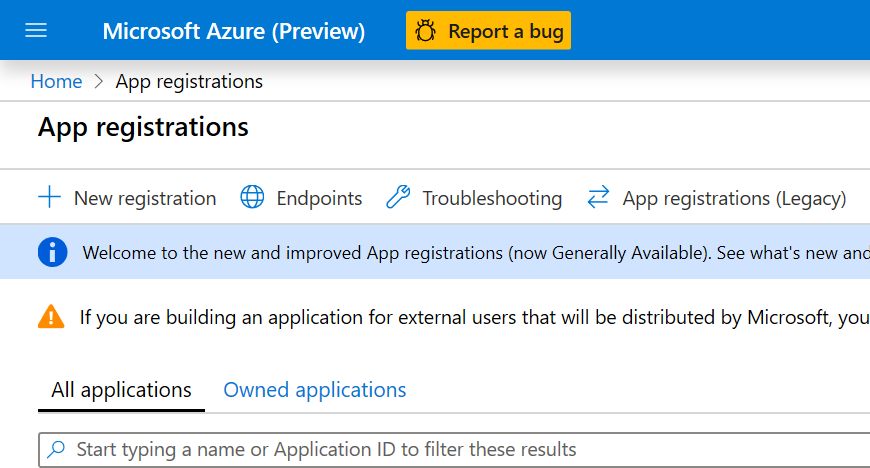
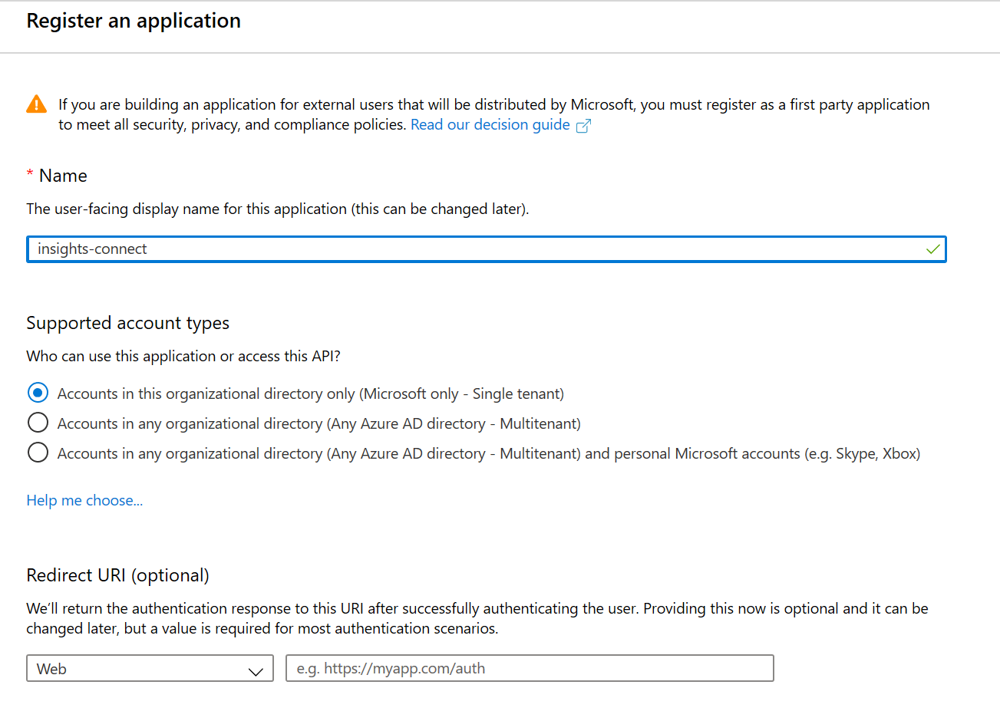
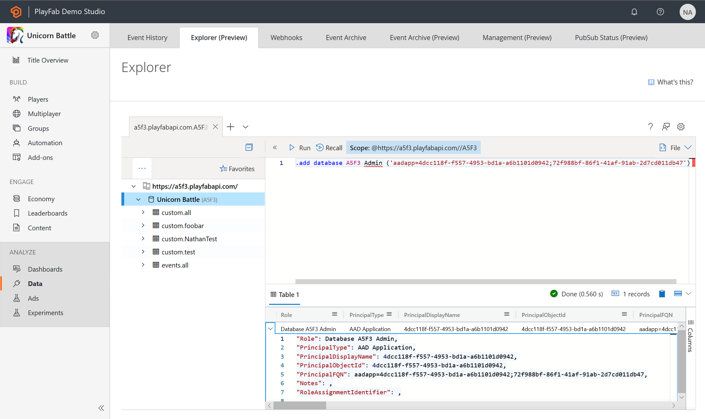
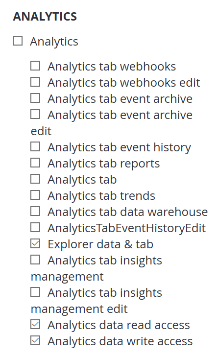

# Connecting Insights to Python

[comment]: < Replace links with relative links once placement of article is determined. >
This guide helps you get started using Insights along with Grafana To learn more about other tools you can connect Insights with, go [here](insights-connectivity.md).

## Prerequisites
* A PlayFab user account authenticated with [AAD (Azure Active Directory)](https://docs.microsoft.com/gaming/playfab/features/authentication/aad-authentication/).
* The following [Game Manager permissions](https://docs.microsoft.com/gaming/playfab/features/config/gamemanager/playfab-user-roles#assigning-roles) enabled for your user:
    *  Admin status.
    *  Access to the Explorer tab and associated data.
    *  Read and write access to Analytics data.

## Create an Azure Active Directory (AAD) application

You are going to create a new AAD application to link to your title database. 

## Create a new Azure app

1. Log into the [Azure portal](https://portal.azure.com) and create a new Azure App. If you don't have an Azure subscription, [create a free trial account](https://azure.microsoft.com).

2. After logging into the portal, use the search bar to find and select **App Registrations**. Then, select **New registration** in the upper left-hand corner.  

   

3. In the **Register an application** window enter a name for your registration, then select which account types you would like this registration to support. (If you need help deciding, select the **Help me choose** link which will open a window with more information.)

     

## Connect the AAD app to your title database

Now we will connect the Azure app to your title database. 

1. From the Explorer page in GameManager or in Kusto.Explorer, run the command:
   > `.add database <titleID> Admin ('aadapp=<app/client ID>;<tenant ID>') `

   `titleID` is case sensitive, so make sure it is in all caps.

   

   You can verify that this command was successful by going to the **Users* page in [GameManager](https://developer.playfab.com/login). There should be an entry that matche the Client/Tenant ID.

   Note that this will make the Azure app an Admin on your game in PlayFab. If you would like the Azure app to have lesser permissions, assign the Azure app a [custom role](https://docs.microsoft.com/gaming/playfab/features/config/gamemanager/playfab-user-roles#assigning-roles) in PlayFab that only has permissions for the Kusto database. The necessary permissions are:
   * Explorer data & tab.
   * Analytics data read access.
   * Analytics data write access.

   

## Install Python packages

1. Install the following python packages using [pip](https://pypi.org/project/pip/):
   * azure-kusto-data
   * azure-kusto-ingest
   * adal