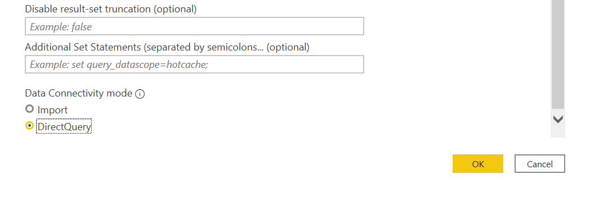

# Tutorial: Connecting Power BI to Insights

This guide helps you get started using Power BI along with Insights. To learn more about other tools you can connect Insights with, go to the [connectivity guide](index.md).

## Prerequisites
* A PlayFab user account authenticated with [AAD (Azure Active Directory)](https://docs.microsoft.com/gaming/playfab/features/authentication/aad-authentication/).
* The following [Game Manager permissions](https://docs.microsoft.com/gaming/playfab/features/config/gamemanager/playfab-user-roles#assigning-roles) enabled for your user:
    *  Admin status.
    *  Access to the Explorer tab and associated data.
    *  Read and write access to Analytics data.

## Connect with Power BI
Open [Power BI](https://powerbi.microsoft.com/desktop/) for desktop. 

###
1. In the **Power BI Desktop** window, select **Get Data** -> **Azure Data Explorer (Kusto)**.
2. In the **Azure Data Explorer (Kusto)** dialog box take the following steps:
   * Under **Cluster** enter your API endpoint, which follows the format `https://<titleid>.playfabapi.com`. 
   * Under **Database** enter your title ID in all uppercase, as Database names are case sensitive. 
   * Scroll down, and under **Data Connectivity mode** select **DirectQuery**.

   Optionally, enter a table or query. You can also set limits for max records or max size. Note that if your query exceeds these limits, it will fail as `PartialQueryFailure` and return a message saying you exceeded limits. 

   You can see in our example that we entered a query on the table `events.all` that returns events occuring in the last seven days. 

   
   

3. Select **OK**, and you should now be able to execute queries and commands on the database. 

## Additional resources

* Power BI [documentation](https://docs.microsoft.com/power-bi/).
* Connect [more tools](index.md) to Insights.