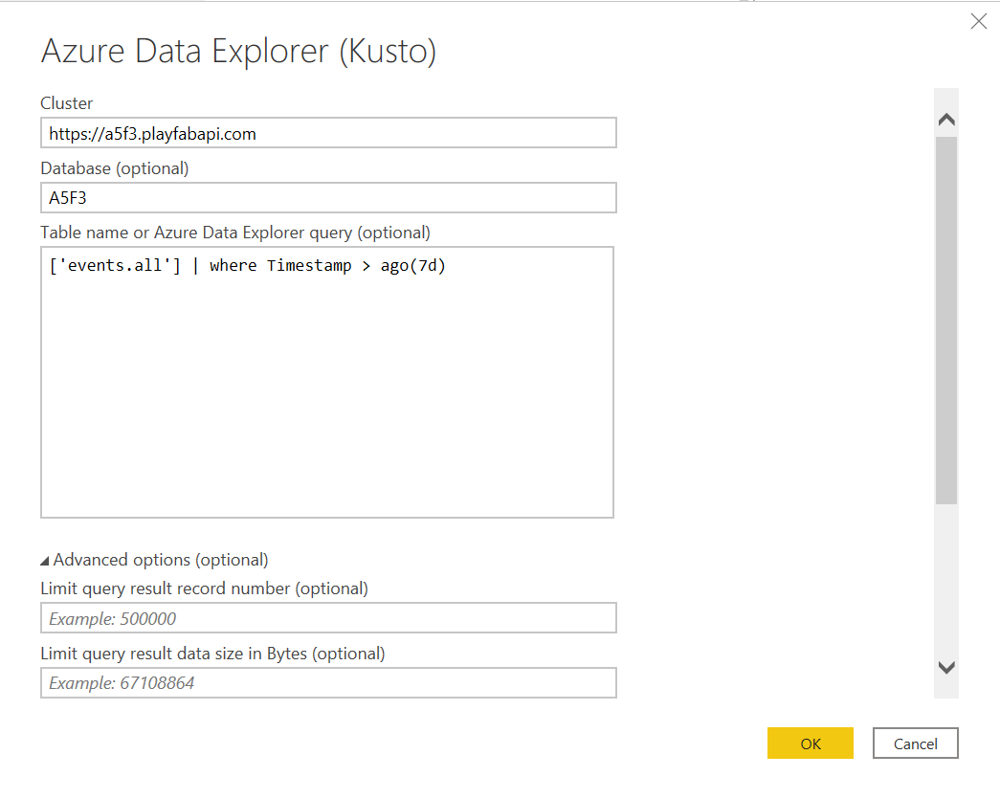
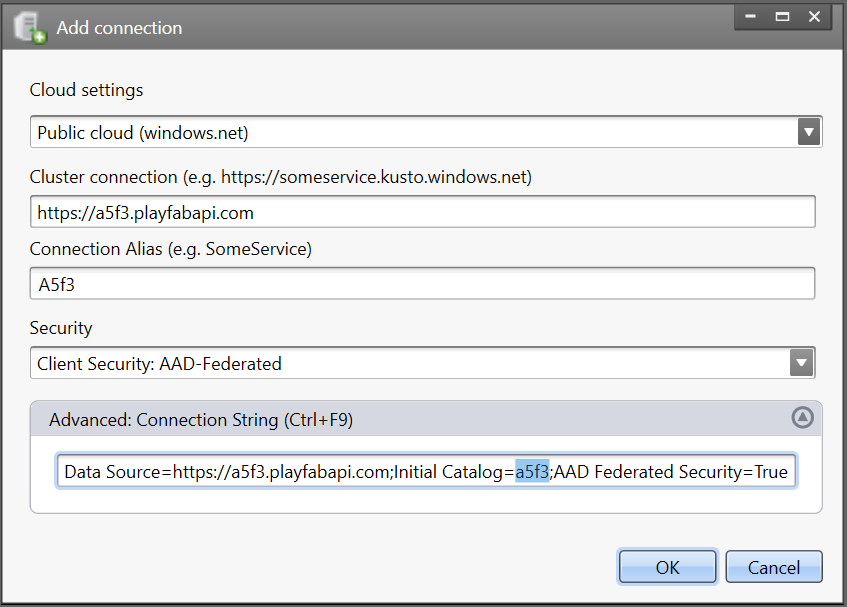
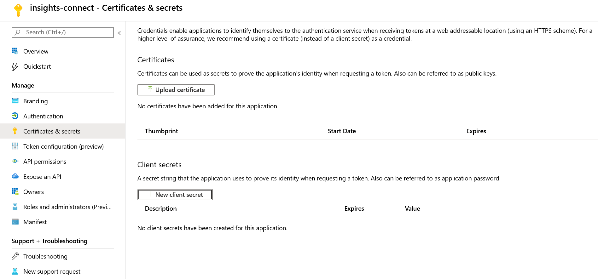

# Connecting Insights to other tools

[comment]: < Replace links with relative links once placement of article is determined. >

## Prerequisites
* A PlayFab user account authenticated with [AAD (Azure Active Directory)](https://docs.microsoft.com/gaming/playfab/features/authentication/aad-authentication/).
* The following [Game Manager permissions](https://docs.microsoft.com/gaming/playfab/features/config/gamemanager/playfab-user-roles#assigning-roles) enabled for your user:
    *  Admin status.
    *  Access to the Explorer tab and associated data.
    *  Read and write access to Analytics data.

Once you have completed all the prerequisites, proceed to the section on the tool that you would like to connect with. Currently you can connect Insights with: 
  - [Prerequisites](#prerequisites)
  - [Connect with Power BI](#connect-with-power-bi)
  - [Connect with Kusto Explorer](#connect-with-kusto-explorer)
  - [Connect with Azure Data Explorer (ADX)](#connect-with-azure-data-explorer-adx)
  - [Connect with Azure Data Factory (ADF)](#connect-with-azure-data-factory-adf)
  - [Connect with Grafana](#connect-with-grafana)
  - [Connect with Python](#connect-with-python)
  
## Connect with Power BI
Open [Power BI](https://powerbi.microsoft.com/desktop/) for desktop. Then, select **Get Data** -> **Azure Data Explorer (Kusto)**. Under **Cluster** enter your API endpoint, which will follow the format `https://<titleid>.playfabapi.com`. Under **Database** enter your title ID in all uppercase. Scroll down, and under **Data Connectivity mode** select **DirectQuery**.

Optionally, enter a table or query. You can also set limits for max records or max size. Note that if your query exceeds these limits, it will fail as `PartialQueryFailure` and return a message saying you exceeded limits. 

You can see in our example that we entered a query on the table `events.all` that returns events occuring in the last seven days. Select **OK**, and you should now be able to execute queries and commands on the database. 

## Connect with Kusto Explorer
Open [Kusto.Explorer](https://docs.microsoft.com/azure/kusto/tools/kusto-explorer). Next, add a connection. You can do this in two different ways:
* Select the **Connections** tab, then select **Add connection**.
* Right-click on the **Connections** folder in the left navigation panel, then select **Add connection**.

Under **Cluster connection** enter your API endpoint, which will follow the format `https://<titleid>.playfabapi.com`. Under **Security**, make sure **AAD Federated** is selected. Next, expand the **Advanced: Connection String** box and change the value of **Initial Catalog** from `NetDefaultDB` to `<titleID>`. In the example below, this change is highlighted in the string. 

Select **OK**, and you should now be able to execute queries and commands on the database.

## Connect with Azure Data Explorer (ADX)

Open [Azure Data Explorer](https://dataexplorer.azure.com/). Select **Add Cluster**. 

Enter your title API endpoint, which follows the format `https://<titleID>.playfabapi.com`. Select **Add**, and you should now be able to execute queries or commands on the database. 

## Connect with Azure Data Factory (ADF)

First, you will need to log into the [Azure portal](https://portal.azure.com) and create a new Azure App. If you don't have an Azure subscription, [create a free trial account](https://azure.microsoft.com).

After logging into the portal, use the search bar to find and select **App Registrations**. Then, select **New registration** in the upper left-hand corner.  

Enter a name for your registration, then select which account types you would like this registration to support. (If you need help deciding, select the **Help me choose** link which will open a window with more information.) Once you have filled out the fields, select **Register**. You will be directed to a page with an overview of your newly-registered applcation. Save the **Application (client) ID** and **Directory (tenant) ID** somewhere (you will need these later).

Next, in the navigation panel on the left-hand side select **Certificates & secrets** -> **New client secret**. 

Enter a description for the secret and select how long you would like it to be valid. 

Select **Add**, and the new secret will appear below **Client secrets**. Now make sure to copy the secret key and save it somewhere secure. It's essential that you do this now, since you won't be able to access the secret key once you leave this page.   

Now we will connect the Azure app to Kusto Explorer. 

## Connect with Grafana

## Connect with Python