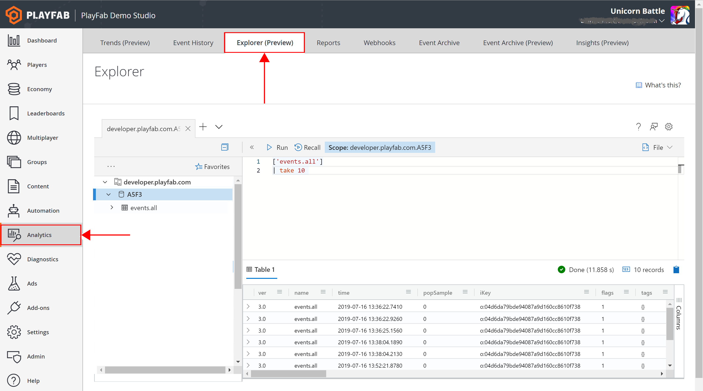
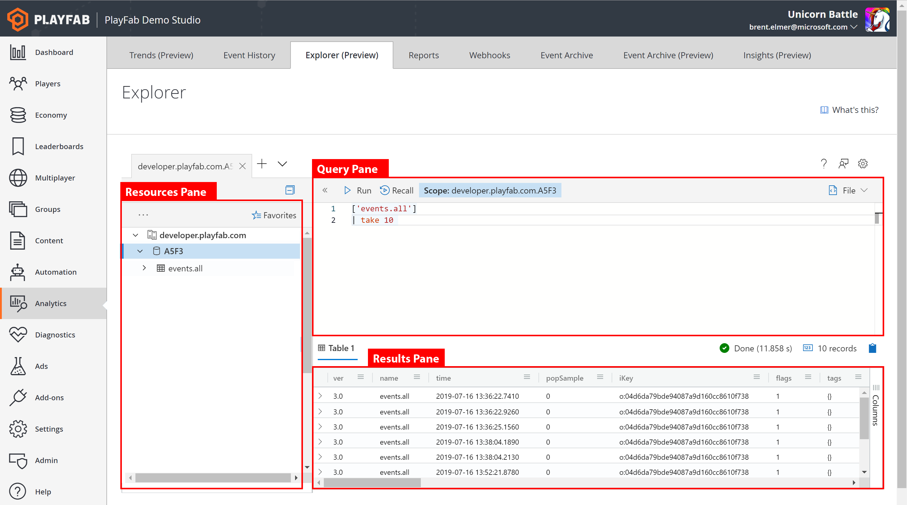
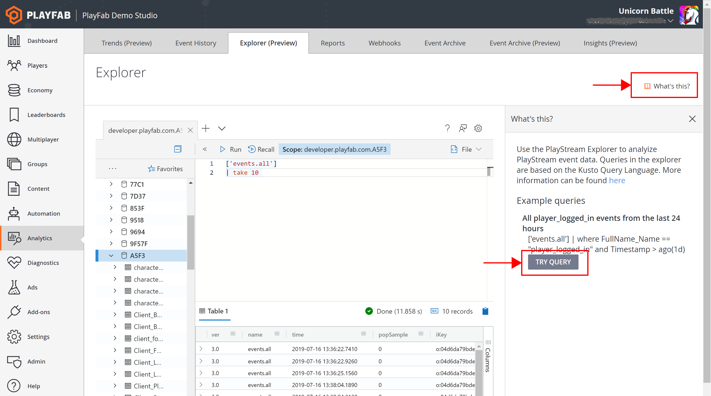

# Explorer quickstart

> [!NOTE]
> The Explorer Feature is in public preview. We anticipate ongoing changes to it as we continue gathering feedback and optimizing for customer use.

Access Explorer from PlayFab Game Manager from the Analytics left nav. You will find the Explorer tab along the top. 

From here, you’ll see the following interface:

First, press the “What’s This” button to display a set of sample queries. Choosing “Try Query” will load the 
query into the Query pane and automatically run it.  Let’s begin with the most basic: How many players 
logged in over the past 24 hours. 

To learn how to author custom queries, see the [Getting Started with PlayFab Explorer](getting-started-with-playfab-explorer.md) tutorial.
