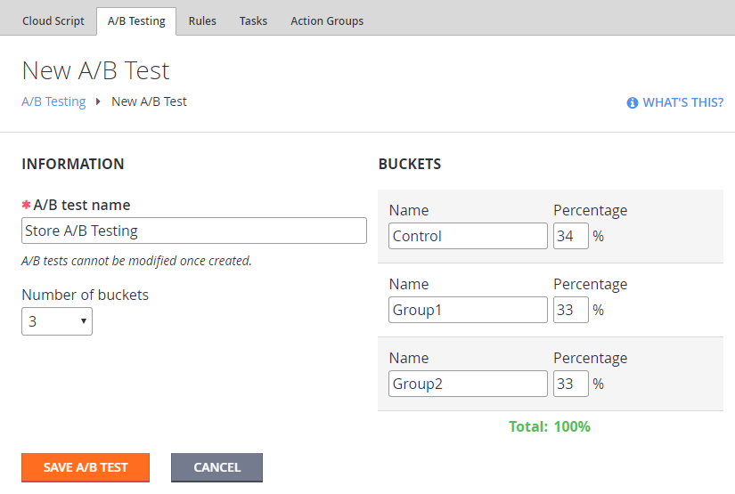
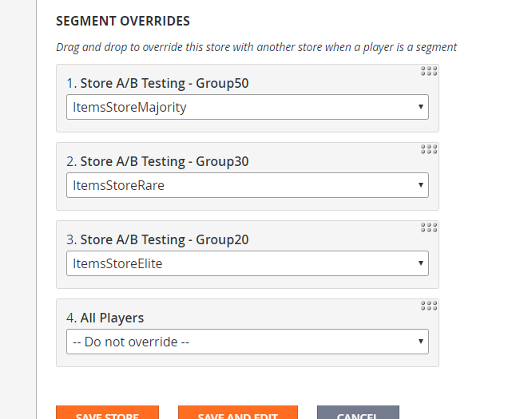

# A/B testing with Stores and Test Buckets

In our [Stores and Sales](../../commerce/stores/stores-and-sales.md) tutorial, we demonstrate how to set up a **Store** and make a few items available to a **Player** at special or alternate prices. In our [A/B Testing Quickstart](quickstart.md), we demonstrate how to create **A/B** tests and form **Player
Buckets** for random, percentage-based user distribution.

This tutorial lets you combine these features, and produce several versions of the **Store** available to different **A/B** testing **Groups** (**Buckets**).

We first define an **A/B** test. In this case we define a test called **Store A/B Testing** which splits **Users** into 3 **Groups**. The first **Group** (**Control**) contains 34% of all the **Players**. The other 2 test **Groups** each contain 33% of all **Players**.

  

Next, we create one **Store** to be the original version, and then we create 3 other **Stores**, which are **A/B** tested variations of the original.

Each **Store** is created independently, has its own unique identifier, and should have content that is customized for that segment (see below).

  

Return to the original **Store** page and locate the **Segment Overrides** section. It will not only contain the usual **Player Segments**, but it will *also* expose all the **Buckets** for all **A/B Tests** that you currently have.

Make sure your **A/B Test Buckets** are on the top of the list, and assign **Store** override settings for each bucket, as shown in the following picture.

Do not forget to *save the settings*. You have an **A/B Test** where **Players** are distributed into 3 **Groups** of **50%**, **30%** and **20%**.

For each **Group** of **Players**, you assign a different version of the **Store**. You may then use **A/B Testing Reports** to track user conversion for each version of the **Store**.

## Best practices for Store Segmentation

Please consult the following tutorial: [Best practices for Store Segmentation](../../commerce/stores/best-practices-for-store-segmentation.md).
