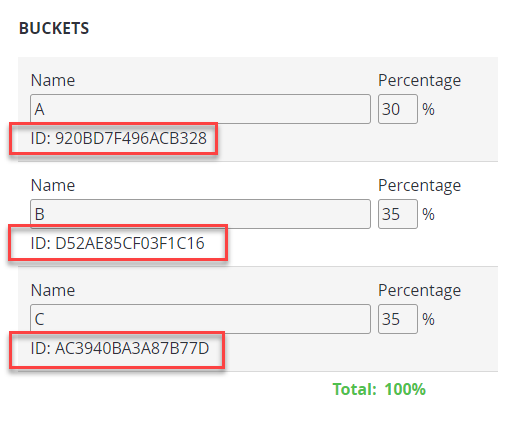
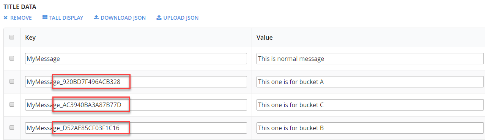
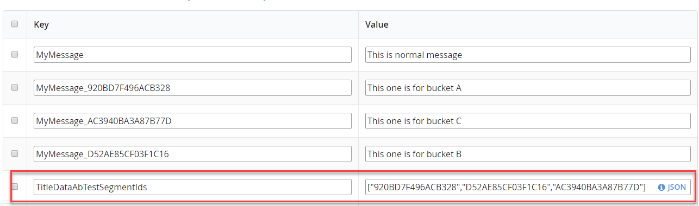

# A/B Testing with TitleData, A/B Test Buckets, and CloudScript

This tutorial illustrates how to complement PlayFab's built-in features with something which is not yet a fully integrated feature, yet. A/B Testing Title Data is a planned feature. However, It is possible to build your own solution now, using CloudScript:

**Requirements:**

- [Writing Custom Cloud Script](../../automation/cloudscript/writing-custom-cloudscript.md), and [Cloud Script File Management](../../automation/cloudscript/using-cloudscript.md)
- [Title Data](../../config/titledata/using-title-data.md)
- [A/B Testing](../../analytics/ab-testing/creating-ab-tests.md)

**Optional Requirements:**

- The final example uses [Unity](../../../sdks/unity3d/quickstart.md), but this technique can be used with any SDK.

## General Idea and Implementation

We already have a built-in feature of [defining A/B segments for player](../../analytics/ab-testing/creating-ab-tests.md). Let's reuse those segments to return Title Data based on which bucket our player belongs to.

First, we will need an A/B test. Please, follow the [Creating A/B Tests tutorial](../../analytics/ab-testing/creating-ab-tests.md) to create an A/B Test. Once the test is created, you will see the IDs of each of the individual buckets:

  

Functionally, a Bucket ID is the same as a normal Segment ID: an API call to [GetPlayerSegments](xref:titleid.playfabapi.com.server.playstream.getplayersegments) will return both Segment IDs and A/B Test Bucket IDs. We can use this to our advantage and introduce a convention for A/B-tested Title Data keys, as shown in the following picture:

  

We first introduce a regular entry with the key "MyMessage". We then introduce an A/B-version for each bucket. The key is composed using the original key and a suffix in the form '_BUCKETID'. At any point in time, if we are given an original key and segment ID, we can easily compose a key for an entry specific for this segment/bucket.

Our next step is defining one more entry - a list of all the bucket IDs participating in the testing. In this case we have three of those:

  

> [!NOTE]
> Make sure to use double quotes ( " ). Otherwise, the JavaScript runtime will not be able to parse it properly.

Now let us define a brand new API call using CloudScript. This API call is named "GetTitleDataAB" and performs a very simple procedure:

1. We receive a regular Title Data Key (ex. "MyMessage") from the client, via args.
2. We get all the bucket IDs participating in the testing
    - We do this by reading the "TitleDataAbTestSegmentIds" key from our title data.

3. We get all the segment IDs a player belongs to
    - We do this by making a call to [GetPlayerSegments](xref:titleid.playfabapi.com.server.playstream.getplayersegments) and passing the current player ID.

4. If a player does not belong to any bucket, we return the value for the original key:
    - For example, "MyMessage" -> "This is normal message".

5. If a player belongs to one of the tested segments, we assemble a new key using our convention and try to fetch the value for this key:
    - For example, if a player belongs to a bucket with the ID 920BD7F496ACB328, we read the value for the "MyMessage_920BD7F496ACB328" key.

6. If no bucket-specific value was defined, we, again, return the value for the original key.

Let's inspect the following implementation (please, read the code comments for further explanation):

```csharp
// Special key in the Title Data that contains an array of AB buckets that participate in the testing
var TITLE_AB_TEST_TITLE_KEY = "TitleDataAbTestSegmentIds";
handlers.GetTitleDataAB = function (args, ctx) {
    // The data key the player originally requested.
    var dataKey = args.TitleKey;

    // A variable to store AB segment of the player, if any
    var currentAbTestSegmentId = null;

    /*
     * We store a list of bucket IDs that participate in the AB testing in the title data.
     * This line extracts an array of such ids
     */
    var requestedTitleData = server.GetTitleData({ Keys: [TITLE_AB_TEST_TITLE_KEY, dataKey] });
    var defaultValue = requestedTitleData.Data.hasOwnProperty(dataKey) ? requestedTitleData.Data[dataKey] : null;
    var segmentIdJson = requestedTitleData.Data.hasOwnProperty(TITLE_AB_TEST_TITLE_KEY) ? requestedTitleData.Data[TITLE_AB_TEST_TITLE_KEY] : null;
    var abTestSegmentIds = JSON.parse(segmentIdJson);

    // This line extracts all the segments current player belongs to
    var playerSegments = server.GetPlayerSegments({ PlayFabId: currentPlayerId }).Segments;

    // Locate first ABTest segment the player belongs to
    for (var i = 0; i < playerSegments.length; i++) {
        var playerSegmentId = playerSegments[i].Id;
        if (abTestSegmentIds.indexOf(playerSegmentId) !== -1)
            currentAbTestSegmentId = playerSegmentId;
    }

    // If player does not belong to any tested segment, return a value for the original key
    if (!currentAbTestSegmentId)
        return defaultValue;

    /*
     * If player belongs to one of AB tested segments
     * we use ID of this segment to construct special key
     * First part of this key is the original key
     * Followed by underscore ('-') we add a suffix, which is ID of the bucket the player belongs to.
     */
    var abTestedKey = dataKey + "_" + currentAbTestSegmentId;

    // We try to get a value using our special key
    var result = server.GetTitleData({ Keys: [abTestedKey] });
    if (result.Data[abTestedKey])
        return result.Data[abTestedKey];
    else
        return defaultValue;
};
```

## Testing

Once the CloudScript from the previous section is uploaded, the following code snippet can be used to test the described technique:

```csharp
public void GetContent() {
    PlayFabClientAPI.ExecuteCloudScript(new ExecuteCloudScriptRequest {
        FunctionName = "GetTitleDataAB",
        FunctionParameter = new Dictionary<string, string>() { { "TitleKey", "MyMessage" } },
    }, 
    result => Debug.Log(JsonWrapper.SerializeObject(result.FunctionResult)),
    error => Debug.LogError(error.GenerateErrorReport()));
}
```

## [Optional] Demonstration (with Unity)

[Deploy the CloudScript](../../automation/cloudscript/using-cloudscript.md) sample to your PlayFab title. Once this is done, open a new Unity project. Make sure you have PlayFab SDK imported and title setting configured.

Create an empty scene and an empty game object. Attach the following script to the game object:

```csharp
// Import statements to gain reference to all PlayFab classes we need
using System.Collections;
using System.Collections.Generic;
using PlayFab;
using PlayFab.ClientModels;
using UnityEngine;

public class PlayerABTestingTitle : MonoBehaviour {
    // We simply start coroutine on start
    public void Start() {
        StartCoroutine(ABTester());
    }

    private IEnumerator ABTester() {
        // Repeat 10 times
        for (int i = 0; i < 10; i++) {
            // Waiting flags
            bool isLoggedIn = false;
            bool isAbDataFetched = false;

            // First, we log as a certain "fake" player using custom ID.
            // The player is different with each iteration, as custom ID includes the value of "i"
            PlayFabClientAPI.LoginWithCustomID(new LoginWithCustomIDRequest {
                CustomId = "CustomID-"+i,
                CreateAccount = true
            }, result =>
            {
                // Once we are logged in, set the log in waiting flag to true
                isLoggedIn = true;
                Debug.Log("Logged in as Player "+i);
            },OnError);

            // Coroutine will wait here, until we set log in waiting flag to true
            while(!isLoggedIn) yield return null;

            // Secondly, we execute Cloud Script call to our function called "GetTItleDataAB"
            // We pass in TitleKey. In this example, it is "MyMessage"
            PlayFabClientAPI.ExecuteCloudScript(new ExecuteCloudScriptRequest {
                FunctionName = "GetTitleDataAB",
                FunctionParameter = new Dictionary<string, string>() { { "TitleKey", "MyMessage" } },

            }, result =>
            {
                // Once data is obtained, we set isAbDataFetched to true and log the result 
                isAbDataFetched = true;
                Debug.Log(result.FunctionResult);
            },OnError);

            while(!isAbDataFetched) yield return null;
        }
    }

    private void OnError(PlayFabError obj) {
        Debug.LogError(obj.GenerateErrorReport());
    }
}
```

Start the scene and open the console. If everything is configured properly, you will see how the application is signing into PlayFab using different player accounts, and we get different Title Data fetched each time:

  

At this point, you can use this implementation to A/B-test any data in your title.
