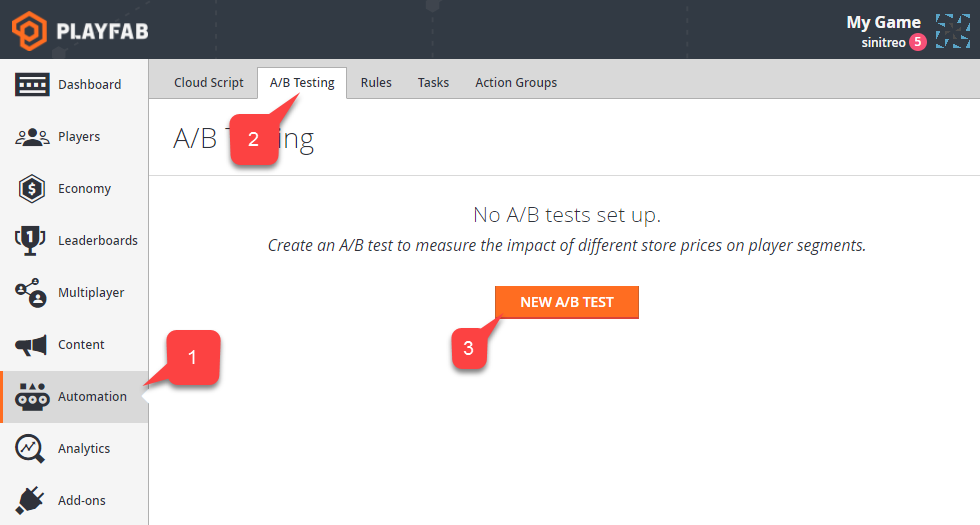
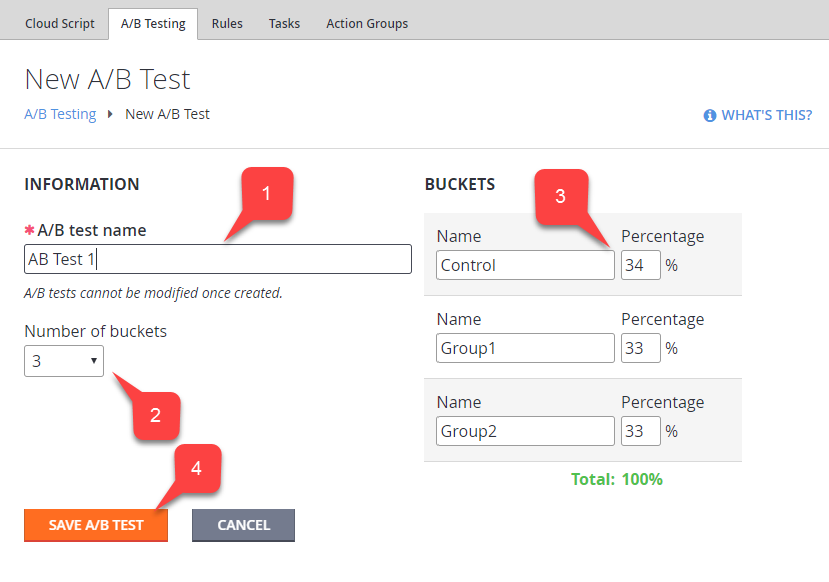
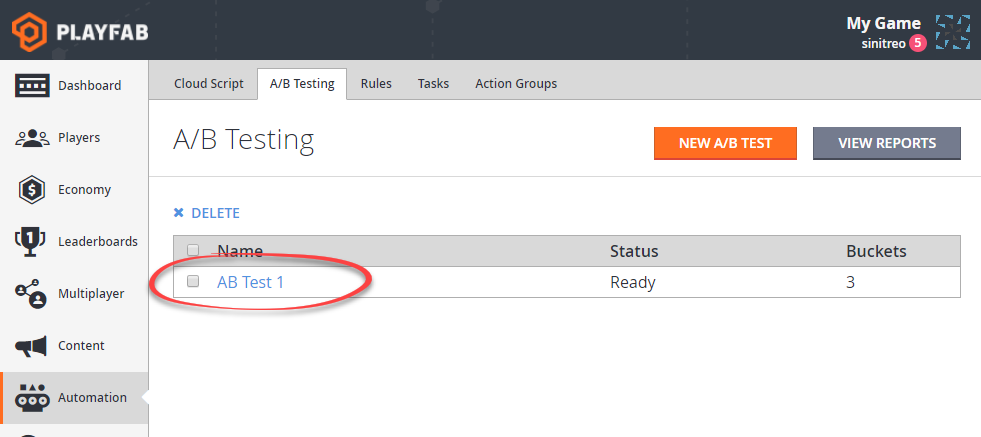

# Creating A/B Tests

This tutorial demonstrates how to create A/B tests with player buckets. A/B tests allow you to use the buckets as [player segments](../segmentation/player-segmentation.md). Unlike [player segments](../segmentation/player-segmentation.md), however, A/B buckets distribute players randomly.

A/B test buckets may then be used in some of the features, where you, normally, use player segments. For an example of this, see our tutorial [A/B Testing with Stores and A/B Test Buckets](ab-testing-with-stores-and-test-buckets.md).

## Creating an A/B Test

A/B tests are created through the PlayFab Game Manager. Open your title page and navigate to the "Automation" tab **(1)**, then to the "A/B Testing" sub-tab **(2)**. Finally, locate the "New A/B Test" button **(3)**, as shown in the following picture:

Image -   

A new A/B test page will open. Keep in mind, that once created, an A/B test cannot be modified. Fill in the A/B test name **(1)**. Set the number of player groups (buckets) **(2)**. For each bucket you define a name and a percentage of players that belong to the bucket **(3)**. Click the "Save A/B Test" button **(4)** to submit the test. The workflow is illustrated in the following picture:

Image -   

The A/B Testing page will open and a newly created test will appear in the list:

Image -   
