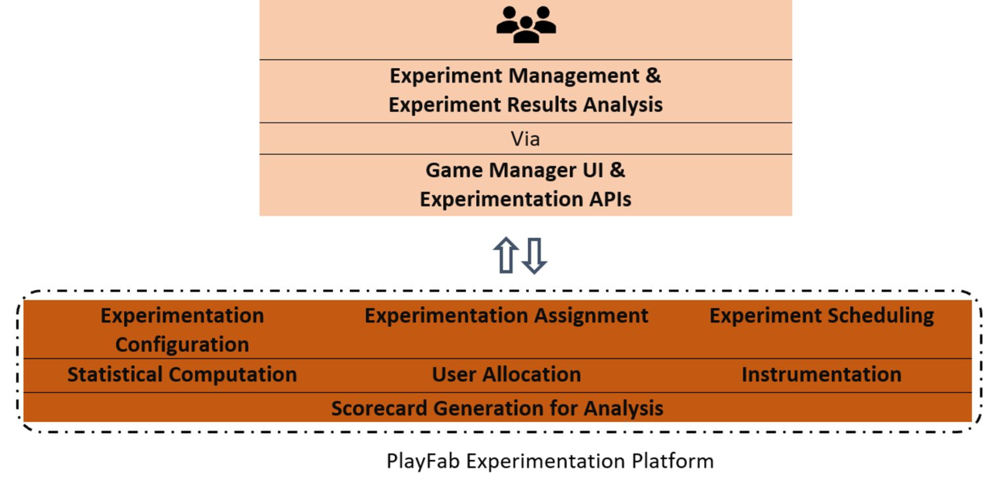

# Experimentation

> [!IMPORTANT]
> This improvised experimentation feature is currently in **Private Preview**. 
> It is provided to give you an early look at an upcoming feature, and to allow you to provide feedback while it is still in development. 
> 
> Access to this feature is restricted to select titles. If you are interested in trying it, please contact us at [helloplayfab@microsoft.com](mailto:helloplayfab@microsoft.com). 

## Overview

PlayFab’s **Experimentation** feature enables you to elevate the player experience by helping you identify the best strategies for your game via A/B experiment. It does so by helping you run multiple simultaneous trustworthy experiment and analysis. 

You can compare different versions of game configurations, pricing models, and outreach mechanisms to determine which is better in bringing conversions. This enables you to make data-informed decisions an area like your game’s roll-out strategy or feature changes of the game, ensuring that every change produces positive results.

### Capabilities of PlayFab’s Experimentation 

PlayFab’s Experiment is a tailored solution for A/B experimentation in gaming. It is powered by Microsoft’s scalable and reliable experiment and statistics computation platform. This feature empowers you in your A/B experiment journey by providing the following capabilities:

- Create, manage, and analyze A/B experiments via Game Manager or APIs. 
- Run multiple concurrent experiments 
- Target audience by making use of existing traffic. One can experiment on specific audience by selecting a segment 
- Get reliable results of the experiment as scorecard. The scorecard is enriched, and detailed
- Support of end-to-end A/B experiment workflow with simple, easy-to-use APIs
- Integration into PlayFab’s through the Player Profile, Playstream, CloudScript and Insights Explorer

### PlayFab Experimentation at a Glance

PlayFab’s Experiments enables to run multiple concurrent experiments in managed and controlled randomization manner. In the process, 

- A unique identifier for each running experiment’s variant groups called variant ID is tagged to each player profile. These variant IDs enables you to assign different treatments via any client or server-side code
- Each variant group is supported and defined by variables. These variables are attributes on variant groups that allow you to bundle a different set of game experience via parameterization
- The computation of the experiment for reliable results takes care of statistical significance level
- Despite your best attempt to in-flight the traffic to suitable audience, there are certain cases where ratio of traffic allocation is way off. PlayFab’s experimentation feature flags such issues enabling you to run reliable experiment 

## Quick Start

### Create an Experiment

An experiment is created to compare a control variant against one or more treatment variant (up to 9). The experiment is controlled and managed as the target audience is as per the user-input. 

From the Game Manager: 	
- Navigate to your **Title** 
- Select **Experimentation** from the menu on the left 
- Click on **New A/B Experiment**, experiment configuration page is opened 
- Enter **Experiment Name**, **Description**, **Duration** (up to 21 days) and **Flight to Population %** 
- Under **Settings**, define the **Control Variant** and **Treatment Variant** 
  * Each variant is supported and defined by **Variables** (up to 10). These variables are attributes on variant groups that allow you to bundle different set of user-experience via parameterization
  * This variable parametrization configures the feature settings for variants without deploying new code. This allows you to iterate faster on changes and make fixes and updates to live games. It is recommended to have name variable name in each of the variant group as a best practice of experimentation  
  * A/B Experimentation is a controlled experiment, hence, a weight % determines the traffic ratio to be in-flighted for target audience. Ideally, a ratio of 1:1 is recommended  
  * An experiment can be configured to run on a Segment
- Click **Save Experiment** or **Save and Run Experiment** 
  * With Save Experiment the experiment will be in **Drafted** status in the manage experiment page
  * With Save and Run Experiment the experiment will be in **Running** status in the manage experiment page 

### Manage Experiment

One can modify an experiment when it is in drafted status. Each field is modifiable. Although, for any experiment in running state, no modification is possible.

- To start the experiment, select the desired experiment from the list of drafted experiment and click **Start**
  * The experience/ behavior in each variant of experiment is in-flighted to the qualifying traffic immediately at random 
  * A few other actions can be taken in an experiment, like, **Clone**, **Rerun**, ****Delete**. The applicability and availability of the option is based on the state the experiment
- Once the duration of the experiment is reached or a user explicitly stops the experiment, the experiment status is turned **Stopped/ completed**

### Analyze Experiment  

Experiments results will be showed in a scorecard which is generated in a regular cadence. The cadence is 12 hours, 1 day, 2 day, 3 day, 5 day, 7 day, 14 day, 21 day.

Once the experiment is completed or stopped, click on the **View Scorecard** link of the experiment from the manage experiment page,

At the run: 
 * If an issue of Statistical Ratio Mismatch (SRM) is identified, then it is flagged to the user for investigation
  * SRM indicates sampling bias in the randomization which leads to the options of resolving bugs (if any), wait till certain duration of the experiment for auto-resolution or immediately stop the experiment based on the estimated impact 

At the completion:  
 * The overall statistical computation of each metric is available for analysis

## Scorecard Metrics

PlayFab has pre-identified the simple, effective, and actionable set of metrics for analysis of experimentation results. These are tracked and categorized to measure impact on the acquisition, activation, retention, and revenue of the title. These are computed on player_logged_in and player_realmoney_purchase events. 

The identified metrics are:  

| **Type**                    | **Metric**                              | 
|:---------------------------------- |:-----------------------------------| 
| **Acquisition**        | Average Login Per User |
| **Activation**         | Payer Conversion Rate |
| **Revenue**            | Average Revenue Per Payer |
| **Revenue**            | Average Transactions Count Per Payer |
| **Retention**          | Day N Retention (N = 1, 2, 3, 5, 7, 14, 21 day) |

## Experimentation APIs

> [!Note]
> API details and access will be provided on Public Preview 

PlayFab has scalable and integrable APIs for experimentation. The APIs and associated operation details are as below:  

| **API Name**                    | **Operation**                              | 
|:---------------------------------- |:-----------------------------------| 
| **Create Experiment**        | It allows client to request creation of an experiment for the title. The experiment configuration gets defined as part of it, containing the experiment details, like target audience, start date, variant groups, and associated variables for orchestrating the change in experience (or treatment assignment). The treatment assignment can include virtually anything on client or PlayFab services. |
| **Update Experiment**        | It allows client to request update in experiment configuration of an existing experiment for the title based on the experimentation ID. |
| **Start Experiment**         | It allows client to request start of an existing experiment for the title based on the experiment ID. The client code gets orchestrated for the change in experience as per the treatment assignment given for the experimental study on the target audience. |
| **Stop Experiment**          | It allows client to request stop of an existing running experiment for the title based on the experiment ID. The default client code (control variant) gets orchestrated for the change in experience for the entire audience. |
| **Delete Experiment**        | It allows client to request delete of an experiment in completed/ stopped status for the title based on the experiment ID. |
| **Get Experiment**           | Lists all the experiments and its details of drafted, running and completed an experiment for the title. |
| **Get Treatment Assignment** | List the treatment assignments for a player for every running experiment in the title. |
| **Get Experiment Scorecard** | Gives the latest scorecard result for an experiment of the title. |
| **Get Title Scorecards**     | Gives the latest scorecard results for all the experiments of the title. |
