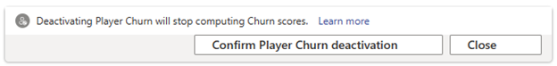
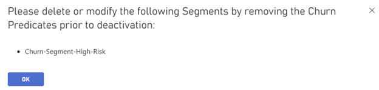

# Churn Prediction - Public Preview

## Overview

Identifying Churn is a key metric to reduce player attrition and increase engagement. In addition, Churn has direct impact on Revenue when players leave a game. To provide the ability to identify and mitigate Churn, PlayFab is introducing its very first Azure AI/ML based Predictive Service. Directly integrated into Segmentation and with no additional integration required from Titles, Churn Prediction can be easily enabled via Game Manager.

PlayFab will consume different datapoints from Player Profile and PlayStream events and determine from the list of **Eligible Players** who are likely to **Churn** within the next **Churn Window.** 

Let’s define some key terms used above: 
- **Eligible Players** – Players who have logged in within the past 21 days. To ensure accurate predictions, only Eligible Players will be considered and scored for predictions.   
- **Churn** – Is an indicator of whether a player would stop playing within the next Churn Window.
- **Churn Window** – Is the specific period during which players are expected to Churn based on their Risk Propensity. This parameter is set to 7 days and is non configurable at this time. 

This feature will be presented as **Churn Prediction** within the Segmentation Filters dropdown. Titles can further define their Segments via Churn Risk Factors of Low/Medium/High and in conjunction with other Segmentation Filters as well. Once the required Segments have been created, Mitigation Strategies can be applied via **Segment Actions** directly from the Segmentation page to reduce Churn as much as possible.

## Opt in/out of Churn Prediction

Churn Prediction is a paid, premium feature that must be explicitly opted into from Game Manager. Once opted in, it takes **48 hours** for the required data to be collected, ingested and scores to be computed and generated before segments can be created. The Churn Prediction filter will only appear within the Segmentation filter dropdown once the scores are generated in the backend. 

### Pre-Requisites 

- Ensure your billing information is up to date prior to opting into the feature. 

### Opt into Player Churn 
1.	Navigate to your **Title**
2.	Select **Players** from the menu on the left
3.	Move to the **Segments** Tab above
4.	Opt into Churn Prediction clicking on **Activate Player Churn**
 
 
5.	On the official Churn Activation page, select the blue **Activate Player Churn**
 
 
### Opt-Out of Player Churn
Prior to opting out, please ensure to **Modify** or **Delete** any Segments that use the Churn Prediction Filter.

**Note** - The 48 hours lead time is applicable if a title were to opt in again after opting out.

1.	Navigate to your **Title**
2.	Select **Players** from the menu on the left
3.	Move to the **Segments** Tab above
4.	Opt out of Churn Prediction by selecting **Deactivate Player Churn**

5. Confirm your action by selcting **Confirm Player Churn Deactivation**

6. Delete or Modify any existing segments with the Churn Filter prior to Deactivation
 

## Mitigation Strategies
Once Churn has been identified, the next step to re-engage and retain your players is to apply Mitigation Strategies. With Segmentation Actions, the required steps can be configured while creating the Segment itself. These actions will apply to all players real-time. Few of the Actions that are offered directly out of the box are: 
-	Send Push Notifications – Targeted Promotions can be sent on ios and Andriod platforms. 
-	Send Emails – Custom Email Templates can be created to invite players to Exclusive Sales or Sneak Peak access to new levels/content.
-	Grant Items/Coins – Personalized rewards such as granting Virtual Currency or Catalog Items.

If above actions are not applicable or do not suffice, Titles can always create customized solutions via [Cloudscript using Azure Functions](https://learn.microsoft.com/en-us/gaming/playfab/features/automation/cloudscript-af/)

 
