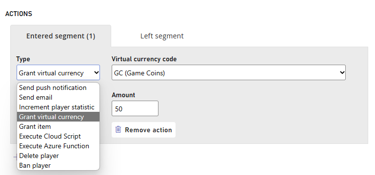

# Quickstart

## Create a Churn Prediction Segment and Apply Mitigation Strategy

1.	Navigate to your **Title**
2.	Select **Players** from the menu on the left
3.	Move to the **Segments** Tab above
4.	Select **New Segment** to create a new Segment. 
5.	Add a Segment Name and Navigate to **Churn Prediction** in the Filter Dropdown. Select **High Risk** in the Churn Category

6.	Navigate to **Actions** and Select **Add Action**

7.Select **Grant Virtual Currency** under Type,  select your variant of Currency and the amount you would like to grant to the player. 

You have now created a segment with High Risk Churn Players and have applied a Mitigation Strategy to reduce your churn rate and retain your players. 
