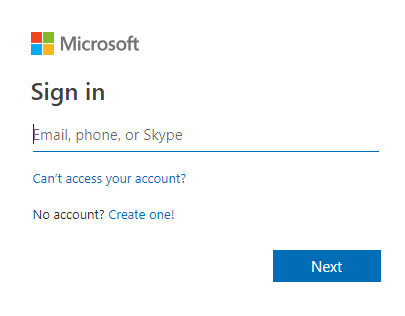
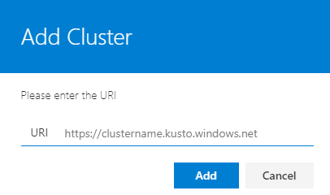
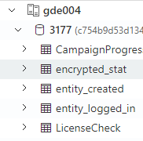

# Viewing or analyzing event data with PlayFab Insights

> [!IMPORTANT]
> This feature is currently in **Private Preview**.  
>
> It is provided to give you an early look at an upcoming feature and to allow you to provide feedback while it is still in development.  
>
> Access to this feature is restricted to select titles. If you are interested in trying it, you can request access by submitting a ticket on [support.playfab.com](https://support.playfab.com/hc/en-us/requests/new).

Creating and editing queries, in addition to working interactively with returned data, can be accomplished with the Azure Data Explorer Web or Desktop Client. Both tools provide powerful client querying capabilities. It's simply a matter of preference between which tool you chose.

## 1. Log into the Data Explorer Web Client

Log in to [AzureData Explorer](https://dataexplorer.azure.com).

Sign-in with your organizational or Microsoft account.



## 2. Connect your PlayFab Insights cluster to Azure Data Explorer

* Return to the **Analytics | Insights** page and capture the name of the cluster assigned to your title.
* Click the **Add Cluster** button in the Azure Data Explorer.

   

* Enter the URI in the format `https://`*clustername*`.kusto.windows.net`. For example, if the cluster is named PlayFab34239 then the URI is `https://PlayFab34239.kusto.windows.net`

   

   > [!NOTE]
   > Only user organizational or Microsoft accounts entered in the provisioning process will have access to the PlayFab Insights cluster. You may optionally grant other users access to your cluster.

## 3. Locate the Insights service database to query

Your Insight service will contain a database with the icon of a database and every corresponding table in the database will contain the icon of a table. To query an asset, select the table, and then navigate to the script window.



## 4. Create a simple search

The quickest way to retrieve some data to work with is a simple query that returns all records in table.

Enter the following query to return all records of players logged in:

```cmd
player_logged_in
```

Enter the following query to return the top 10 rows of the players logged in:

```cmd
player_logged_in | limit 10
```

Enter the following query to return all player logged in events between now and 3 days ago:

```cmd
player_logged_in | where Timestamp >= ago(3d)
```

Enter the following query to return the count of all players logged in, grouped by platform:

```cmd
player_logged_in | summarize count() by Platform
```

Enter the following query to return the count of all players logged in, grouped by platform and visualized in a pie chart:

```cmd
player_logged_in | summarize count() by Platform | render piechart
```

## 5. Data Explorer Resources

Here are some additional resources to help you take the full advantage of the Data Explorer:

### Tutorials

* [Visualize data from Azure Data Explorer in Power BI](https://docs.microsoft.com/en-us/azure/data-explorer/visualize-power-bi)
* [Querying data in the Azure Data Explorer](https://docs.microsoft.com/en-us/azure/data-explorer/web-query-data)

### User Guides

* [Writing queries for the Azure Data Explorer](https://docs.microsoft.com/en-us/azure/data-explorer/write-queries)
* [Azure Data Explorer Query Language Guide](https://docs.microsoft.com/en-us/azure/kusto/query/)
