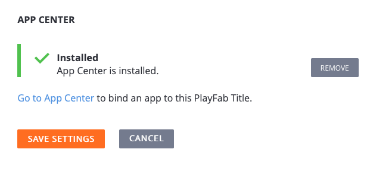

# Diagnostics with App Center Quickstart (Private Preview)

> [!IMPORTANT]
> This feature is currently in **Private Preview**.  
>
> It is provided to give you an early look at an upcoming feature, and to allow you to provide feedback while it is still in development.  
>
> Access to this feature is restricted to select titles. If you are interested in trying it, you can request access by submitting a ticket on [support.playfab.com](https://support.playfab.com/hc/en-us/requests/new).

PlayFab is consistently looking to bring new capabilities to our game developers. We know how important it is to understand the health of your game as part of your overall LiveOps view. We are excited to announce that we have partnered with App Center to bring their diagnostic capabilities directly into PlayFab.

App Center provides tools to help you build, test, deploy and monitor mobile and pc apps. It is especially good at detecting when your app has crashed and saving that information to help you fix it quickly.

## Prerequisites

* You will need a PlayFab Account.
* You will need an App Center Account.
* You will need to have the App Center SDK installed in your game.
* Private Preview enabled for your title (email [devrel@playfab.com](mailto:devrel@playfab.com)) to get access for your title.

## Getting started

To get started, log into your PlayFab account. Once App Center integration is enabled for your title (private preview only), you will see a **Diagnostics** tab in the sidebar.

Since the add-on has not yet been enabled, you will need to navigate to the add-ons page to turn on the integration.

Select the install button on the **App Center Add-On** page. You should see the screenshot shown below.

Now you need to link your PlayFab title to your App Center titles. To do this, select **Go to App Center**.

This will ask you to authenticate for AppCenter, and will provide you with a list of titles you can select and link to your PlayFab title. If you have more iOS and Android App Center titles, be sure to select both of them to get your diagnostic information for both titles.

Once you have completed the above steps select the **Save Settings** button.

Your integration is now enabled. If you navigate back to the **Diagnostics** tab, you should see your crash data enabled.

