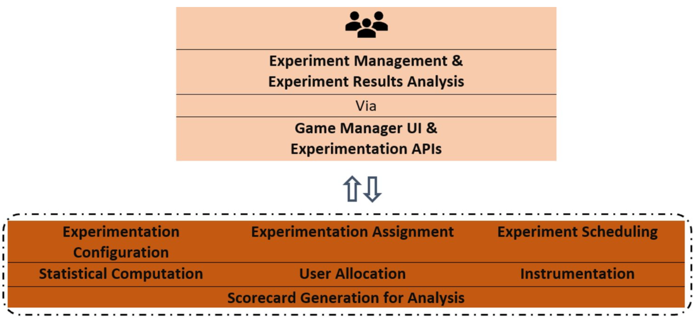
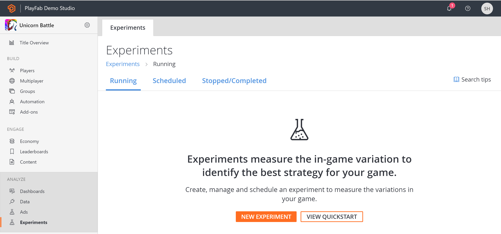
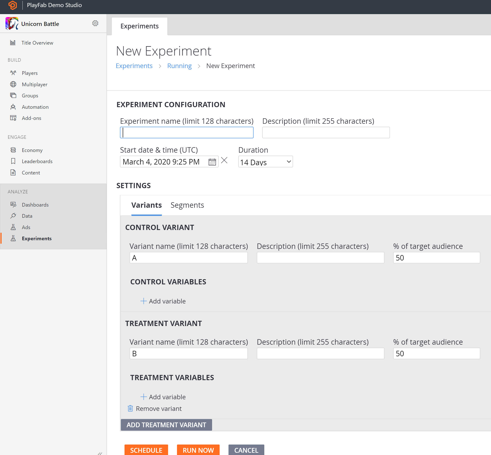
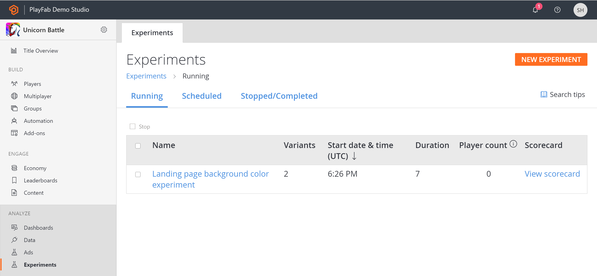

# Experiments

## Overview

PlayFab **Experiments** feature helps you identify the best strategies for your game. It does so by helping you run multiple concurrent experiments by ensuring statistical trustworthiness. 

You can elevate the player experience by comparing different versions of game configurations, pricing models, and outreach mechanisms, determining the best variation for your titles goals (engagement, monetization, retention, etc.) via experiments. 

### Capabilities of PlayFab's Experiments

PlayFab Experiments is a tailored solution for running experiments in your games. It is powered by Microsoft's internal experimentation platform which unlocks the best-in-class capabilities which are used by Azure, Office, Bing, Minecraft, and many other Microsoft products. 

PlayFab Experiments empowers you by providing the following capabilities:

- Creation and management of multiple concurrent experiments with the (interactive and self-directing) user interface on PlayFab Game Manager and via scalable APIs.
- Configurations comparison in an experiment. Each configuration is easily mappable to variants where each variant is supported by variables. These variables allow you to bundle a different set of game experiences via parameterization.
- Targeting of desired audience at random but in a controlled manner by making use of existing traffic. You can experiment over a segment, and define the percentage of the target audience in each variant.
- Scheduling of experiments or to run immediately.
- Analysis of experiments' scorecard results. The scorecards are computed reliably and possess enriched statistical details. This gives you an indication of statistical significance and alerts if a Sample Ratio Mismatch is observed.
- Integrability with other PlayFab services such as Player Profile, PlayStream events, CloudScript and Insights Explorer, etc.

### PlayFab Experiments at a Glance

PlayFab Experiments enables you to run multiple concurrent randomized experiments in a managed and controlled manner. In the process, 

- A unique identifier for each running experiment's variant groups called a variant ID is tagged to each player profile. These variant IDs are assigned to different treatments via client or server-side code. Thus, instrumenting different treatment behaviour.
- Each variant group is supported and defined by variables. These variables are attributes on variant groups that allow you to bundle a different set of game experience via parameterization.
-    Reliable computation of results of an experiment with statistical significance calculation is provided.
-    Detection of issues when the targeted audience traffic is way off. This is often caused by a treatment causing crashes or affecting logging. PlayFab's experimentation feature flags such issues enabling you to run a reliable experiment.   

## Quick Start

### Create an Experiment

An experiment is created to compare a control variant against one or more treatment variants (up to 9). The experiment is managed through a target audience controlled by the user.

From the Game Manager:     
- Navigate to your **Title** 
- Select **Experiments** from the menu on the left 
- Select **New Experiment**, experiment configuration page is opened 
- Enter **Experiment Name**, **Description**, **Start Date & Time**, **Duration** (up to 21 days) 
- Under **Settings**, configure your target audience for the experiment. By default, the experiment's audience is all players from the title
  * Configure to run the experiment on a Segment by unckecking **Run across all title players**
- Under **Settings**, define the **Control Variant** and **Treatment Variant(s)** 
  * Each variant is supported and defined by **Variables** (up to 10) and associated **% of target audience**. These variables are attributes on variant groups that allow you to bundle different set of user-experience via parameterization
  * This variable parametrization configures the feature settings for variants without deploying new code. This allows you to iterate faster on changes and make fixes and updates to live games. It is recommended to have the same variable name in each of the variant group as part of best practices of experimentation  
  * For controlled experiment, **% of target audience** determines the traffic stream and instrumentation of variants
  * Sufficient traffic is required to make the changes from your experiments more detectable.  An experiment with equal traffic in each variant will have the best ability to detect a change
- Select **Schedule** or **Run Now** 
  * With Schedule the experiment will be in **Scheduled** status in the manage experiment page
  * With Run Now the experiment will be in **Running** status in the manage experiment page 
  

### Manage Experiments

The Experiments page displays the experiments available based on the experiments' status which is **Running**, **Scheduled**, **Stopped/ Completed**. Here the high-level details on each experiment is available, like experiment's **Name**, number of **Variants**, **Start Date & Time** and **End Date & Time**. Interestingly, for an experiment in running state, one can also see a near-real-time metric of **Player Count** which gives insights into the number of players that have been assigned to the experiment (It is refreshed every 8 hours).  

The Experiments page can also be used for managing experiments. Here,  

- A scheduled experiment is automatically picked to run based on the configured schedule
  * The configuration's variations mapped in each variant of the experiment is enabled to the qualifying traffic immediately at random 
- A previously scheduled experiment can be started at any time prior to its start date, just select the desired experiment from the list of scheduled experiments and Select **Run**. Different actions can be taken on experiments based on their state. Like,
  * **Stop** a running experiment
  * **Delete** and **Clone** a scheduled experiment
  * **Delete** and **Clone** a stopped/ completed experiment
  Note: One can also **Clone** an existing experiment from the experiment's configuration page which allows further edits
- A scheduled experiment's fields are completely modifiable and vice-versa for a stopped/ completed experiment. Although, for any experiment in running state, only Experiment description and duration modifications are possible
- A running experiment status is turned **Stopped/ completed**, once the duration of the experiment is reached or a user explicitly stops the experiment

### Analyze Experiment  

Experiments' results are shown in a scorecard that is generated in a regular cadence. The first scorecard is generated in 12 hours, followed by scorecard(s) every 24 hours for the entire duration of an experiment.

Once the experiment is completed or stopped, select the **View Scorecard** link of the experiment from the manage experiment page.

At the completion of the experiment:  
 * The overall statistical computation of each metric is available for analysis.

At the experiment run: 
 * If an issue of Sample Ratio Mismatch (SRM) is identified, then it is flagged to the user for investigation.
 * SRM indicates sampling bias in the randomization which leads to the options of resolving bugs (if any), immediately stop the experiment based on the estimated impact or take the risk and let the experiment to continue.

> [!Note]
> To learn more about SRM and how to resolve it, see the **Sample Ratio Mismatch** section in [Experimentation Best Practices and Recommendations](experimentation-keys.md)) 

## Scorecard Metrics

PlayFab has pre-identified a set of simple, effective, and actionable metrics for analysis of experiment results. These are tracked and categorized to measure impact on the acquisition, activation, retention, and revenue of the title. These are computed based on the player_logged_in and player_realmoney_purchase events. 

The identified metrics are calculated for the time the experiment has ran so far based on the configured duration. The metrics are:  

| **Type**                    | **Metric**                              | **Description**                           |
|:---------------------------------- |:-----------------------------------|:-----------------------------------| 
| **Acquisition**        | Average Login Per User | Average of all user logins |
| **Activation**         | Payer Conversion Rate | Percentage of active users who purchased |
| **Revenue**            | Average Revenue Per User | Average of revenue generated from users including those that didn't make any purchase |
| **Retention**          | Day N Retention (N = 1, 2, 3, 5, 7, 14, 21 day) |Percentage of users who logged in N days after seeing the experiment |

## Experimentation APIs

PlayFab has scalable and integrable [APIs](https://docs.microsoft.com/rest/api/playfab/experimentation/experimentation) for experimentation. The APIs and associated operation details are as below:  

| **API Name**                    | **Operation**                              | 
|:---------------------------------- |:-----------------------------------| 
| **Create Experiment**        | Allows a client to request the creation of an experiment for the title. The experiment configuration gets defined as part of it, containing the experiment details, like target audience, start date, variant groups, and associated variables for orchestrating the change in experience (or treatment assignment). The treatment assignment can include virtually anything on the client or PlayFab services. |
| **Update Experiment**        | Allows a client to request an update in the experiment configuration of an existing experiment for the title based on the experimentation ID. |
| **Start Experiment**         | Allows a client to request the start of an existing experiment for the title based on the experiment ID. The client code gets orchestrated for the change in experience as per the treatment assignment given for the experimental study on the target audience. |
| **Stop Experiment**          | Allows a client to request the stop of an existing running experiment for the title based on the experiment ID. The default client code (control variant) gets orchestrated for the change in experience for the entire audience. |
| **Delete Experiment**        | Allows a client to request a delete of an experiment in completed/stopped status for the title based on the experiment ID. |
| **Get Experiments**           | Lists all the experiments and its details, no matter which state (drafted, running, and completed/stopped) for the title. |
| **Get Treatment Assignment** | List the treatment assignments for a player for every running experiment in the title. |
| **Get Latest Scorecard** | Gives the latest scorecard result for an experiment of the title. |

> [!Note]
> For more information about the Experiments APIs, see [Experimentation] (https://docs.microsoft.com/rest/api/playfab/experimentation/experimentation) APIs.

## Integrating Experiments with other PlayFab services 
Experiments is compatible with Player Profile, PlayStream events, CloudScript and Insights Explorer. For example, you can:

- **Make configuration changes using CloudScript:** Virtually any configuration-related game code variation can be enabled using a combination of CloudScript and Experiment's getTreatmentAssignment API.
- **Make configuration changes using PlayStream events:** Use the [getTreatmentAssignment] https://docs.microsoft.com/en-us/rest/api/playfab/experimentation/experimentation/gettreatmentassignment?view=playfab-rest API to trigger game configuration changes based on PlayStream events. 
- **Do a drill-down analysis using Insights Explorer:** A unique identifier of each variant (VariantID) is stamped on all PlayStream v2 events and two specific PlayStream v1 events (player_logged_in and player_realmoney_purchase). This can be used to do further analysis on specific metrics. (The metrics can be based on the PlayStream events or your own game telemetry.) To query, use the Insights Explorer service or connect your own analytics platform.

> [!WARNING]
> A new player login only has attributes associated with the [player_logged_in PlayStream] https://docs.microsoft.com/en-us/gaming/playfab/api-references/events/player-logged-in event. An experiment that targets a new player with PlayStream event-based configuration variations can only use attributes that are part of the player_logged_in PlayStream event. This ensures treatment assignment to the new players who have no PlayStream events associated yet.

