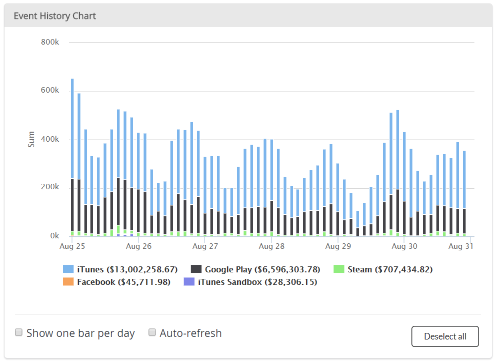
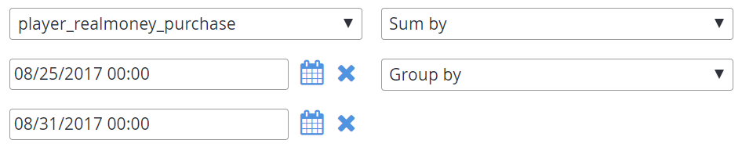
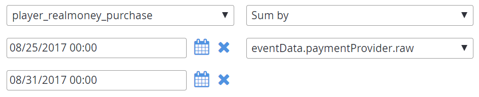
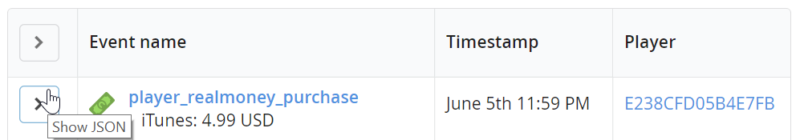
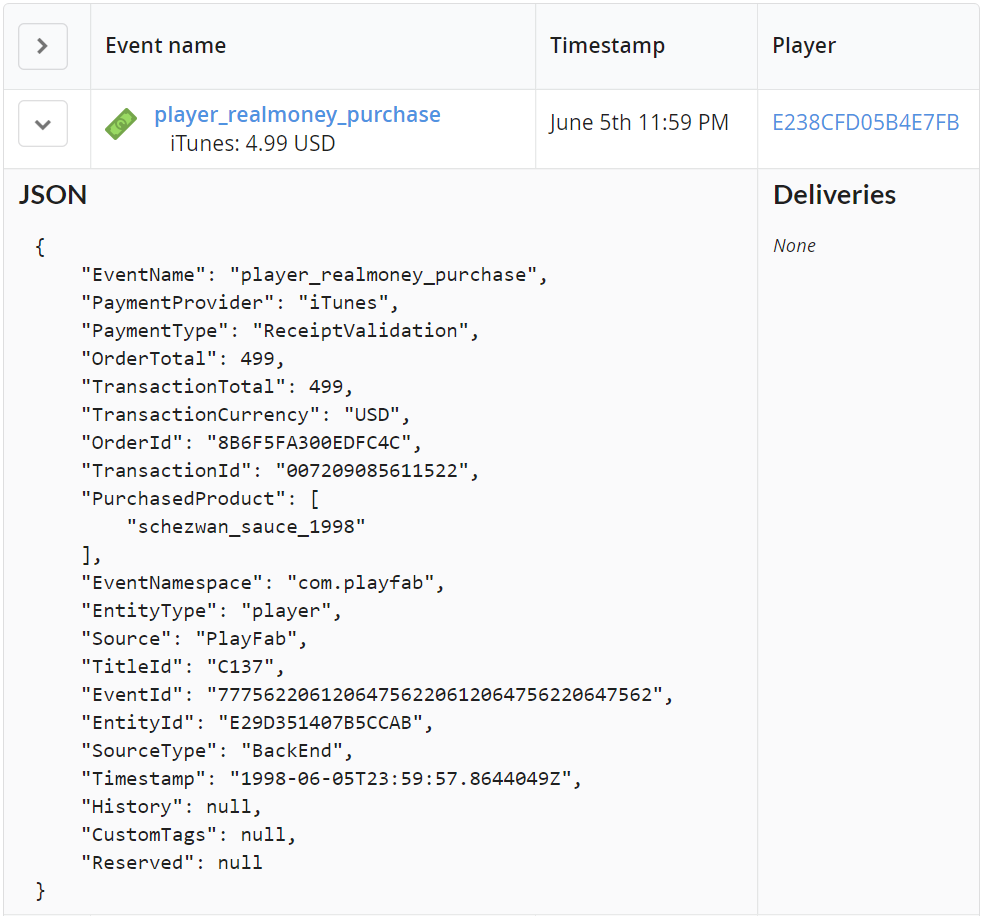
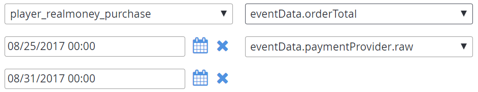

# Constructing an Event History search

This tutorial illustrates how to construct an Event History search, the components of a search, and how to use elastic search syntax in your queries.

Let's start by looking at the final results of a successful search, displaying a comparison of how much money goes through each payment provider in the most recent week.

  

Searches are constructed from three fields:

1. The **Query** field.
2. The **Group by** field.
3. The **Sum by** field.

The first field to edit will usually be the **Query** field, which is constructed by selecting an event type, a start date, and an end date.

  

By editing anything within the event type, start date, or end date, the **Query** field itself will be constructed.

  

At this point, the search will result in showing only [player_realmoney_purchase](../../../api-references/events/player-realmoney-purchase.md) events, as shown below.

  

By default, **Group by** will aggregate events by their event type. Here, we are only querying for a *single* event type.

Instead, let's group by a property of the event. Looking at the [documentation for the event](../../../api-references/events/player-realmoney-purchase.md), we can see that `paymentProvider` is a property.

  

Now, the chart shows the counts of how many events occurred for each group, as shown below.

  

By default, **Sum by** will count the number of events per group. We can sum a property of the event instead. We could find a property by again looking at the [event documentation](../../../api-references/events/player-realmoney-purchase.md).

There is another way to see the properties of the events - you query by looking at the event JSON itself.

We do this by selecting the **Show JSON** button to the left of the **Event name** column, as seen in the following screen capture.

  

Now we can find for a value to compute with. Looking at the JSON, an appropriate value (a number value, not an ID) is `OrderTotal`.

  

Let's set the **Sum by** to that value.

  

After searching again, we can see that our chart is now what we want, as shown in the following example.

  

We could be done here, but there's one issue - If you want to *save* this search, the dates will still be the week of **Aug 25** to **Aug 31**!

We can do better by *manually editing* the **Query** field.

The constructed **Query** field uses Azure Data Explorer search syntax, meaning that you can use Azure Data Explorer's query language scalar function `ago()` and the `datetime` data type. Literals of type `datetime` are accessible at the Azure Data Explorer [Data Types](https://docs.microsoft.com/azure/kusto/query/scalar-data-types/datetime) page. The `ago()` function is documented in the Azure Data Explorer [Scalar Functions](https://docs.microsoft.com/azure/kusto/query/agofunction) page.

We can directly substitute the dates in the **Query** field for relative dates, as indicated in the following example.

  

Once we save the search, it will be available from the **Saved Searches** drop-down. By selecting it, your search will be reconstructed, and the dates will be relative to the current time.

  
